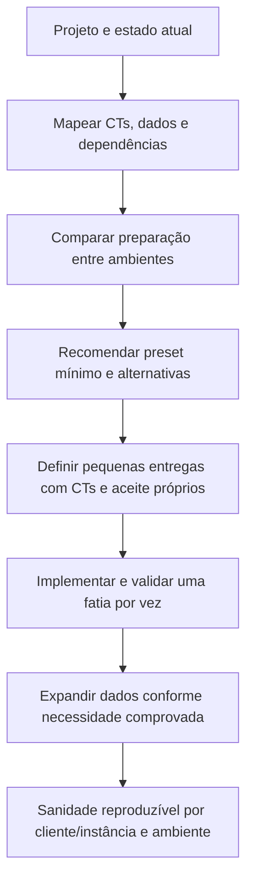

---
tags:
  - qa
  - automacao
  - roadmap
tipo: roadmap
demanda: SGV-11262
status: ativo
---
# Roadmap — Automação do Termo de Referência SOGOV

> [!info] Como usar este documento
> Este roadmap registra a direção, a ordem sugerida e as dependências da iniciativa. Ele não substitui os casos de teste, o plano ou o placar de uma entrega. Para localizar documentos e ciclos, consulte o [[Conhecimento/0 - SGV-11262 - Índice|Índice da SGV-11262]].

## Objetivo

Evoluir a automação dos requisitos do Termo de Referência em entregas pequenas, cada uma com escopo e validação próprios. A direção é permitir uma execução reproduzível da sanidade do SOGOV por cliente/instância e ambiente, reaproveitando os mecanismos de preparação já existentes sempre que fizer sentido.

O próximo passo é compreender e documentar o que já existe antes de escolher uma mudança técnica. A execução reproduzível em diferentes clientes/instâncias e ambientes continua como direção da iniciativa e será alcançada incrementalmente, conforme os pré-requisitos forem conhecidos e entregues.

## Estado atual

O ciclo **TR 1.24–1.25 — Autenticação e ciclo de vida do usuário** está registrado na [[SGV-11971 - TR 1.24-1.25 Autenticação e Ciclo de Vida/Arquivo/00 QA/00 README|SGV-11971]]. O pacote funcional original está preservado em `SGV-11971/Arquivo/`; seus casos continuam sendo a origem dos 38 CTs. As novas entregas executáveis ficam fora dessa pasta de arquivo e cada uma tem seus próprios pacotes QA e automação.

> [!info] Direção revisada — 07/10/2026
> A Entrega 01 propôs como piloto a instância dedicada **225 — “Termo De Referência - Sogov”**, mas o seed não foi ajustado nem validado nela. Com a mudança de escopo, esse pacote fica preservado como histórico do piloto. A SGV-12082 vai mapear o projeto, a massa dos CTs e as diferenças entre ambientes antes de recomendar o próximo passo. Refatorar o seed permanece uma hipótese, não uma decisão.

O placar de automação registra:

- **25/38 CTs aprovados** no histórico de validação;
- **13 CTs identificados em Playwright**, aprovados e sem falhas `@auth` no run de 06/10/2026;
- **12 CTs aprovados ainda associados ao Cypress**, sem porte Playwright confirmado; a prioridade e a fatia de porte devem ser definidas após a estabilização do baseline;
- **4 CTs com falha/achado** (015, 029, 030 e 033);
- **6 CTs bloqueados** (022, 026, 028, 034, 035 e 036);
- **3 CTs aguardando código, captura de API ou investigação** (016, 017 e 037).

O fato de um CT estar verde não confirma, por si só, que seja independente e reproduzível em outra instância. A leitura do código dos 13 CTs e do seed foi concluída; a independência operacional em outra instância ainda não foi demonstrada por execução.

**Mapeamento de código concluído em 07/10:** os 13 CTs são CT-001–012 e CT-038. Todos dependem do seed global, mas usam diretamente apenas a instância e atores por worker; nenhum usa módulo, serviço ou documento. O seed já é idempotente e grava um manifesto de IDs, mas hoje aponta para um perfil fixo de instância. O inventário detalhado e as ressalvas de cobertura estão em [[Conhecimento/Mapa do seed Playwright atual - SGV-11971|Mapa do seed Playwright atual]].

Na verificação de 07/10, CT-001–012 estavam em `origin/main`. CT-038 passou nos runs registrados, mas seu arquivo ainda está em um worktree com `HEAD` destacado (`16c41e4`) e sem commit. O destino desse arquivo precisa ser resolvido antes de encerrar uma entrega que o inclua.

## Entregas existentes

| Entrega | Escopo | Situação |
|---|---|---|
| [[SGV-11971 - TR 1.24-1.25 Autenticação e Ciclo de Vida/Arquivo/00 QA/00 README\|Arquivo funcional da SGV-11971]] | Pacote original do ciclo: requisitos, 38 CTs e evidências históricas | 🗄️ Preservado como referência; casos reutilizados pelas entregas no escopo aplicável |
| [[SGV-11971 - TR 1.24-1.25 Autenticação e Ciclo de Vida/Entrega 01 - Baseline de autenticação na instância 225/00 QA/00 README\|Entrega 01 — Baseline na instância 225]] | Piloto de seleção do alvo pelo seed + CT-001–012 e CT-038 | 🗄️ Preservada como histórico; não executada nem validada na 225; decisão técnica reaberta pela SGV-12082 |
| [[SGV-12082 - Análise do TR e preset de dados/00 QA/00 README\|SGV-12082 — Análise do TR e preset de dados]] | Entender automação, avaliar reuso de massa entre ambientes e mapear o preset provável para o TR completo; os 38 CTs existentes cobrem 1.24–1.25 | 🔄 Em análise; pacote criado, levantamento pendente |

A Entrega 01 permanece arquivada como registro da hipótese de piloto na 225; seu pacote não representa uma implementação validada. A SGV-12082, reorganizada em 07/10/2026 como pacote irmão (direto sob a SGV-11262, não mais aninhada dentro da SGV-11971 — seu escopo é o Termo completo, não um ciclo específico), usa `00 QA/` para escopo e verificações da análise e `01 Automação/` para mapear tecnicamente o projeto e acompanhar essa análise. As entregas de implementação serão abertas depois que a matriz identificar fatias executáveis e seus CTs. O pacote original completo está em `SGV-11971/Arquivo/`, inclusive documentos históricos de handoff e revisão. Eles servem como referência e não definem a estrutura das entregas novas.

## Próximos passos e entregas candidatas

As linhas futuras permanecem candidatas; somente a SGV-12082 está aberta como entrega de investigação. Não se assume que o seed será refatorado: a recomendação deve comparar as alternativas com base nos CTs e nas evidências.

| Ordem | Entrega / passo | Resultado esperado | Dependência | Situação |
|---:|---|---|---|---|
| 1 | **Entender o projeto e o estado atual** | Explicar fluxo Playwright, setup, seed, fixtures, manifesto, ambientes e situação real dos testes | Acesso de leitura ao repositório/configuração e documentos | 🔄 SGV-12082 em análise |
| 2 | **Mapear dados e dependências dos 38 CTs** | Identificar atores, módulos/serviços, estados, preparação, consumo, limpeza e lacunas por CT/grupo | Fonte funcional da SGV-11971; mapa técnico existente como ponto de partida | 🔄 Incluído na SGV-12082 |
| 3 | **Propor preset inicial e pequenas entregas** | Matriz dos requisitos 1.1–1.43 com cobertura/evidência, detalhamento dos 38 CTs existentes de 1.24–1.25, recomendação do preset provável e sequência de entregas | Conclusão dos passos 1–2 | 🔄 Incluído na SGV-12082; recomendação pendente |
| 4 | **Implementar a primeira fatia recomendada** | Entrega pequena, com QA, automação e validação próprias, conforme resultado da investigação | Recomendação aprovada pela equipe; dependências e aceite definidos | 📝 Candidata; não abrir pasta/demanda ainda |
| 5 | **Expandir o preset conforme os próximos CTs priorizados** | Acrescentar somente os dados/estados exigidos pela próxima fatia | Resultado e limites da fatia anterior | 📝 Candidata incremental |
| 6 | **Reproduzir sanidade por cliente/instância e ambiente** | Selecionar alvo de forma explícita, segura e repetível em diferentes ambientes/clientes | Evolução incremental do preset, configuração, isolamento, permissões e evidência de execução | 🎯 Direção futura da iniciativa |

A matriz da SGV-12082 usa o PDF completo como fonte e registra cobertura dos requisitos 1.1–1.43, tipo de evidência e dados necessários. Os 38 CTs existentes da SGV-11971 cobrem apenas 1.24–1.25 e serão mapeados detalhadamente como cobertura parcial. Cada implementação que nascer dessa análise seguirá o pacote dos templates: `00 QA/` e `01 Automação/`, contendo apenas critérios e CTs do seu escopo. `05 - Preparação Qase` só será criado quando houver casos novos a sincronizar.

## Ordem sugerida

## Critérios para abrir uma nova entrega

Criar uma demanda filha somente quando a análise confirmar uma fatia executável e revisável. O plano de cada entrega deve declarar problema, objetivo, CTs incluídos e excluídos, dados/estados necessários, dependências, estratégia e critério de aceite. A validação registra apenas os CTs daquela fatia; a nota da iniciativa mantém a visão geral e links para as entregas.

Não abrir agora demandas para todas as entregas futuras nem assumir que é necessário refatorar o seed ou construir um mecanismo chamado `Preset`. A análise da SGV-12082 deve classificar os requisitos do PDF completo (1.1–1.43), mapear em detalhe os 38 CTs existentes de 1.24–1.25 e localizar cobertura/dados de automação para as demais áreas, usando o inventário dos 13 Playwright como ponto de partida.
