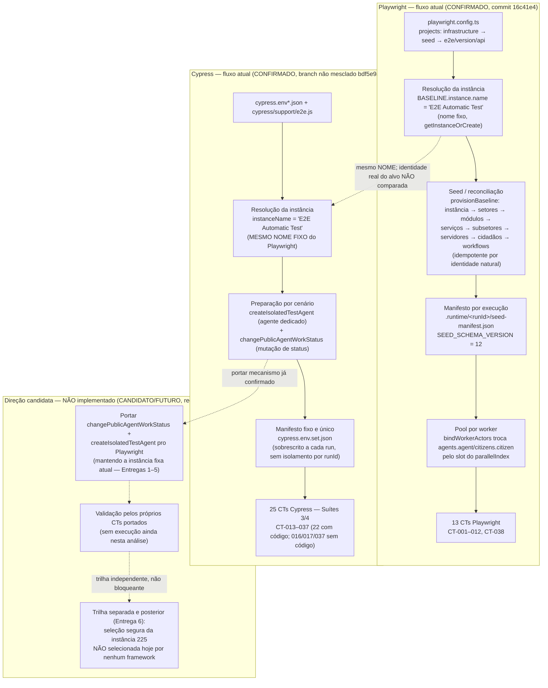

# Fluxo — Preset de dados (Playwright, Cypress e direção candidata)

> [!info]- Navegação
> **Índice/resumo:** [[Matriz - Análise do preset provável]] · **DISC-001 (arquitetura):** [[../01 Automação/01 - Plano de automação#DISC-001 — Auditoria do projeto, reconciliada com o código (07/10/2026)|Plano de automação]] · **DISC-002:** [[DISC-002 - Cobertura do TR e rastreabilidade dos CTs]] · **DISC-003:** [[DISC-003 - Dados, preparação e eixos]] · **DISC-004:** [[DISC-004 - Alternativas e recomendação]]

> [!warning] Nenhuma execução ou teste foi feito nesta análise
> Este fluxo é uma **síntese visual** do que DISC-001–004 já confirmaram por leitura de código (commits `16c41e4` e `bdf5e9a`) + do que o DISC-004 recomenda. Nenhum comando foi rodado, nenhuma configuração foi alterada, nenhuma instância foi criada ou selecionada pra produzir este diagrama. Linhas sólidas = confirmado/atual (DISC-001–003). Linhas tracejadas = candidato/futuro, ainda não implementado (DISC-004).

## Diagrama

## Como ler

- **Subgraph `PW` (Playwright) e `CY` (Cypress)**: cada etapa e seta sólida corresponde a algo lido diretamente no código — ver [[DISC-002 - Cobertura do TR e rastreabilidade dos CTs|DISC-002]] (quais CTs, qual arquivo) e [[DISC-003 - Dados, preparação e eixos|DISC-003]] (dados/config por etapa).
- **Seta tracejada entre `PW2` e `CY2`**: os dois frameworks resolvem a instância pelo **mesmo nome fixo** (`"E2E Automatic Test"`), mas isso **não prova que é a mesma instância real** — a identidade do alvo (backend/registro) nunca foi comparada entre os dois `.env`/`cypress.env*.json` (achado do DISC-003). O nome igual é uma coincidência de código, não uma evidência de infraestrutura compartilhada.
- **Subgraph `FUT` (direção candidata)**: nada aqui existe hoje. É a recomendação do [[DISC-004 - Alternativas e recomendação|DISC-004]] — portar pro Playwright os mecanismos já confirmados em Cypress, mantendo a instância atual, em 6 entregas pequenas e sequenciadas. A seleção da instância 225 (`F3`) é **a última etapa, não a primeira**, e está desenhada aqui só como destino de uma trilha separada — **não como algo já selecionado ou em andamento**.
- Nenhuma caixa deste diagrama representa execução real nesta análise; todas as setas "confirmado" vêm de leitura de código, não de rodar o automação.
