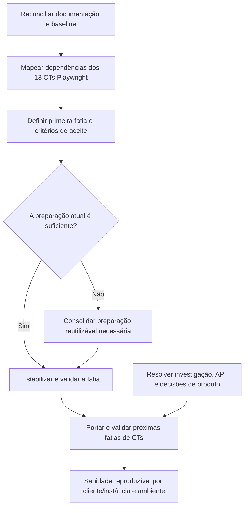

---
tags:
  - qa
  - automacao
  - roadmap
tipo: roadmap
demanda: SGV-11262
status: ativo
---
# Roadmap — Automação do Termo de Referência SOGOV

> [!info] Como usar este documento
> Este roadmap registra a direção, a ordem sugerida e as dependências da iniciativa. Ele não substitui os casos de teste, o plano ou o placar de uma entrega. Para localizar documentos e ciclos, consulte o [[Conhecimento/0 - SGV-11262 - Índice|Índice da SGV-11262]].

## Objetivo

Evoluir a automação dos requisitos do Termo de Referência em entregas pequenas, cada uma com escopo e validação próprios. A direção é permitir uma execução reproduzível da sanidade do SOGOV por cliente/instância e ambiente, reaproveitando os mecanismos de preparação já existentes sempre que fizer sentido.

O caminho começa pela estabilização e compreensão do que já existe. A execução configurável em diferentes clientes/instâncias e ambientes é objetivo da iniciativa e será alcançada incrementalmente, conforme os pré-requisitos técnicos forem conhecidos e entregues.

## Estado atual

O ciclo **TR 1.24–1.25 — Autenticação e ciclo de vida do usuário** está registrado na [[SGV-11971 - TR 1.24-1.25 Autenticação e Ciclo de Vida/00 QA/00 README|SGV-11971]]. Seus artefatos de QA — demanda, plano, casos, validação e preparação Qase — permanecem próprios desse ciclo. Os 38 CTs dessa entrega continuam sendo a referência funcional do escopo.

O placar de automação registra:

- **25/38 CTs aprovados** no histórico de validação;
- **13 CTs identificados em Playwright**, aprovados e sem falhas `@auth` no run de 06/10/2026;
- **12 CTs aprovados ainda associados ao Cypress**, pendentes de porte para Playwright;
- **4 CTs com falha/achado** (015, 029, 030 e 033);
- **6 CTs bloqueados** (022, 026, 028, 034, 035 e 036);
- **3 CTs aguardando código, captura de API ou investigação** (016, 017 e 037).

O fato de um CT estar verde não confirma, por si só, que seja independente e reproduzível em outra instância. A primeira investigação deve mapear essa propriedade nos 13 CTs Playwright, junto com seus dados, estados e mecanismos de preparação.

Segundo o hub atual da SGV-11971, CT-001–012 estão na `origin/main`; CT-038 passou em execuções repetidas, mas seu código ainda está em um worktree com `HEAD` destacado e sem commit. Confirmar essa situação ao reconciliar a baseline.

> [!warning] Números sujeitos a reconciliação
> As notas anteriores divergem sobre a quantidade restante a portar e algumas ainda descrevem Cypress como alvo. Até a revisão do pacote SGV-11971, use o placar em [[SGV-11971 - TR 1.24-1.25 Autenticação e Ciclo de Vida/01 Automação/02 - Validação automação|02 - Validação automação]] como referência dos estados por CT; o run de 06/10 cobre a suíte ampla e confirma apenas que os 13 CTs `@auth` não falharam naquela execução.

## Entregas existentes

| Entrega | Escopo | Situação |
|---|---|---|
| [[SGV-11971 - TR 1.24-1.25 Autenticação e Ciclo de Vida/00 QA/00 README\|SGV-11971 — TR 1.24–1.25]] | Ciclo funcional de autenticação e ciclo de vida: critérios, 38 CTs, validação e automação associada | 🔄 Em andamento; fonte atual dos CTs e do placar |
| Baseline Playwright — 13 CTs | CT-001 a CT-012 e CT-038 | ✅ Verdes no Playwright; independência e preparação ainda a mapear |

O pacote padrão de automação da entrega usa [[SGV-11971 - TR 1.24-1.25 Autenticação e Ciclo de Vida/01 Automação/00 - Automação|00 — Automação]], [[SGV-11971 - TR 1.24-1.25 Autenticação e Ciclo de Vida/01 Automação/01 - Plano de automação|01 — Plano de automação]] e [[SGV-11971 - TR 1.24-1.25 Autenticação e Ciclo de Vida/01 Automação/02 - Validação automação|02 — Validação automação]]. Os arquivos `03 - Handoff de execução` e `04 - Documentação de entrega` ainda existem no pacote antigo; não são parte do padrão atualizado. Sua destinação será decidida ao reconciliar a documentação, preservando informação útil.

## Próximos passos e entregas candidatas

As linhas abaixo são candidatas de roadmap, não demandas já criadas. O escopo final das implementações depende da investigação inicial.

| Ordem | Entrega / passo | Resultado esperado | Dependência | Situação |
|---:|---|---|---|---|
| 1 | **Reconciliar a documentação e o baseline** | Alinhar os estados e números entre índice, README, hub e placar; confirmar os 13 CTs Playwright e a situação real dos arquivos/código | Nenhuma | 🔜 Próximo passo — investigação |
| 2 | **Mapear dados e preparação dos 13 CTs** | Registrar por CT os dados consumidos, estados de negócio, dependências, IDs fixos e mecanismos existentes de setup/seed/fixture/API; avaliar independência e repetibilidade | Passo 1 | ⏳ Investigação proposta |
| 3 | **Definir a primeira fatia de estabilização** | Converter os achados em uma entrega pequena, com CTs exclusivos, critério de aceite e validação próprios | Passos 1 e 2 | 📝 A definir com base na análise |
| 4 | **Criar ou consolidar preparação reutilizável, se necessária** | Tornar reproduzíveis somente os dados/estados realmente exigidos pelos CTs priorizados, reaproveitando a arquitetura existente | Escopo demonstrado no passo 2; entrega do passo 3 quando houver dependência | 📝 Candidata; não assumir nova abstração `Preset` |
| 5 | **Portar e validar grupos restantes de CTs** | Evoluir a cobertura Playwright em fatias funcionais delimitadas, cada qual com seu próprio plano e placar | Análise das dependências e decisões dos CTs incluídos | 📝 Candidata; grupos a definir |
| 6 | **Desbloquear CTs pendentes de comportamento/API** | Separar descoberta de API, investigação de falhas e decisões de produto da tarefa de porte | Evidência ou decisão técnica/produto por CT | ⏳ Dependências abertas |
| 7 | **Executar a sanidade por cliente/instância e ambiente** | Permitir preparar e executar a cobertura validada com configuração explícita por cliente/instância e ambiente | Preparação reproduzível, configuração/auth compatíveis e entregas de cobertura necessárias | 🎯 Direção futura da iniciativa |

Cada futura entrega acompanhará apenas os CTs do seu escopo em seu pacote `00–02`. Se uma entrega for de preparação/infraestrutura, terá critérios de aceite próprios e CTs-piloto explícitos. O placar consolidado desta iniciativa deverá apontar para os resultados por entrega, sem duplicar a validação detalhada dos CTs.

## Ordem sugerida

## Critérios para abrir uma nova entrega

Criar uma demanda filha somente quando a análise confirmar uma fatia executável e revisável. O plano de cada entrega deve declarar problema, objetivo, CTs incluídos e excluídos, dados/estados necessários, dependências, estratégia e critério de aceite. A validação registra apenas os CTs daquela fatia; a nota da iniciativa mantém a visão geral e links para as entregas.

Não abrir agora demandas para todos os grupos restantes, nem assumir que é necessário construir um mecanismo chamado `Preset`. A investigação do código e dos 13 CTs atuais deve determinar a forma e a sequência das primeiras implementações.
