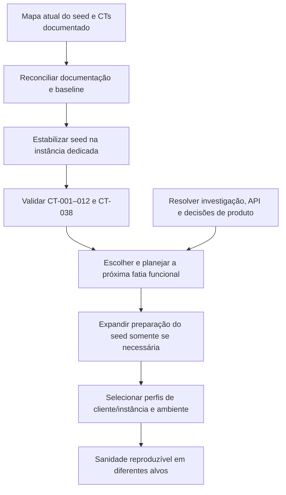

---
tags:
  - qa
  - automacao
  - roadmap
tipo: roadmap
demanda: SGV-11262
status: ativo
---
# Roadmap — Automação do Termo de Referência SOGOV

> [!info] Como usar este documento
> Este roadmap registra a direção, a ordem sugerida e as dependências da iniciativa. Ele não substitui os casos de teste, o plano ou o placar de uma entrega. Para localizar documentos e ciclos, consulte o [[Conhecimento/0 - SGV-11262 - Índice|Índice da SGV-11262]].

## Objetivo

Evoluir a automação dos requisitos do Termo de Referência em entregas pequenas, cada uma com escopo e validação próprios. A direção é permitir uma execução reproduzível da sanidade do SOGOV por cliente/instância e ambiente, reaproveitando os mecanismos de preparação já existentes sempre que fizer sentido.

O caminho começa pela estabilização e compreensão do que já existe. A execução configurável em diferentes clientes/instâncias e ambientes é objetivo da iniciativa e será alcançada incrementalmente, conforme os pré-requisitos técnicos forem conhecidos e entregues.

## Estado atual

O ciclo **TR 1.24–1.25 — Autenticação e ciclo de vida do usuário** está registrado na [[SGV-11971 - TR 1.24-1.25 Autenticação e Ciclo de Vida/00 QA/00 README|SGV-11971]]. Seus artefatos de QA — demanda, plano, casos, validação e preparação Qase — permanecem próprios desse ciclo. Os 38 CTs dessa entrega continuam sendo a referência funcional do escopo.

> [!success] Decisão de direção — 07/10/2026
> O primeiro alvo será uma **instância de teste dedicada e estável**, criada ou reconciliada pelo seed. Não vamos apontar o piloto para uma instância de cliente existente. A execução em diferentes clientes/instâncias continua como direção futura, evoluindo depois que este baseline estiver estável.

O placar de automação registra:

- **25/38 CTs aprovados** no histórico de validação;
- **13 CTs identificados em Playwright**, aprovados e sem falhas `@auth` no run de 06/10/2026;
- **12 CTs aprovados ainda associados ao Cypress**, sem porte Playwright confirmado; a prioridade e a fatia de porte devem ser definidas após a estabilização do baseline;
- **4 CTs com falha/achado** (015, 029, 030 e 033);
- **6 CTs bloqueados** (022, 026, 028, 034, 035 e 036);
- **3 CTs aguardando código, captura de API ou investigação** (016, 017 e 037).

O fato de um CT estar verde não confirma, por si só, que seja independente e reproduzível em outra instância. A leitura do código dos 13 CTs e do seed foi concluída; a independência operacional em outra instância ainda não foi demonstrada por execução.

**Mapeamento de código concluído em 07/10:** os 13 CTs são CT-001–012 e CT-038. Todos dependem do seed global, mas usam diretamente apenas a instância e atores por worker; nenhum usa módulo, serviço ou documento. O seed já é idempotente e grava um manifesto de IDs, mas hoje aponta para um perfil fixo de instância. O inventário detalhado e as ressalvas de cobertura estão em [[Conhecimento/Mapa do seed Playwright atual - SGV-11971|Mapa do seed Playwright atual]].

Na verificação de 07/10, CT-001–012 estavam em `origin/main`. CT-038 passou nos runs registrados, mas seu arquivo ainda está em um worktree com `HEAD` destacado (`16c41e4`) e sem commit. O destino desse arquivo precisa ser resolvido antes de encerrar uma entrega que o inclua.

## Entregas existentes

| Entrega | Escopo | Situação |
|---|---|---|
| [[SGV-11971 - TR 1.24-1.25 Autenticação e Ciclo de Vida/00 QA/00 README\|SGV-11971 — TR 1.24–1.25]] | Ciclo funcional de autenticação e ciclo de vida: critérios, 38 CTs, validação e automação associada | 🔄 Em andamento; fonte atual dos CTs e do placar |
| [[SGV-11971 - TR 1.24-1.25 Autenticação e Ciclo de Vida/Entrega 01 - Baseline de autenticação na instância 225/00 QA/00 README|Entrega 01 — Baseline na instância 225]] | Critérios próprios do seed + CT-001–012 e CT-038 da SGV-11971 | 📋 Pacotes QA e automação preparados; implementação e validação na 225 pendentes |

A Entrega 01 está organizada dentro da SGV-11971 em dois pacotes: `00 QA/` para escopo, plano, critérios técnicos e validação; `01 Automação/` para o hub, plano técnico e placar dos CTs funcionais incluídos. Cada próxima entrega seguirá o mesmo recorte e conterá apenas os CTs do seu escopo. Os arquivos `03 - Handoff de execução` e `04 - Documentação de entrega` ainda existem no pacote antigo; não são parte do padrão atualizado. Sua destinação será decidida ao reconciliar a documentação, preservando informação útil.

## Próximos passos e entregas candidatas

As linhas abaixo são candidatas de roadmap, não demandas já criadas. O escopo final das implementações depende da investigação inicial.

| Ordem | Entrega / passo | Resultado esperado | Dependência | Situação |
|---:|---|---|---|---|
| 1 | **Reconciliar documentação e baseline** | Alinhar números, framework-alvo e status entre índice, README, hub e placar; confirmar estado do código CT-038 | Mapeamento de código já feito | ✅ Documentos alinhados em 07/10; CT-038 confirmado em `HEAD` destacado, sem commit |
| 2 | **Estabilizar o baseline de autenticação na instância dedicada** | Usar a instância **ID 225 — “Termo De Referência - Sogov”**, configurar o seed para selecioná-la sem criar outra e validar atores por worker; depois executar CT-001–012 e CT-038. A entrega acompanha somente esses 13 CTs | Configuração do seed apontando ao mesmo backend da instância 225; resolver branch/commit do CT-038 antes do encerramento | 📋 Pacotes `00 QA` e `01 Automação/00–02` preparados dentro da SGV-11971; implementação pendente, sem ID de demanda filha |
| 3 | **Preparar a próxima fatia funcional** | Separar CTs restantes por estado de negócio e dependência; definir aceite e preparação somente para o grupo escolhido | Baseline da autenticação estabilizado e CTs mapeados | 📝 Candidata; grupos a definir |
| 4 | **Desbloquear CTs pendentes de comportamento/API** | Separar descoberta de API, investigação de falhas e decisões de produto da tarefa de porte | Evidência ou decisão técnica/produto por CT | ⏳ Dependências abertas |
| 5 | **Expandir a preparação conforme CTs priorizados** | Acrescentar apenas dados e estados necessários à próxima fatia; consultar o Roteiro de Sanidade 01 como contexto de negócio quando envolver implantação, órgãos, módulos ou permissões | Escopo e dependências confirmados para cada grupo de CTs | 📝 Candidata contínua; referência no [[Conhecimento/Mapa do seed Playwright atual - SGV-11971#Roteiro de Sanidade 01 — referência de contexto de negócio|Mapa do seed]] |
| 6 | **Selecionar perfis de instância por cliente/ambiente** | Evoluir da instância dedicada atual para execução controlada em diferentes instâncias/clientes e ambientes | Baseline dedicado estável; definir contrato de seleção, permissões e isolamento | 🎯 Objetivo futuro da iniciativa |
| 7 | **Executar a sanidade por cliente/instância e ambiente** | Preparar e executar a cobertura validada com configuração explícita por alvo e ambiente | Passos 3–6, autenticação e acesso compatíveis | 🎯 Direção da iniciativa, evolução incremental |

Cada futura entrega acompanhará apenas os CTs do seu escopo em seu pacote `00–02`. Se uma entrega for de preparação/infraestrutura, terá critérios de aceite próprios e CTs-piloto explícitos. O placar consolidado desta iniciativa deverá apontar para os resultados por entrega, sem duplicar a validação detalhada dos CTs.

## Ordem sugerida

## Critérios para abrir uma nova entrega

Criar uma demanda filha somente quando a análise confirmar uma fatia executável e revisável. O plano de cada entrega deve declarar problema, objetivo, CTs incluídos e excluídos, dados/estados necessários, dependências, estratégia e critério de aceite. A validação registra apenas os CTs daquela fatia; a nota da iniciativa mantém a visão geral e links para as entregas.

Não abrir agora demandas para todos os grupos restantes, nem assumir que é necessário construir um mecanismo chamado `Preset`. A investigação do código e dos 13 CTs atuais deve determinar a forma e a sequência das primeiras implementações.
