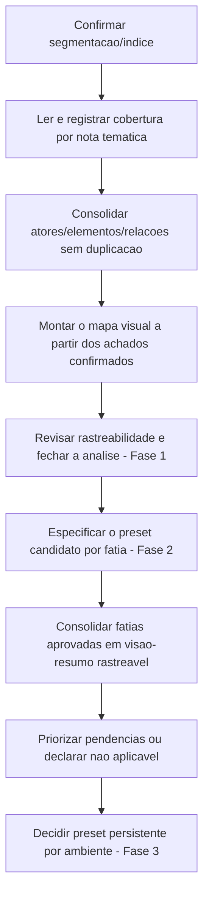

# Roadmap — Modelo de atores e preset do TR

> [!info] Diferença entre este Roadmap e o Índice
> Este documento registra a **direção, a sequência macro e as dependências** da iniciativa. Ele não substitui a navegação/localização de documentos — isso vive no [[Conhecimento/0 - SGV-11262 - Índice|Índice da SGV-11262]].

## Objetivo e limite de escopo

Construir um modelo de **atores, entidades, configurações, estados, relações e dependências** do SOGOV, com base no **Termo de Referência completo** (itens 1.1–1.43), que sirva de referência pra avaliar e preparar um preset de dados reproduzível.

**Fora de escopo até a decisão da Fase 3:** casos de teste (CTs), sincronização com a Qase, automação e qualquer implementação de preset. A Fase 2 (ver "Estado atual") especifica o preset candidato por cruzamento com seed/testes reais, mas não o implementa — isso só é decidido na Fase 3, com os achados consolidados em mãos.

## Estado atual

- **Abordagem anterior:** arquivada para consulta em [[Arquivo/Abordagem anterior/Roadmap - Automação TR|Arquivo/Abordagem anterior]] — referência de consulta, **não é fluxo ativo**.
- **Fase 1 — Modelo conceitual do TR completo:** ✅ **concluída** (09/10/2026). Segmentação em 11 recortes temáticos aprovada pelo Rafael (08/10/2026); os 11 recortes (itens 1.1–1.43) revisados e aprovados pelo Codex; revisão documental concluída (ver [[SGV-12082 - Mapeamento de atores e modelo do preset do TR/00 QA/04 - Revisão da análise|04 - Revisão da análise]]).
- **Fase 2 — Especificação do preset candidato (em andamento):** cruza cada item do TR com o que o seed/testes Playwright **reais** confirmam hoje — nunca implementa seed/preset. **16 fatias aprovadas pelo Codex** (notas 02–17, ver tabela "Status do trabalho" no [[SGV-12082 - Mapeamento de atores e modelo do preset do TR/00 QA/00 README|README do card]] para a lista completa e atualizada — não repetida aqui para não ficar obsoleta a cada fatia nova). **Próximo passo único, antes de qualquer fatia 18+:** consolidar essas 16 fatias numa visão-resumo rastreável, com vocabulário normalizado (ver passo 7 da sequência macro abaixo).
- **Fase 3 — Preset persistente por ambiente de QA:** ainda não iniciada; condicionada à consolidação da Fase 2 ser revisada. Premissa fixa: seed de alto custo, preparado **uma vez por ambiente** e persistente — não dados recriados por CT a cada execução. Esta fase não prescreve arquitetura/mecanismo agora.
- **Dúvidas de negócio (trilha paralela, não bloqueante):** levantadas durante o mapeamento (Fase 1) e ainda abertas — a primeira é se Canal Oficial (1.38.1.b) e Jornal Oficial (1.38.3.1) são o mesmo elemento (ver [[SGV-12082 - Mapeamento de atores e modelo do preset do TR/01 Modelo do preset/00 - Mapa geral#Lacunas registradas (arestas tracejadas)|lacunas no mapa geral]]). Não bloqueiam a Fase 2 nem a consolidação, **exceto** quando uma linha específica da especificação depender diretamente de uma delas.

## Entregas existentes

| Entrega | Referência | Escopo | Status |
|---|---|---|---|
| Ciclo 1.24-1.25 | [[Arquivo/Abordagem anterior/SGV-11971 - TR 1.24-1.25 Autenticação e Ciclo de Vida/Arquivo/00 QA/00 README\|SGV-11971]] | Autenticação e ciclo de vida do usuário (itens 1.24–1.25) | 🗄️ Histórico arquivado |
| Entrega 01 — Baseline na instância 225 | [[Arquivo/Abordagem anterior/SGV-11971 - TR 1.24-1.25 Autenticação e Ciclo de Vida/Entrega 01 - Baseline de autenticação na instância 225/00 QA/00 README\|Entrega 01]] | Piloto de seleção da instância 225 pelo seed | 🗄️ Histórico arquivado; não executada nem validada |
| SGV-12082 — Análise do TR e preset de dados (anterior) | [[Arquivo/Abordagem anterior/SGV-12082 - Análise do TR e preset de dados/00 QA/00 README\|SGV-12082 anterior]] | Mapa do projeto de automação, cobertura do TR (DISC-001–004) e recomendação de porte | 🗄️ Histórico arquivado; concluída com recomendação registrada |
| SGV-12082 — Mapeamento de atores e modelo do preset do TR (atual) | [[SGV-12082 - Mapeamento de atores e modelo do preset do TR/00 QA/00 README\|SGV-12082 atual]] | Modelo de atores/entidades/relações a partir do TR completo | ✅ Fase 1 concluída (11 recortes revisados e aprovados pelo Codex); 🔵 Fase 2 em andamento (16 fatias aprovadas, 02–17; próximo passo é a consolidação); dúvidas de negócio seguem registradas em aberto, em trilha paralela |

## Sequência macro da SGV-12082

A ordem abaixo é macro, verificável por etapa e com gates — não antecipa achados de domínio (atores, estados, relações), só o fluxo de trabalho.

1. **Confirmar segmentação/índice** — ✅ **concluído**: o recorte temático do TR completo (11 notas em `01 Modelo do preset/Seções do TR/`, indexadas pela [[SGV-12082 - Mapeamento de atores e modelo do preset do TR/01 Modelo do preset/01 - Matriz de atores e relações|matriz]]) foi validado contra o PDF e **aprovado pelo Rafael** (08/10/2026), junto com demanda e plano de análise.
2. **Ler e registrar cobertura por nota temática** — ✅ **concluído**: todos os 11 recortes (itens 1.1–1.43) foram lidos, classificados (mapeado/não aplicável/pendente) e registrados com elementos, relações, dúvidas e fontes, com página/referência do TR, revisados e aprovados pelo Codex. **Gate cumprido:** cada recorte só avançou após a revisão do anterior; não há mais recorte pendente de leitura.
3. **Consolidar atores/elementos/estados/relações sem duplicação** — a matriz central permanece só como índice dos recortes (intervalo de itens/páginas, status, link); nenhum elemento/relação é copiado pra fora da nota temática que o registrou. **Gate:** não há consolidação de recorte que ainda não tenha sido lido.
4. **Montar o Mermaid a partir dos achados confirmados** — síntese visual no mapa geral, usando só o que já estiver confirmado nas notas temáticas. **Gate:** o mapa nunca antecipa conteúdo que as notas ainda não têm.
5. **Revisar rastreabilidade e fechar a análise (Fase 1)** — ✅ **concluído**: cobertura completa conferida (nenhum item do TR omitido), consistência entre notas temáticas e mapa revisada (ver [[SGV-12082 - Mapeamento de atores e modelo do preset do TR/00 QA/04 - Revisão da análise|04 - Revisão da análise]]). **Gate cumprido:** a decisão tomada foi abrir a Fase 2 (passo 6) com os achados em mãos.
6. **Especificar o preset candidato por fatia (Fase 2)** — 🔵 **em andamento**: cada fatia liga um item/subitem do TR ao que o seed/testes Playwright reais confirmam hoje, distinguindo baseline reutilizável, ação de teste, consulta e dependência observada, com revisão do Codex por fatia antes de aprovar. 16 fatias aprovadas (notas 02–17). **Gate:** cada fatia só vira `aprovado` depois de revisão explícita; nenhuma fatia antecipa conteúdo de recorte ainda não lido na Fase 1.
7. **Consolidar as fatias aprovadas numa visão-resumo rastreável** — ⏳ **próximo passo único**: reunir as 16 fatias (02–17) num resumo sem duplicar as notas-fonte, com vocabulário normalizado (classes: baseline persistente reutilizável; ação de teste/temporária; consulta; dependência observada; comportamento de tela quando aplicável) e colunas para requisito/referência do TR, ator/entidade/dado/estado/relação, classe, evidência/link, certeza (confirmado/inferido/a confirmar) e lacuna/decisão. **Gate:** nenhuma fatia nova (18+) abre antes desta consolidação ser revisada.
8. **Priorizar pendências ou declarar não aplicável/fora do preset** — depende do passo 7: usar a visão-resumo para decidir, item a item do TR ainda não especificado, se vira fatia futura ou é marcado não aplicável/fora do preset, com justificativa. **Gate:** só acontece depois da consolidação (passo 7) estar revisada.
9. **Decidir o preset persistente por ambiente (Fase 3)** — ainda não iniciado; condicionado ao passo 8. Premissa fixa: seed de alto custo, preparado uma vez por ambiente de QA e persistente, não recriado por CT a cada execução — esta fase não prescreve arquitetura/mecanismo agora.

## Dependências e gates

- O passo 2 (ler por recorte) só começa depois do passo 1 (segmentação/índice confirmados).
- O passo 3 (consolidação dos recortes) é alimentado continuamente conforme recortes do passo 2 são concluídos — não é uma etapa única no fim, mas nunca adianta um recorte ainda não lido.
- O passo 4 (Mermaid do mapa geral) depende do que já estiver confirmado nas notas temáticas — nunca antecipa conteúdo que elas ainda não tenham.
- O passo 5 (fechamento da Fase 1) depende de todos os recortes terem passado pelo passo 2; a decisão de abrir a Fase 2 (passo 6) só aconteceu depois da revisão de rastreabilidade.
- O passo 6 (fatias da Fase 2) só referencia recortes já lidos/aprovados na Fase 1; cada fatia é revisada e aprovada individualmente pelo Codex antes da próxima.
- O passo 7 (consolidação) é o gate atual: **nenhuma fatia nova (18+) deve abrir antes dessa consolidação ser revisada** — isso vale mesmo que o passo 6 ainda tenha itens do TR sem fatia própria.
- O passo 8 (priorização/não aplicável) só usa a visão-resumo depois de revisada no passo 7.
- O passo 9 (Fase 3) só é avaliado depois do passo 8; não há compromisso de arquitetura/mecanismo antes disso.
- Dúvidas de negócio (trilha paralela, ver "Estado atual") não bloqueiam os passos 6–8, exceto quando uma linha específica da especificação depender diretamente de uma delas — nesse caso, a linha fica registrada como pendente da dúvida correspondente, sem travar o restante da consolidação.

## Direção futura — Fase 3 (condicionada, sem compromisso de implementação)

A Fase 3 — desenhar/implementar um preset de dados reproduzível por **cliente/instância** e por **ambiente** — segue **condicionada** ao resultado revisado da consolidação da Fase 2 (passos 7–8 acima). Isso não é mais um horizonte inteiramente hipotético: a Fase 2 já está em andamento (16 fatias aprovadas) e alimenta diretamente essa decisão — mas a decisão de design/implementação em si, e qualquer compromisso de arquitetura ou mecanismo técnico, só acontece depois que a consolidação existir e for revisada.

---

Para localizar documentos, ciclos e a estrutura de pastas da iniciativa, use o [[Conhecimento/0 - SGV-11262 - Índice|Índice da SGV-11262]] — este Roadmap não duplica essa navegação.
