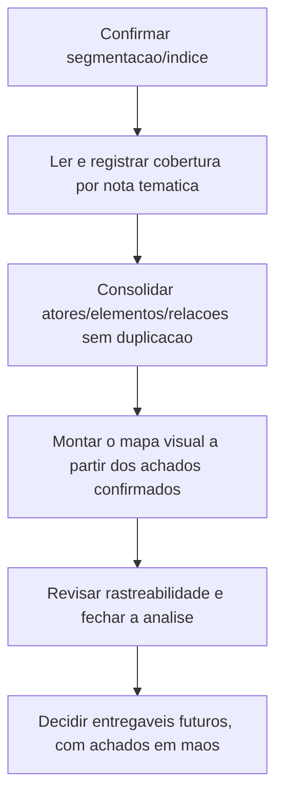

# Roadmap — Modelo de atores e preset do TR

> [!info] Diferença entre este Roadmap e o Índice
> Este documento registra a **direção, a sequência macro e as dependências** da iniciativa. Ele não substitui a navegação/localização de documentos — isso vive no [[Conhecimento/0 - SGV-11262 - Índice|Índice da SGV-11262]].

## Objetivo e limite de escopo

Construir um modelo de **atores, entidades, configurações, estados, relações e dependências** do SOGOV, com base no **Termo de Referência completo** (itens 1.1–1.43), que sirva de referência pra avaliar e preparar um preset de dados reproduzível.

**Fora de escopo nesta fase:** casos de teste (CTs), sincronização com a Qase, automação e qualquer implementação de preset. Esses são trabalhos separados, a decidir depois que o modelo existir com evidência.

## Estado atual

- **Abordagem anterior:** arquivada para consulta em [[Arquivo/Abordagem anterior/Roadmap - Automação TR|Arquivo/Abordagem anterior]] — referência de consulta, **não é fluxo ativo**.
- **SGV-12082 (atual):** segmentação em 11 recortes temáticos **aprovada pelo Rafael** (08/10/2026). Leitura iniciada pelo **recorte 1** (itens 1.1–1.23), lido e classificado contra o PDF, aguardando revisão do Codex. **Recortes 2–11 ainda não lidos** — a análise não está completa.

## Entregas existentes

| Entrega | Referência | Escopo | Status |
|---|---|---|---|
| Ciclo 1.24-1.25 | [[Arquivo/Abordagem anterior/SGV-11971 - TR 1.24-1.25 Autenticação e Ciclo de Vida/Arquivo/00 QA/00 README\|SGV-11971]] | Autenticação e ciclo de vida do usuário (itens 1.24–1.25) | 🗄️ Histórico arquivado |
| Entrega 01 — Baseline na instância 225 | [[Arquivo/Abordagem anterior/SGV-11971 - TR 1.24-1.25 Autenticação e Ciclo de Vida/Entrega 01 - Baseline de autenticação na instância 225/00 QA/00 README\|Entrega 01]] | Piloto de seleção da instância 225 pelo seed | 🗄️ Histórico arquivado; não executada nem validada |
| SGV-12082 — Análise do TR e preset de dados (anterior) | [[Arquivo/Abordagem anterior/SGV-12082 - Análise do TR e preset de dados/00 QA/00 README\|SGV-12082 anterior]] | Mapa do projeto de automação, cobertura do TR (DISC-001–004) e recomendação de porte | 🗄️ Histórico arquivado; concluída com recomendação registrada |
| SGV-12082 — Mapeamento de atores e modelo do preset do TR (atual) | [[SGV-12082 - Mapeamento de atores e modelo do preset do TR/00 QA/00 README\|SGV-12082 atual]] | Modelo de atores/entidades/relações a partir do TR completo | 🔵 Segmentação (11 recortes) aprovada; recorte 1 (1.1–1.23) lido, aguardando revisão do Codex; recortes 2–11 não iniciados |

## Sequência macro da SGV-12082

A ordem abaixo é macro, verificável por etapa e com gates — não antecipa achados de domínio (atores, estados, relações), só o fluxo de trabalho.

1. **Confirmar segmentação/índice** — validar o recorte temático proposto do TR completo (11 notas em `01 Modelo do preset/Seções do TR/`, indexadas pela [[SGV-12082 - Mapeamento de atores e modelo do preset do TR/01 Modelo do preset/01 - Matriz de atores e relações|matriz]]) contra o PDF, junto com demanda e plano de análise. **Gate:** nenhuma leitura de conteúdo começa antes dessa confirmação.
2. **Ler e registrar cobertura por nota temática** — percorrer cada recorte, classificando os itens (mapeado/não aplicável/pendente) e registrando elementos, relações, dúvidas e fontes, com página/referência do TR. **Gate:** só avança recorte a recorte depois do passo 1 aprovado.
3. **Consolidar atores/elementos/estados/relações sem duplicação** — a matriz central permanece só como índice dos recortes (intervalo de itens/páginas, status, link); nenhum elemento/relação é copiado pra fora da nota temática que o registrou. **Gate:** não há consolidação de recorte que ainda não tenha sido lido.
4. **Montar o Mermaid a partir dos achados confirmados** — síntese visual no mapa geral, usando só o que já estiver confirmado nas notas temáticas. **Gate:** o mapa nunca antecipa conteúdo que as notas ainda não têm.
5. **Revisar rastreabilidade e fechar a análise** — conferir cobertura completa (nenhum item do TR omitido), consistência entre notas temáticas e mapa, e só então decidir, com os achados em mãos, se há entregáveis futuros separados (ex.: casos de teste, preset executável). **Gate:** nenhuma entrega futura é proposta antes dessa revisão.

## Dependências e gates

- O passo 2 (ler por recorte) só começa depois do passo 1 (segmentação/índice confirmados).
- O passo 3 (consolidação) é alimentado continuamente conforme recortes do passo 2 são concluídos — não é uma etapa única no fim, mas nunca adianta um recorte ainda não lido.
- O passo 4 (Mermaid) depende do que já estiver confirmado nas notas temáticas — nunca antecipa conteúdo que elas ainda não tenham.
- O passo 5 (fechamento) depende de todos os recortes terem passado pelo passo 2; a decisão sobre entregáveis futuros (parte final do passo 5) só acontece depois da revisão de rastreabilidade.

## Direção futura (condicionada, sem compromisso de implementação)

Uma direção possível, **ainda futura e condicionada ao resultado desta análise**: usar o modelo de atores/relações como base para avaliar e preparar um preset de dados reproduzível por **cliente/instância** e por **ambiente**. Isso não é uma decisão de implementação — é um horizonte que só se torna concreto depois que o modelo tiver evidência suficiente (passos 1–5 acima).

---

Para localizar documentos, ciclos e a estrutura de pastas da iniciativa, use o [[Conhecimento/0 - SGV-11262 - Índice|Índice da SGV-11262]] — este Roadmap não duplica essa navegação.
