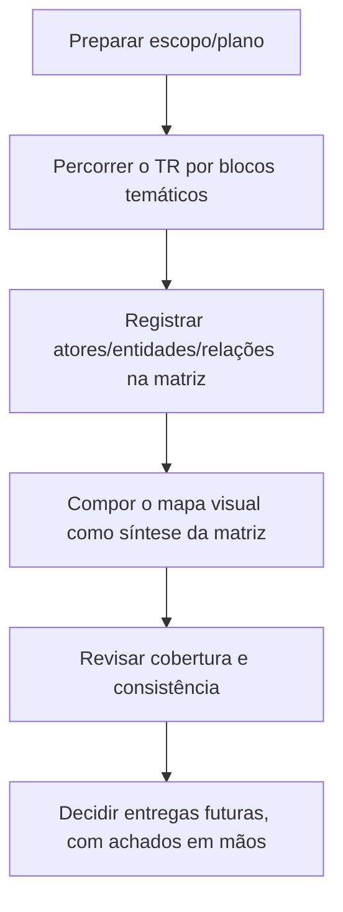

# Roadmap — Modelo de atores e preset do TR

> [!info] Diferença entre este Roadmap e o Índice
> Este documento registra a **direção, a sequência macro e as dependências** da iniciativa. Ele não substitui a navegação/localização de documentos — isso vive no [[Conhecimento/0 - SGV-11262 - Índice|Índice da SGV-11262]].

## Objetivo e limite de escopo

Construir um modelo de **atores, entidades, configurações, estados, relações e dependências** do SOGOV, com base no **Termo de Referência completo** (itens 1.1–1.43), que sirva de referência pra avaliar e preparar um preset de dados reproduzível.

**Fora de escopo nesta fase:** casos de teste (CTs), sincronização com a Qase, automação e qualquer implementação de preset. Esses são trabalhos separados, a decidir depois que o modelo existir com evidência.

## Estado atual

- **Abordagem anterior:** arquivada, intacta, em [[Arquivo/Abordagem anterior/Roadmap - Automação TR|Arquivo/Abordagem anterior]] — referência de consulta, **não é fluxo ativo**.
- **SGV-12082 (atual):** em **scaffold** — estrutura de pastas e notas criada em 08/10/2026 (`00 QA/`, `01 Modelo do preset/`, `Fontes/`), sem conteúdo analítico ainda. Estrutura inicial aprovada; pacote sendo alinhado antes do início do mapeamento.

## Entregas existentes

| Entrega | Referência | Escopo | Status |
|---|---|---|---|
| Ciclo 1.24-1.25 | [[Arquivo/Abordagem anterior/SGV-11971 - TR 1.24-1.25 Autenticação e Ciclo de Vida/Arquivo/00 QA/00 README\|SGV-11971]] | Autenticação e ciclo de vida do usuário (itens 1.24–1.25) | 🗄️ Histórico arquivado |
| Entrega 01 — Baseline na instância 225 | [[Arquivo/Abordagem anterior/SGV-11971 - TR 1.24-1.25 Autenticação e Ciclo de Vida/Entrega 01 - Baseline de autenticação na instância 225/00 QA/00 README\|Entrega 01]] | Piloto de seleção da instância 225 pelo seed | 🗄️ Histórico arquivado; não executada nem validada |
| SGV-12082 — Análise do TR e preset de dados (anterior) | [[Arquivo/Abordagem anterior/SGV-12082 - Análise do TR e preset de dados/00 QA/00 README\|SGV-12082 anterior]] | Mapa do projeto de automação, cobertura do TR (DISC-001–004) e recomendação de porte | 🗄️ Histórico arquivado; concluída com recomendação registrada |
| SGV-12082 — Mapeamento de atores e modelo do preset do TR (atual) | [[SGV-12082 - Mapeamento de atores e modelo do preset do TR/00 QA/00 README\|SGV-12082 atual]] | Modelo de atores/entidades/relações a partir do TR completo | 🧱 Estrutura aprovada; pacote em alinhamento antes do mapeamento |

## Sequência macro da SGV-12082

A ordem abaixo é macro e não antecipa subentregas, blocos temáticos ou quantidade de etapas — isso é definido durante a própria análise, com evidência.

1. **Preparar escopo e plano** — fechar demanda e plano de análise (ver [[SGV-12082 - Mapeamento de atores e modelo do preset do TR/00 QA/02 - Plano de análise|Plano de análise]]).
2. **Percorrer o TR completo progressivamente**, por blocos temáticos — os blocos e a quantidade são definidos durante a análise, não presumidos aqui.
3. **Registrar na matriz** ([[SGV-12082 - Mapeamento de atores e modelo do preset do TR/01 Modelo do preset/01 - Matriz de atores e relações|Matriz de atores e relações]]): atores/entidades, atributos/dados, configurações, estados, relações/dependências e a fonte/item do TR correspondente.
4. **Compor o Mermaid** ([[SGV-12082 - Mapeamento de atores e modelo do preset do TR/01 Modelo do preset/00 - Mapa geral|Mapa geral]]) como síntese visual da matriz — a matriz é a fonte detalhada; o mapa é o resumo visual, não uma segunda fonte.
5. **Revisão de cobertura e consistência** do que foi mapeado contra o TR.
6. **Decidir, com os achados em mãos**, se há entregas futuras separadas (ex.: casos de teste, preset executável) — nenhuma é aberta antes disso.

## Dependências e gates

- O passo 2 (percorrer o TR) só avança depois do passo 1 (escopo/plano fechados).
- O passo 3 (matriz) é alimentado continuamente enquanto o passo 2 avança por blocos — não é uma etapa única no fim.
- O passo 4 (Mermaid) depende do que já estiver registrado na matriz — nunca antecipa conteúdo que a matriz ainda não tem.
- O passo 6 (decisão de entregas futuras) depende da revisão de cobertura (passo 5); nenhuma entrega nasce antes dessa revisão.

## Direção futura (condicionada, sem compromisso de implementação)

Uma direção possível, **ainda futura e condicionada ao resultado desta análise**: usar o modelo de atores/relações como base para avaliar e preparar um preset de dados reproduzível por **cliente/instância** e por **ambiente**. Isso não é uma decisão de implementação — é um horizonte que só se torna concreto depois que o modelo tiver evidência suficiente (passos 1–6 acima).

---

Para localizar documentos, ciclos e a estrutura de pastas da iniciativa, use o [[Conhecimento/0 - SGV-11262 - Índice|Índice da SGV-11262]] — este Roadmap não duplica essa navegação.
