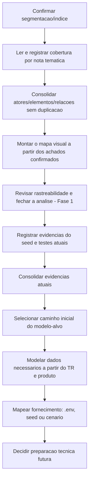

# Roadmap — Modelo de atores e preset do TR

> [!info] Diferença entre este Roadmap e o Índice
> Este documento registra a **direção, a sequência macro e as dependências** da iniciativa. Ele não substitui a navegação/localização de documentos — isso vive no [[Conhecimento/0 - SGV-11262 - Índice|Índice da SGV-11262]].

## Objetivo e limite de escopo

Construir um modelo de **atores, entidades, configurações, estados, relações e dependências** do SOGOV, com base no **Termo de Referência completo** (itens 1.1–1.43), que sirva de referência pra avaliar e preparar um preset de dados reproduzível.

**Fora de escopo nesta demanda:** escrever/alterar CTs, sincronizar com a Qase, automatizar ou implementar o seed/preset. As fatias e a consolidação da Fase 2 registram evidências sobre o seed/testes atuais; elas não definem nem limitam o modelo-alvo. O próximo produto desta demanda é o modelo dos dados necessários aos cenários de sanidade, derivado do TR e da documentação de produto.

## Estado atual

- **Abordagem anterior:** arquivada para consulta em [[Arquivo/Abordagem anterior/Roadmap - Automação TR|Arquivo/Abordagem anterior]] — referência de consulta, **não é fluxo ativo**.
- **Fase 1 — Modelo conceitual do TR completo:** ✅ **concluída** (09/10/2026). Segmentação em 11 recortes temáticos aprovada pelo Rafael (08/10/2026); os 11 recortes (itens 1.1–1.43) revisados e aprovados pelo Codex; revisão documental concluída (ver [[SGV-12082 - Mapeamento de atores e modelo do preset do TR/00 QA/04 - Revisão da análise|04 - Revisão da análise]]).
- **Fase 2 — Evidências da automação atual (concluída):** 17 fatias aprovadas pelo Codex (notas 02–18) e consolidação aprovada registram o que os testes e o seed atuais demonstram. São referência técnica para rastreabilidade e possível reaproveitamento, não especificação do preset-alvo.
- **Triagem do caminho inicial:** ✅ **concluída** como seleção da ordem de partida. A nota [[SGV-12082 - Mapeamento de atores e modelo do preset do TR/01 Modelo do preset/03 - Triagem dos itens sem fatia (passo 8)|03 - Triagem dos itens sem fatia]] foi aprovada para orientar o modelo-alvo; extensões e dúvidas continuam abertas, sem exclusão de requisitos. A aprovação do caminho não confirma automaticamente as evidências técnicas de cada linha.
- **Fase 3 — Modelo-alvo dos dados do preset (ativa):** derivar do TR e da documentação do produto os atores, entidades, configurações, estados e relações necessários aos cenários de sanidade. Primeiro se define o dado necessário; depois se mapeia, campo a campo, o que será fornecido pelo `.env` individual, pelo seed persistente ou durante o cenário de teste. Não implementa o preset nem cria CTs.
- **Etapa futura, ainda sem compromisso:** após revisar o modelo-alvo, decidir a preparação técnica e a persistência por ambiente/instância. A hipótese de seed de alto custo preparado uma vez continua relevante, mas não exclui dados fornecidos pelo `.env` individual nem define arquitetura agora.
- **Dúvidas de negócio (trilha paralela):** levantadas durante o mapeamento (Fase 1) — Canal Oficial (1.38.1.b) e Jornal Oficial (1.38.3.1) foram esclarecidos no contexto do produto atual em 13/10/2026 (mesmo fluxo de divulgação externa, via [[QA Workspace/04 Conhecimento/Módulos/Divulgar Documento|Divulgar Documento]]); outras seguem abertas (ver [[SGV-12082 - Mapeamento de atores e modelo do preset do TR/01 Modelo do preset/00 - Mapa geral#Lacunas registradas (arestas tracejadas)|lacunas no mapa geral]]). Não bloqueiam a seleção do caminho inicial nem o modelo-alvo; quando uma dúvida afetar um dado específico, esse ponto fica marcado como aberto e pode ser aprofundado depois.

## Entregas existentes

| Entrega | Referência | Escopo | Status |
|---|---|---|---|
| Ciclo 1.24-1.25 | [[Arquivo/Abordagem anterior/SGV-11971 - TR 1.24-1.25 Autenticação e Ciclo de Vida/Arquivo/00 QA/00 README\|SGV-11971]] | Autenticação e ciclo de vida do usuário (itens 1.24–1.25) | 🗄️ Histórico arquivado |
| Entrega 01 — Baseline na instância 225 | [[Arquivo/Abordagem anterior/SGV-11971 - TR 1.24-1.25 Autenticação e Ciclo de Vida/Entrega 01 - Baseline de autenticação na instância 225/00 QA/00 README\|Entrega 01]] | Piloto de seleção da instância 225 pelo seed | 🗄️ Histórico arquivado; não executada nem validada |
| SGV-12082 — Análise do TR e preset de dados (anterior) | [[Arquivo/Abordagem anterior/SGV-12082 - Análise do TR e preset de dados/00 QA/00 README\|SGV-12082 anterior]] | Mapa do projeto de automação, cobertura do TR (DISC-001–004) e recomendação de porte | 🗄️ Histórico arquivado; concluída com recomendação registrada |
| SGV-12082 — Mapeamento de atores e modelo do preset do TR (atual) | [[SGV-12082 - Mapeamento de atores e modelo do preset do TR/00 QA/00 README\|SGV-12082 atual]] | Modelo-alvo dos dados necessários aos cenários do TR | ✅ Fase 1 e evidências atuais concluídas; ✅ caminho-base aprovado; 🔵 modelo-alvo em elaboração |

## Sequência macro da SGV-12082

A ordem abaixo é macro, verificável por etapa e com gates — não antecipa achados de domínio (atores, estados, relações), só o fluxo de trabalho.

1. **Confirmar segmentação/índice** — ✅ **concluído**: o recorte temático do TR completo (11 notas em `01 Modelo do preset/Seções do TR/`, indexadas pela [[SGV-12082 - Mapeamento de atores e modelo do preset do TR/01 Modelo do preset/01 - Matriz de atores e relações|matriz]]) foi validado contra o PDF e **aprovado pelo Rafael** (08/10/2026), junto com demanda e plano de análise.
2. **Ler e registrar cobertura por nota temática** — ✅ **concluído**: todos os 11 recortes (itens 1.1–1.43) foram lidos, classificados (mapeado/não aplicável/pendente) e registrados com elementos, relações, dúvidas e fontes, com página/referência do TR, revisados e aprovados pelo Codex. **Gate cumprido:** cada recorte só avançou após a revisão do anterior; não há mais recorte pendente de leitura.
3. **Consolidar atores/elementos/estados/relações sem duplicação** — a matriz central permanece só como índice dos recortes (intervalo de itens/páginas, status, link); nenhum elemento/relação é copiado pra fora da nota temática que o registrou. **Gate:** não há consolidação de recorte que ainda não tenha sido lido.
4. **Montar o Mermaid a partir dos achados confirmados** — síntese visual no mapa geral, usando só o que já estiver confirmado nas notas temáticas. **Gate:** o mapa nunca antecipa conteúdo que as notas ainda não têm.
5. **Revisar rastreabilidade e fechar a análise (Fase 1)** — ✅ **concluído**: cobertura completa conferida (nenhum item do TR omitido), consistência entre notas temáticas e mapa revisada (ver [[SGV-12082 - Mapeamento de atores e modelo do preset do TR/00 QA/04 - Revisão da análise|04 - Revisão da análise]]). **Gate cumprido:** a decisão tomada foi abrir a Fase 2 (passo 6) com os achados em mãos.
6. **Registrar evidências da automação atual** — ✅ **concluído**: 17 fatias revisadas individualmente (notas 02–18), distinguindo o que o seed/testes mostram hoje, suas lacunas e as incertezas. Esse levantamento informa, mas não define, o preset-alvo.
7. **Consolidar as evidências atuais** — ✅ **concluído**: ver [[SGV-12082 - Mapeamento de atores e modelo do preset do TR/01 Modelo do preset/02 - Visão consolidada do preset candidato|02 - Visão consolidada do preset candidato]]. Não é uma especificação final do modelo-alvo.
8. **Selecionar o caminho inicial para o modelo-alvo** — ✅ **concluído**: o caminho-base da nota 03 foi aprovado para iniciar o modelo, preservando extensões e dúvidas como aprofundamentos posteriores. Não foi necessário declarar requisitos fora do preset nem fechar todas as questões.
9. **Construir o modelo-alvo do preset** — 🔵 **em andamento**: modelar atores, dados, configurações, estados e relações necessários aos cenários de sanidade do TR completo, com origem rastreável em TR/produto. Só depois de definido o que é necessário, atribuir cada campo ao `.env` individual, seed persistente ou cenário de teste. Nenhum CT ou código de seed é produzido nesta etapa.
10. **Decidir a preparação técnica** — futura, depois da revisão do modelo-alvo: determinar persistência, reconciliação e execução por ambiente/instância. A hipótese de seed persistente de alto custo permanece, junto com o fornecimento de dados pelo `.env`; arquitetura não está decidida.

```mermaid
flowchart TD
    A[Confirmar segmentacao/indice] --> B[Ler e registrar cobertura por nota tematica]
    B --> C[Consolidar atores/elementos/relacoes sem duplicacao]
    C --> D[Montar o mapa visual a partir dos achados confirmados]
    D --> E[Revisar rastreabilidade e fechar a analise - Fase 1]
    E --> F[Registrar evidencias do seed e testes atuais]
    F --> G[Consolidar evidencias atuais]
    G --> H[Selecionar caminho inicial do modelo-alvo]
    H --> I[Modelar dados necessarios a partir do TR e produto]
    I --> J[Mapear fornecimento: .env, seed ou cenario]
    J --> K[Decidir preparacao tecnica futura]
```

## Dependências e gates

- O passo 2 (ler por recorte) só começa depois do passo 1 (segmentação/índice confirmados).
- O passo 3 (consolidação dos recortes) é alimentado continuamente conforme recortes do passo 2 são concluídos — não é uma etapa única no fim, mas nunca adianta um recorte ainda não lido.
- O passo 4 (Mermaid do mapa geral) depende do que já estiver confirmado nas notas temáticas — nunca antecipa conteúdo que elas ainda não tenham.
- O passo 5 (fechamento da Fase 1) depende de todos os recortes terem passado pelo passo 2; a decisão de abrir a Fase 2 (passo 6) só aconteceu depois da revisão de rastreabilidade.
- O passo 6 está **concluído** como inventário de evidências atuais, sem impor os limites do seed ao modelo-alvo.
- O passo 7 está **concluído** como consolidação dessas evidências.
- O passo 8 está concluído como seleção do ponto de partida; não significa que todas as dúvidas ou classificações técnicas tenham sido encerradas.
- O passo 9 deriva o modelo-alvo do TR e do produto; os passos 9 e 10 não implementam seed nem automação.
- O mapeamento de campo para `.env`, seed persistente ou cenário de teste vem depois da definição das necessidades, não antes.
- Dúvidas de negócio (trilha paralela, ver "Estado atual") não bloqueiam o modelo-alvo como um todo; quando um elemento específico depender diretamente de uma delas, ele permanece marcado como pendente, sem travar o restante do modelo.

## Resultado esperado e etapa técnica futura

O resultado desta demanda é o **modelo-alvo rastreável** dos dados necessários aos cenários de sanidade do TR. A futura preparação reproduzível por ambiente/instância será decidida a partir desse modelo; a etapa de preparação técnica e qualquer implementação permanecem fora do escopo atual.

---

Para localizar documentos, ciclos e a estrutura de pastas da iniciativa, use o [[Conhecimento/0 - SGV-11262 - Índice|Índice da SGV-11262]] — este Roadmap não duplica essa navegação.
