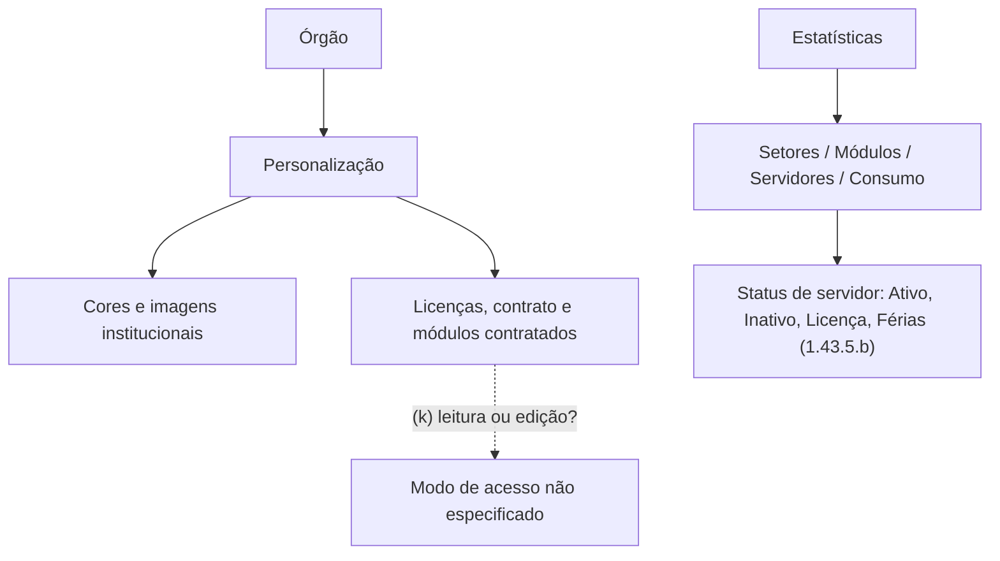

# Mapa geral — Modelo do preset (SGV-12082)

> [!info]- Navegação QA
> **README do card:** [[../00 QA/00 README|Abrir README do card]]
> **Demanda:** [[../00 QA/01 - Demanda]]
> **Plano de análise:** [[../00 QA/02 - Plano de análise]]
> **Matriz de atores e relações:** [[01 - Matriz de atores e relações]]
> **Revisão da análise:** [[../00 QA/04 - Revisão da análise]]

> [!info] Síntese derivada das 11 notas de recorte aprovadas (revisão de cobertura em 09/10/2026)
> Este mapa é um **resumo visual de alto nível**, derivado das 11 notas temáticas em `Seções do TR/` (ver [[01 - Matriz de atores e relações|Matriz de atores e relações]]), todas já revisadas e aprovadas pelo Codex. Ele **não substitui** essas notas nem o PDF ([[../Fontes/Termo de Referência SOGOV.pdf|Termo de Referência SOGOV.pdf]]) — ambos continuam sendo a fonte da verdade; este diagrama é só uma visão consolidada, agrupada por tema (não por recorte), para orientar a evolução do modelo do preset. As relações mostradas já estão documentadas nas notas de origem; nenhuma lacuna foi resolvida ou inferida aqui.

## Diagramas — leitura vertical por tema

Os diagramas menores seguem a hierarquia de cima para baixo. A sequência entre diagramas organiza a leitura, sem indicar dependência; relações entre temas ficam na tabela seguinte.

### 1. Órgão e níveis de acesso

> Diagrama movido para [[Seções do TR/03 - Estrutura organizacional e cadastro de servidores (1.26–1.27)#Modelo visual|Modelo visual]], no recorte 03.

### 2. Estado de atividade e presença do servidor

> Diagrama dividido: ciclo de autenticação (1.25.3) movido para [[Seções do TR/02 - Autenticação e ciclo de vida da identidade (1.24–1.25)#Modelo visual|Modelo visual]], no recorte 02; status de atividade, presença e listagem (1.27.10.1/1.27.11.2) movidos para [[Seções do TR/03 - Estrutura organizacional e cadastro de servidores (1.26–1.27)#Status de atividade e presença|Status de atividade e presença]], no recorte 03.

### 3. Bloqueio por tentativas de acesso

> Diagrama movido para [[Seções do TR/02 - Autenticação e ciclo de vida da identidade (1.24–1.25)#Modelo visual|Modelo visual]], no recorte 02 — o requisito de bloqueio (1.25.1) está representado lá.

### 4. Serviços, assuntos e categorias de documento

> Diagrama movido para [[Seções do TR/04 - Serviços, assuntos e categorias de documentos (1.28–1.29)#Modelo visual|Modelo visual]], no recorte 04.

### 5. Zoneamento e categorias de Assuntos e Serviços

> Diagrama movido para [[Seções do TR/04 - Serviços, assuntos e categorias de documentos (1.28–1.29)#Zoneamento e categorias de Assuntos e Serviços|Zoneamento e categorias de Assuntos e Serviços]], no recorte 04.

### 6. Modelos de documentos

> Diagrama movido para [[Seções do TR/05 - Fluxos de trabalho e modelos de documentos (1.30–1.31)#Modelo visual|Modelo visual]], no recorte 05.

### 7. Mesa, fluxo de trabalho e despachos

> Diagrama dividido: fluxo de trabalho e despacho na etapa (1.30.2) movidos para [[Seções do TR/05 - Fluxos de trabalho e modelos de documentos (1.30–1.31)#Fluxo de trabalho e despacho na etapa|Fluxo de trabalho e despacho na etapa]], no recorte 05; mesa de trabalho e despacho na tramitação (1.35.2.2.1) movidos para [[Seções do TR/07 - Mesa de trabalho, etiquetas e tramitação (1.33–1.35)#Modelo visual|Modelo visual]], no recorte 07. As relações (c) e (e) seguem só nas tabelas abaixo.

### 8. Status e documentos associados

> Diagrama movido para [[Seções do TR/07 - Mesa de trabalho, etiquetas e tramitação (1.33–1.35)#Status e documentos associados|Status e documentos associados]], no recorte 07.

### 9. Atores externos e atendimento

> Diagrama movido para [[Seções do TR/06 - Atores externos e atendimento ao cidadão (1.32, 1.36–1.37)#Modelo visual|Modelo visual]], no recorte 06.

### 10. Divulgação, assinatura e exportação

> Diagrama movido para [[Seções do TR/08 - Divulgação, exportação e assinaturas (1.38–1.40)#Modelo visual|Modelo visual]], no recorte 08.

### 11. Chaves de acesso

> Diagrama movido para [[Seções do TR/09 - Chaves de acesso e criação delegada (1.41)#Modelo visual|Modelo visual]], no recorte 09.

### 12. Personalização e estatísticas

## Relações entre grupos

As relações abaixo cruzam os grupos temáticos do diagrama e, por isso, ficam fora da área gráfica para manter a leitura vertical. Continuam sustentadas pelos recortes do TR; dúvidas permanecem identificadas como tal.

| Origem | Relação | Destino | Evidência/estado | Recorte |
|---|---|---|---|---|
| Serviço / Assunto | vinculado a | Categoria de documento | Confirmado | [[Seções do TR/04 - Serviços, assuntos e categorias de documentos (1.28–1.29)]] |
| Modelo simples / Documento automatizado | vinculado a | Categoria, Serviço ou Assunto | Confirmado | [[Seções do TR/05 - Fluxos de trabalho e modelos de documentos (1.30–1.31)]] |
| Modelo simples | é inserido durante a tramitação de | Documento/Processo | Confirmado | [[Seções do TR/05 - Fluxos de trabalho e modelos de documentos (1.30–1.31)]] |
| Documento automatizado | gera documento independente com tramitação própria | Documento/Processo | Confirmado | [[Seções do TR/05 - Fluxos de trabalho e modelos de documentos (1.30–1.31)]] |
| Central de atendimento | oferece acesso aos | Serviços do órgão | Propósito confirmado; vínculo exato com a entidade Serviço não detalhado pelo TR | [[Seções do TR/06 - Atores externos e atendimento ao cidadão (1.32, 1.36–1.37)]] |
| Canal Oficial | está disponível na | Central de atendimento | Confirmado pelo texto do TR | [[Seções do TR/06 - Atores externos e atendimento ao cidadão (1.32, 1.36–1.37)]], [[Seções do TR/08 - Divulgação, exportação e assinaturas (1.38–1.40)]] |
| Signatário externo / contribuinte | pode corresponder a | Contato externo / Usuário externo | Lacuna (h); “contribuinte” segue sem evidência | [[Seções do TR/06 - Atores externos e atendimento ao cidadão (1.32, 1.36–1.37)]], [[Seções do TR/08 - Divulgação, exportação e assinaturas (1.38–1.40)]] |
| Assinatura | é aplicada a | Documento/Processo | Confirmado | [[Seções do TR/08 - Divulgação, exportação e assinaturas (1.38–1.40)]] |
| Documento/Processo | pode ser divulgado em | Mural interno / Canal Oficial | Confirmado | [[Seções do TR/08 - Divulgação, exportação e assinaturas (1.38–1.40)]] |
| Documento/Processo | pode ser exportado como | PDF / árvore do processo | Confirmado | [[Seções do TR/08 - Divulgação, exportação e assinaturas (1.38–1.40)]] |
| Chave de acesso | é criada/concedida por (concedente) e vinculada a (convenente) | Servidor | Confirmado | [[Seções do TR/09 - Chaves de acesso e criação delegada (1.41)]] |
| Órgão | possui | Personalização | Confirmado | [[Seções do TR/10 - Personalização e identidade visual do órgão (1.42)]] |
| Estatísticas | exibem dados de | Servidores e Documentos/Processos | Confirmado | [[Seções do TR/11 - Estatísticas e indicadores (1.43)]] |
| Acesso à personalização/estatísticas | é concedido a | Níveis de usuário | Parcialmente especificado; ver lacuna (j) | [[Seções do TR/10 - Personalização e identidade visual do órgão (1.42)]], [[Seções do TR/11 - Estatísticas e indicadores (1.43)]] |
| Status estatístico de servidor (1.43.5.b) | agrupa | ativos, inativos, em licença, em férias | Vocabulário próprio do item, sem remissão cruzada no TR a 1.25.3/1.27.10.1/1.27.11.2; exclusividade/sobreposição das categorias em aberto; ver lacuna (o) | [[Seções do TR/03 - Estrutura organizacional e cadastro de servidores (1.26–1.27)]], [[Seções do TR/11 - Estatísticas e indicadores (1.43)]] |

## Legenda

- **Linha sólida (→):** relação confirmada — requisito explícito do TR, ou contexto de negócio **já confirmado diretamente por Rafael** (quando liga a um nó azul).
- **Linha tracejada (-.→), com código (a)–(p):** o **texto literal do TR não declara** essa relação — é uma lacuna do próprio TR, por isso a aresta permanece tracejada independentemente do que a documentação de produto diga. Algumas dessas lacunas já têm **contexto de produto documentado** (Conhecimento > Módulos) que esclarece a questão para o produto atual, sem alterar o que o TR declara ou deixa de declarar — ver a coluna "Estado no produto" na tabela abaixo e a subseção "Contexto de produto verificado em documentação" no recorte-fonte, quando existir.
- **Nó azul (classe "Rafael"):** contexto de negócio confirmado diretamente por Rafael (ex.: mapeamento de níveis canônicos, status do servidor, regra de criação de Assuntos e Serviços) — **não é texto literal do TR**. Nó branco/padrão = conceito descrito no próprio texto do TR.

### Lacunas registradas (arestas tracejadas)

> A coluna "Estado no produto" reflete o que a documentação de Conhecimento > Módulos esclarece hoje (09/10/2026) — não resolve nem reescreve a lacuna do TR em si, que segue registrada como aresta tracejada. Detalhe completo de cada achado está na subseção "Contexto de produto verificado em documentação" do recorte-fonte.

| Código | Lacuna do TR | Estado no produto | Recorte-fonte |
|---|---|---|---|
| (a) | Contato externo (1.32) × Usuário externo (1.37) — mesma identidade? | Esclarecido no produto — mesma entidade (Usuário Cidadão) | [[Seções do TR/06 - Atores externos e atendimento ao cidadão (1.32, 1.36–1.37)]] |
| (b) | Zoneamento (1.29.10) — categoria-base entre as 3 de 1.29.1? | Sem evidência — aguarda Rafael | [[Seções do TR/04 - Serviços, assuntos e categorias de documentos (1.28–1.29)]] |
| (c) | Mesa de trabalho × Etapa/Fluxo de trabalho — reflete etapas de um fluxo configurado? | Esclarecido no produto — mesa pode conter documentos fora do modelo de Fluxo de trabalho | [[Seções do TR/07 - Mesa de trabalho, etiquetas e tramitação (1.33–1.35)]] |
| (d) | Alcance da regra de visibilidade de etiquetas por setor — também vale para etiquetas pessoais? | Esclarecido no produto — restrição por setor só vale para compartilhadas | [[Seções do TR/07 - Mesa de trabalho, etiquetas e tramitação (1.33–1.35)]] |
| (e) | Despacho (1.30.2, Etapa) × Despacho (1.35.2.2.1, tramitação) — mesmo conceito de negócio? | Parcialmente esclarecido — mesma família/modelo funcional; identidade estrutural não confirmada | [[Seções do TR/07 - Mesa de trabalho, etiquetas e tramitação (1.33–1.35)]] |
| (f) | Documento apensado via despacho × documento associado automaticamente — mesmo mecanismo/objeto? | Parcialmente esclarecido — convergem no mesmo conceito/regra de visibilidade de documento associado, mas os gatilhos diferem (manual via despacho; automático via Gerar Documento) e a estrutura de dados persistida não está documentada | [[Seções do TR/07 - Mesa de trabalho, etiquetas e tramitação (1.33–1.35)]] |
| (g) | Canal Oficial (1.38.1.b) × Jornal Oficial (1.38.3.1) — mesmo elemento? | Sem evidência — aguarda Rafael | [[Seções do TR/08 - Divulgação, exportação e assinaturas (1.38–1.40)]] |
| (h) | Signatário externo / "contribuinte" (1.40) × Contato externo (1.32) e Usuário externo (1.37) do recorte 06 — mesma população, sem afirmar identidade | Confirmado no produto quanto a Contato/Usuário externo; "contribuinte" segue sem evidência | [[Seções do TR/08 - Divulgação, exportação e assinaturas (1.38–1.40)]] |
| (i) | Filtros de listagem da chave (Ativas/Encerradas/Agendadas) — estados formais da entidade, ou só opções de filtro? | Sem evidência — aguarda Rafael | [[Seções do TR/09 - Chaves de acesso e criação delegada (1.41)]] |
| (j) | Quais níveis acessam a área de personalização e a funcionalidade de estatísticas? | Parcialmente esclarecido — identidade visual (1.42.1.b/c) = Administrador, confirmado no produto; dados cadastrais (1.42.1.a) e estatísticas (1.43) seguem sem evidência | [[Seções do TR/10 - Personalização e identidade visual do órgão (1.42)]], [[Seções do TR/11 - Estatísticas e indicadores (1.43)]] |
| (k) | Acesso aos dados cadastrais do órgão — só leitura, ou também edição? | Sem evidência — aguarda Rafael | [[Seções do TR/10 - Personalização e identidade visual do órgão (1.42)]] |
| (l) | Histórico de documentos da chave × registro de uso da chave — mesmo registro? | Sem evidência — aguarda Rafael | [[Seções do TR/09 - Chaves de acesso e criação delegada (1.41)]] |
| (m) | Fluxo de criação de documento quando há só permissão própria (sem chave) — não especificado pelo TR | Sem evidência — aguarda Rafael | [[Seções do TR/09 - Chaves de acesso e criação delegada (1.41)]] |
| (n) | Relação hierárquica entre Categoria e Subcategoria de Assuntos e Serviços é inferida pelo nome no TR (1.27.8.2.o); estrutura exata não descrita | Sem evidência — aguarda Rafael | [[Seções do TR/04 - Serviços, assuntos e categorias de documentos (1.28–1.29)]] |
| (o) | Relatório de servidores (1.43.5.b): "ativos, inativos, em licença, em férias" é vocabulário próprio deste item, sem remissão cruzada no TR aos enums de 1.25.3/1.27.10.1/1.27.11.2; o TR não define se as categorias são mutuamente exclusivas ou se licença/férias também contam dentro de "ativos" | Sem evidência — aguarda Rafael (não se presume correspondência com o mapeamento de status funcional/presença confirmado para os demais itens) | [[Seções do TR/11 - Estatísticas e indicadores (1.43)]] |
| (p) | Resumo inicial “Concluído” (1.33.2.1) × enum formal “Encerrado” (1.33.3.6/1.35.2.1): equivalência ou agregação não especificada | Sem evidência — aguarda Rafael | [[Seções do TR/07 - Mesa de trabalho, etiquetas e tramitação (1.33–1.35)]] |

## Rastreabilidade por grupo

| Grupo no diagrama | Recortes-fonte |
|---|---|
| Órgão, setores, servidores e níveis | [[Seções do TR/02 - Autenticação e ciclo de vida da identidade (1.24–1.25)]], [[Seções do TR/03 - Estrutura organizacional e cadastro de servidores (1.26–1.27)]] |
| Assuntos, serviços, documentos e modelos | [[Seções do TR/04 - Serviços, assuntos e categorias de documentos (1.28–1.29)]], [[Seções do TR/05 - Fluxos de trabalho e modelos de documentos (1.30–1.31)]] (item 1.31) |
| Documento/processo, mesa, status, prazos, etiquetas, tramitação | [[Seções do TR/05 - Fluxos de trabalho e modelos de documentos (1.30–1.31)]] (item 1.30), [[Seções do TR/07 - Mesa de trabalho, etiquetas e tramitação (1.33–1.35)]] |
| Usuário externo e atendimento | [[Seções do TR/06 - Atores externos e atendimento ao cidadão (1.32, 1.36–1.37)]] |
| Assinatura, publicação e exportação | [[Seções do TR/08 - Divulgação, exportação e assinaturas (1.38–1.40)]] |
| Chave de acesso | [[Seções do TR/09 - Chaves de acesso e criação delegada (1.41)]] |
| Personalização e estatísticas | [[Seções do TR/10 - Personalização e identidade visual do órgão (1.42)]], [[Seções do TR/11 - Estatísticas e indicadores (1.43)]] |
| (infraestrutura técnica — sem elementos de negócio no diagrama) | [[Seções do TR/01 - Infraestrutura técnica e operacional (1.1–1.23)]] |

## Notas

- Este mapa é só uma síntese visual de alto nível; cobertura item a item, evidência (Confirmado/Inferido/A confirmar) e o texto completo de cada dúvida estão nas notas de recorte listadas acima — não duplicados aqui.
- Em 09/10/2026, uma rodada read-only verificou as dúvidas abertas contra a documentação de Conhecimento > Módulos vigente; os recortes 06, 07, 08 e 10 agora trazem, cada um, uma subseção "Contexto de produto verificado em documentação" com o que foi esclarecido, parcialmente esclarecido, ou segue sem evidência — sem alterar o texto literal do TR nem a classificação de cobertura.
- As lacunas (a), (c) e (d) têm contexto de produto que as esclarece para o produto atual e não exigem mais decisão de Rafael; (e), (f) e (j) seguem parcialmente esclarecidas — (f) converge no conceito/regra de visibilidade de documento associado, mas gatilhos diferentes e estrutura de dados persistida não documentada (detalhe técnico, não pendência de decisão de Rafael). As lacunas (b), (g), (h quanto a "contribuinte"), (i), (k), (l), (m), (n), (o) e (p) seguem sem decisão/evidência suficiente — a pergunta sobre a categoria-base do Zoneamento (b) continua sendo a primeira pendente na sequência de esclarecimentos.
- **Reuso do termo "Inativo" entre itens de status de servidor (revisado em 09/10/2026):** 1.27.10.1 (p. 6) define "Inativo" como presença offline e lista "Suspenso" separadamente no mesmo enum; 1.25.3.4 (p. 2) usa "Inativo" para negar autenticação; 1.27.11.2 (p. 7) não tem "Inativo" nenhum (usa "Suspenso"). Não há divergência de redação em 1.27.10.1 — é reuso do termo com sentidos diferentes. O diagrama 2 foi dividido entre os recortes 02 (ciclo de autenticação) e 03 (status de atividade, presença e listagem), sem desenhar equivalência não declarada; a lacuna de composição entre listagem e os demais eixos permanece no recorte 03. Ver [[Seções do TR/03 - Estrutura organizacional e cadastro de servidores (1.26–1.27)]].
