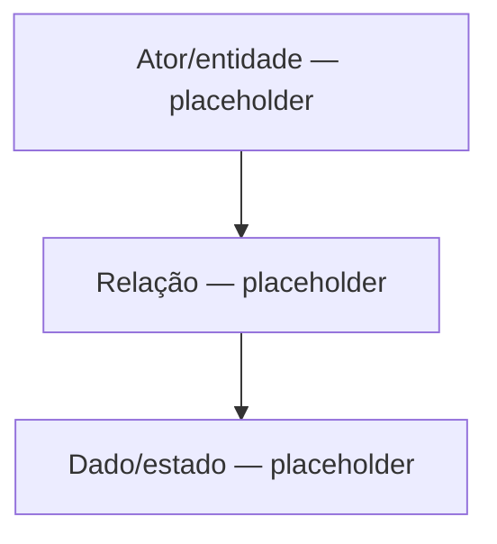

# Mapa geral — Modelo do preset (SGV-12082)

> [!info]- Navegação QA
> **README do card:** [[../00 QA/00 README|Abrir README do card]]
> **Demanda:** [[../00 QA/01 - Demanda]]
> **Plano de análise:** [[../00 QA/02 - Plano de análise]]
> **Matriz de atores e relações:** [[01 - Matriz de atores e relações]]
> **Revisão da análise:** [[../00 QA/04 - Revisão da análise]]

> [!info] Esqueleto estrutural — sem conteúdo de domínio ainda
> Scaffold criado em 08/10/2026. Este mapa é sempre um **resumo visual derivado das notas temáticas** (`Seções do TR/`, indexadas pela [[01 - Matriz de atores e relações|matriz]]) — nunca uma fonte própria de fato. O diagrama abaixo é um placeholder vazio, sem atores/relações reais; só será atualizado depois que as notas temáticas tiverem elementos/relações confirmados, e deve permanecer consistente com elas.

## Diagrama (placeholder)

## Notas

- <preencher conforme o mapeamento avançar>
