# Mapa geral — Modelo do preset (SGV-12082)

> [!info]- Navegação QA
> **README do card:** [[../00 QA/00 README|Abrir README do card]]
> **Demanda:** [[../00 QA/01 - Demanda]]
> **Plano de análise:** [[../00 QA/02 - Plano de análise]]
> **Matriz de atores e relações:** [[01 - Matriz de atores e relações]]
> **Revisão da análise:** [[../00 QA/04 - Revisão da análise]]

> [!info] Síntese derivada das 11 notas de recorte aprovadas (atualizado em 08/10/2026)
> Este mapa é um **resumo visual de alto nível**, derivado das 11 notas temáticas em `Seções do TR/` (ver [[01 - Matriz de atores e relações|Matriz de atores e relações]]), todas já revisadas e aprovadas pelo Codex. Ele **não substitui** essas notas nem o PDF ([[../Fontes/Termo de Referência SOGOV.pdf|Termo de Referência SOGOV.pdf]]) — ambos continuam sendo a fonte da verdade; este diagrama é só uma visão consolidada, agrupada por tema (não por recorte), para orientar a evolução do modelo do preset. As relações mostradas já estão documentadas nas notas de origem; nenhuma lacuna foi resolvida ou inferida aqui.

## Diagrama — visão geral de atores, entidades e relações

```mermaid
flowchart TD
    classDef rafael fill:#dbe9ff,stroke:#2b6cb0,color:#1a365d,stroke-width:1px;

    subgraph G1["Órgão, setores, servidores e níveis"]
        Orgao["Órgão"]
        Setor["Setor / Subsetor"]
        Servidor["Servidor"]
        NivelTR["Nível de acesso (TR)<br/>nomes originais — só rastreabilidade"]
        NivelRafael["Níveis canônicos (Rafael):<br/>Administrador, Administrador Setorial,<br/>Especialista, Usuário básico, Somente leitura"]:::rafael
        StatusFuncionalTR["Status funcional (TR)<br/>Ativo, Licença, Férias, Inativo…"]
        StatusFuncionalRafael["Mapeamento confirmado (Rafael):<br/>Ativo = Em atividade, Licença, Férias;<br/>Inativo = Suspenso — revisável"]:::rafael
        PresencaOnlineOffline["Presença Online/Offline<br/>(eixo separado, Rafael)"]:::rafael
        BloqueioTentativas["Bloqueio por tentativas (TR)<br/>5 tentativas malsucedidas bloqueiam a conta<br/>— separado do status funcional, não é Inativo"]
    end

    subgraph G2["Assuntos, serviços, documentos e modelos"]
        AssuntoServico["Assunto / Serviço"]
        CategoriaDoc["Categoria de documento (base)"]
        SubtipoDoc["Subtipos de documento<br/>(Memorando, Ofício, Ouvidoria…)"]
        CategoriaAS["Categoria (de Assuntos e Serviços)"]
        SubcategoriaAS["Subcategoria (de Assuntos e Serviços)"]
        Zoneamento["Zona / Categoria de uso"]
        ModeloSimples["Modelo simples<br/>(inserido durante a tramitação)"]
        DocAutomatizado["Documento automatizado<br/>(gera documento independente)"]
        VinculoModelo["Vínculo obrigatório:<br/>Categoria/Serviço/Assunto"]
        PermCriar["Regra confirmada (Rafael):<br/>visualizar = todos os 5 níveis;<br/>criar Assunto/Serviço = Administrador<br/>e Administrador Setorial"]:::rafael
    end

    subgraph G3["Documento/processo, mesa, status, prazos, etiquetas, tramitação"]
        DocProcesso["Documento / Processo"]
        Mesa["Mesa de trabalho"]
        FluxoTrabalho["Fluxo de trabalho"]
        Etapa["Etapa"]
        DespachoA["Despacho de etapa (1.30.2)"]
        DespachoB["Despacho de tramitação (1.35.2.2.1)"]
        Etiqueta["Etiqueta"]
        Prazo["Prazo"]
        DocApensado["Doc. apensado (despacho)"]
        DocAssociado["Doc. associado (automático)"]
        RegraVisEtiqueta["Alcance da regra de visibilidade"]
    end

    subgraph G4["Usuário externo e atendimento"]
        ContatoExterno["Contato externo"]
        UsuarioExterno["Usuário externo"]
        CentralAtendimento["Central de atendimento<br/>(cidadãos, empresas, entes externos)"]
    end

    subgraph G5["Assinatura, publicação e exportação"]
        Divulgacao["Divulgação (interna/externa)"]
        MuralInterno["Mural interno"]
        CanalOficial["Canal Oficial"]
        JornalOficial["Jornal Oficial"]
        Assinatura["Assinatura"]
        SignatarioExterno["Signatário externo / contribuinte"]
        Exportacao["Exportação"]
    end

    subgraph G6["Chave de acesso"]
        ChaveAcesso["Chave de acesso"]
        FiltrosChave["Filtros de listagem"]
        HistoricoChave["Histórico de documentos da chave"]
        RegistroUso["Registro de uso da chave"]
        FluxoSoPermissao["Fluxo só permissão própria"]
    end

    subgraph G7["Personalização e estatísticas"]
        Personalizacao["Personalização do órgão"]
        AcessoPersonalizacao["Acesso à personalização"]
        AcessoDadosCadastrais["Dados cadastrais: leitura/edição?"]
        Estatisticas["Estatísticas"]
        AcessoEstatisticas["Acesso às estatísticas"]
    end

    %% Relações centrais confirmadas (TR literal e/ou contexto confirmado por Rafael)
    Orgao --> Setor
    Servidor -->|"vínculo: nível + cargo por setor"| Setor
    Servidor --> NivelTR
    NivelTR --> NivelRafael
    Servidor --> StatusFuncionalTR
    StatusFuncionalTR --> StatusFuncionalRafael
    Servidor --> PresencaOnlineOffline

    AssuntoServico --> CategoriaDoc
    SubtipoDoc --> CategoriaDoc
    ModeloSimples --> VinculoModelo
    DocAutomatizado --> VinculoModelo
    VinculoModelo -->|"vínculo a um (não aos três): Categoria, Serviço ou Assunto"| AssuntoServico
    VinculoModelo -->|"vínculo a um (não aos três): Categoria, Serviço ou Assunto"| CategoriaDoc
    ModeloSimples -->|"exibido durante a tramitação de"| DocProcesso
    DocAutomatizado -->|"gera (tramitação própria)"| DocProcesso
    NivelRafael --> PermCriar
    PermCriar -->|"criar (só 2 dos 5 níveis)"| AssuntoServico

    Mesa --> DocProcesso
    FluxoTrabalho --> Etapa
    Etapa --> DespachoA
    DocProcesso --> DespachoB
    DocProcesso --> Etiqueta
    DocProcesso --> Prazo
    DespachoB --> DocApensado
    DocProcesso --> DocAssociado

    DocProcesso --> Divulgacao
    Divulgacao --> MuralInterno
    Divulgacao --> CanalOficial
    CanalOficial --> CentralAtendimento
    Assinatura --> DocProcesso
    Assinatura --> SignatarioExterno
    DocProcesso --> Exportacao

    ChaveAcesso -->|"criada/concedida por (concedente)"| Servidor
    ChaveAcesso -->|"vinculada a (convenente)"| Servidor
    ChaveAcesso --> HistoricoChave

    Orgao --> Personalizacao
    Personalizacao --> AcessoPersonalizacao
    Estatisticas --> Servidor
    DocProcesso --> Estatisticas
    Estatisticas --> AcessoEstatisticas

    %% Lacunas — "A confirmar" (preservadas das notas de origem; nenhuma resolvida por analogia)
    ContatoExterno -.->|"(a) mesma identidade?"| UsuarioExterno
    Zoneamento -.->|"(b) categoria-base?"| CategoriaDoc
    Mesa -.->|"(c) reflete etapas?"| FluxoTrabalho
    RegraVisEtiqueta -.->|"(d) alcance?"| Etiqueta
    DespachoA -.->|"(e) mesmo conceito?"| DespachoB
    DocApensado -.->|"(f) mesmo mecanismo?"| DocAssociado
    CanalOficial -.->|"(g) mesmo elemento?"| JornalOficial
    SignatarioExterno -.->|"(h) mesmos atores?"| ContatoExterno
    SignatarioExterno -.->|"(h) mesmos atores?"| UsuarioExterno
    ChaveAcesso -.->|"(i) estado formal?"| FiltrosChave
    AcessoPersonalizacao -.->|"(j) quais níveis?"| NivelRafael
    AcessoEstatisticas -.->|"(j) quais níveis?"| NivelRafael
    Personalizacao -.->|"(k) leitura/edição?"| AcessoDadosCadastrais
    HistoricoChave -.->|"(l) mesmo registro?"| RegistroUso
    ChaveAcesso -.->|"(m) fluxo não definido"| FluxoSoPermissao
    CategoriaAS -.->|"(n) organiza? inferido"| SubcategoriaAS
```

## Legenda

- **Linha sólida (→):** relação confirmada — requisito explícito do TR, ou contexto de negócio **já confirmado diretamente por Rafael** (quando liga a um nó azul).
- **Linha tracejada (-.→), com código (a)–(n):** o **texto literal do TR não declara** essa relação — é uma lacuna do próprio TR, por isso a aresta permanece tracejada independentemente do que a documentação de produto diga. Algumas dessas lacunas já têm **contexto de produto documentado** (Conhecimento > Módulos) que esclarece a questão para o produto atual, sem alterar o que o TR declara ou deixa de declarar — ver a coluna "Estado no produto" na tabela abaixo e a subseção "Contexto de produto verificado em documentação" no recorte-fonte, quando existir.
- **Nó azul (classe "Rafael"):** contexto de negócio confirmado diretamente por Rafael (ex.: mapeamento de níveis canônicos, status do servidor, regra de criação de Assuntos e Serviços) — **não é texto literal do TR**. Nó branco/padrão = conceito descrito no próprio texto do TR.

### Lacunas registradas (arestas tracejadas)

> A coluna "Estado no produto" reflete o que a documentação de Conhecimento > Módulos esclarece hoje (09/10/2026) — não resolve nem reescreve a lacuna do TR em si, que segue registrada como aresta tracejada. Detalhe completo de cada achado está na subseção "Contexto de produto verificado em documentação" do recorte-fonte.

| Código | Lacuna do TR | Estado no produto | Recorte-fonte |
|---|---|---|---|
| (a) | Contato externo (1.32) × Usuário externo (1.37) — mesma identidade? | Esclarecido no produto — mesma entidade (Usuário Cidadão) | [[Seções do TR/06 - Atores externos e atendimento ao cidadão (1.32, 1.36–1.37)]] |
| (b) | Zoneamento (1.29.10) — categoria-base entre as 3 de 1.29.1? | Sem evidência — aguarda Rafael | [[Seções do TR/04 - Serviços, assuntos e categorias de documentos (1.28–1.29)]] |
| (c) | Mesa de trabalho × Etapa/Fluxo de trabalho — reflete etapas de um fluxo configurado? | Esclarecido no produto — mesa pode conter documentos fora do modelo de Fluxo de trabalho | [[Seções do TR/07 - Mesa de trabalho, etiquetas e tramitação (1.33–1.35)]] |
| (d) | Alcance da regra de visibilidade de etiquetas por setor — também vale para etiquetas pessoais? | Esclarecido no produto — restrição por setor só vale para compartilhadas | [[Seções do TR/07 - Mesa de trabalho, etiquetas e tramitação (1.33–1.35)]] |
| (e) | Despacho (1.30.2, Etapa) × Despacho (1.35.2.2.1, tramitação) — mesmo conceito de negócio? | Parcialmente esclarecido — mesma família/modelo funcional; identidade estrutural não confirmada | [[Seções do TR/07 - Mesa de trabalho, etiquetas e tramitação (1.33–1.35)]] |
| (f) | Documento apensado via despacho × documento associado automaticamente — mesmo mecanismo/objeto? | Esclarecido no produto — convergem no mesmo conceito/regra de visibilidade de documento associado | [[Seções do TR/07 - Mesa de trabalho, etiquetas e tramitação (1.33–1.35)]] |
| (g) | Canal Oficial (1.38.1.b) × Jornal Oficial (1.38.3.1) — mesmo elemento? | Sem evidência — aguarda Rafael | [[Seções do TR/08 - Divulgação, exportação e assinaturas (1.38–1.40)]] |
| (h) | Signatário externo / "contribuinte" (1.40) × Contato externo (1.32) e Usuário externo (1.37) do recorte 06 — mesma população, sem afirmar identidade | Confirmado no produto quanto a Contato/Usuário externo; "contribuinte" segue sem evidência | [[Seções do TR/08 - Divulgação, exportação e assinaturas (1.38–1.40)]] |
| (i) | Filtros de listagem da chave (Ativas/Encerradas/Agendadas) — estados formais da entidade, ou só opções de filtro? | Sem evidência — aguarda Rafael | [[Seções do TR/09 - Chaves de acesso e criação delegada (1.41)]] |
| (j) | Quais níveis acessam a área de personalização e a funcionalidade de estatísticas? | Parcialmente esclarecido — identidade visual (1.42.1.b/c) = Administrador, confirmado no produto; dados cadastrais (1.42.1.a) e estatísticas (1.43) seguem sem evidência | [[Seções do TR/10 - Personalização e identidade visual do órgão (1.42)]], [[Seções do TR/11 - Estatísticas e indicadores (1.43)]] |
| (k) | Acesso aos dados cadastrais do órgão — só leitura, ou também edição? | Sem evidência — aguarda Rafael | [[Seções do TR/10 - Personalização e identidade visual do órgão (1.42)]] |
| (l) | Histórico de documentos da chave × registro de uso da chave — mesmo registro? | Sem evidência — aguarda Rafael | [[Seções do TR/09 - Chaves de acesso e criação delegada (1.41)]] |
| (m) | Fluxo de criação de documento quando há só permissão própria (sem chave) — não especificado pelo TR | Sem evidência — aguarda Rafael | [[Seções do TR/09 - Chaves de acesso e criação delegada (1.41)]] |
| (n) | Relação hierárquica entre Categoria e Subcategoria de Assuntos e Serviços é inferida pelo nome no TR (1.27.8.2.o); estrutura exata não descrita | Sem evidência — aguarda Rafael | [[Seções do TR/04 - Serviços, assuntos e categorias de documentos (1.28–1.29)]] |

## Rastreabilidade por grupo

| Grupo no diagrama | Recortes-fonte |
|---|---|
| Órgão, setores, servidores e níveis | [[Seções do TR/02 - Autenticação e ciclo de vida da identidade (1.24–1.25)]], [[Seções do TR/03 - Estrutura organizacional e cadastro de servidores (1.26–1.27)]] |
| Assuntos, serviços, documentos e modelos | [[Seções do TR/04 - Serviços, assuntos e categorias de documentos (1.28–1.29)]], [[Seções do TR/05 - Fluxos de trabalho e modelos de documentos (1.30–1.31)]] (item 1.31) |
| Documento/processo, mesa, status, prazos, etiquetas, tramitação | [[Seções do TR/05 - Fluxos de trabalho e modelos de documentos (1.30–1.31)]] (item 1.30), [[Seções do TR/07 - Mesa de trabalho, etiquetas e tramitação (1.33–1.35)]] |
| Usuário externo e atendimento | [[Seções do TR/06 - Atores externos e atendimento ao cidadão (1.32, 1.36–1.37)]] |
| Assinatura, publicação e exportação | [[Seções do TR/08 - Divulgação, exportação e assinaturas (1.38–1.40)]] |
| Chave de acesso | [[Seções do TR/09 - Chaves de acesso e criação delegada (1.41)]] |
| Personalização e estatísticas | [[Seções do TR/10 - Personalização e identidade visual do órgão (1.42)]], [[Seções do TR/11 - Estatísticas e indicadores (1.43)]] |
| (infraestrutura técnica — sem elementos de negócio no diagrama) | [[Seções do TR/01 - Infraestrutura técnica e operacional (1.1–1.23)]] |

## Notas

- Este mapa é só uma síntese visual de alto nível; cobertura item a item, evidência (Confirmado/Inferido/A confirmar) e o texto completo de cada dúvida estão nas notas de recorte listadas acima — não duplicados aqui.
- Em 09/10/2026, uma rodada read-only verificou as dúvidas abertas contra a documentação de Conhecimento > Módulos vigente; os recortes 06, 07, 08 e 10 agora trazem, cada um, uma subseção "Contexto de produto verificado em documentação" com o que foi esclarecido, parcialmente esclarecido, ou segue sem evidência — sem alterar o texto literal do TR nem a classificação de cobertura.
- As lacunas (a), (c), (d) e (f) têm contexto de produto que as esclarece para o produto atual e não exigem mais decisão de Rafael; (e) e (j) seguem parcialmente esclarecidas; (b), (g), (h quanto a "contribuinte"), (i), (k), (l), (m) e (n) seguem sem evidência documental e aguardam Rafael — a pergunta sobre a categoria-base do Zoneamento (b) é a primeira ainda pendente.
