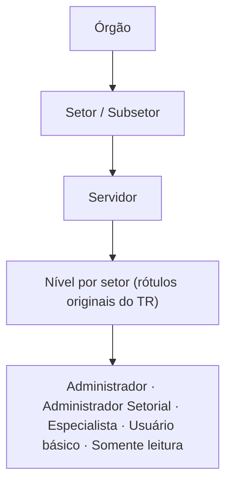
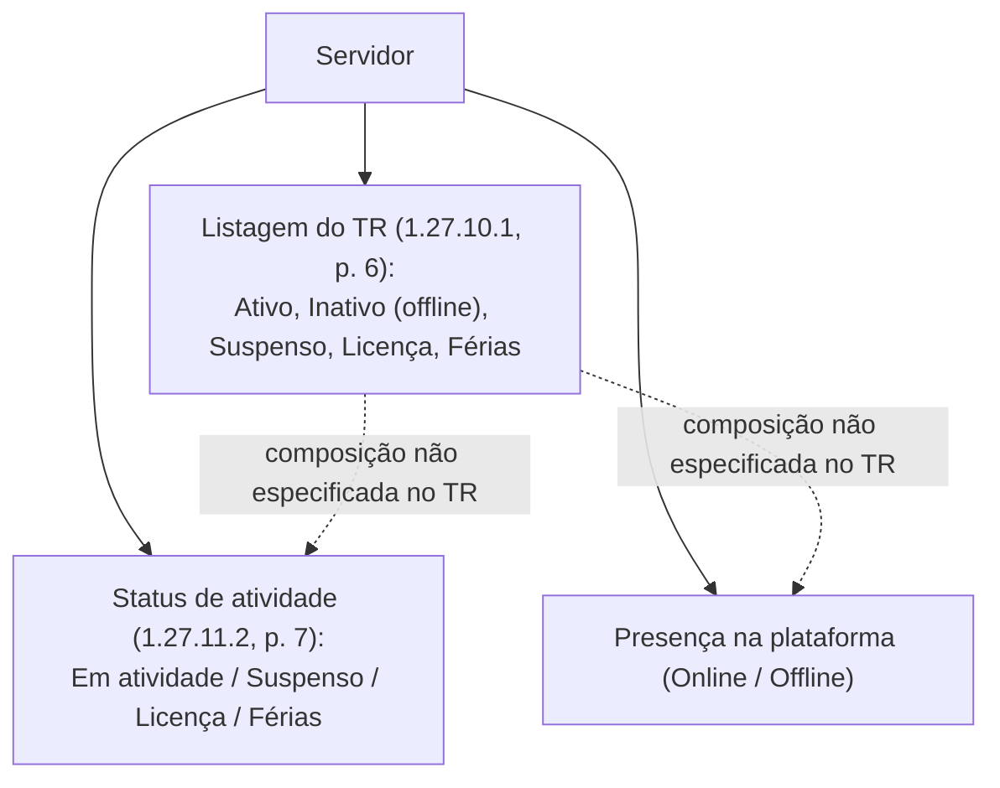

# 03 - Estrutura organizacional e cadastro de servidores (itens 1.26–1.27)

> [!info]- Navegação
> **Matriz/índice:** [[../01 - Matriz de atores e relações|Matriz de atores e relações]] · **Demanda:** [[../../00 QA/01 - Demanda]] · **Plano de análise:** [[../../00 QA/02 - Plano de análise]] · **Mapa geral:** [[../00 - Mapa geral]]

> [!info] Escopo deste recorte — revisado e aprovado pelo Codex em 08/10/2026
> Itens do TR: **1.26–1.27**, cobertos recursivamente em todos os subitens numerados que o PDF apresenta (79 linhas na Cobertura — 18 sob 1.26, 61 sob 1.27). Lido diretamente por render de página, não por extração textual. **Material arquivado não foi usado como evidência.** Mapa de páginas: 1.26–1.26.11.1 (p. 2); 1.26.11.2–1.27.6 (p. 3); 1.27.6.1–1.27.9.3(intro) (p. 4); 1.27.9.3(lista)–1.27.9.4.6 (p. 5); 1.27.10–1.27.11.1(início) (p. 6); 1.27.11.1(fim)–1.27.11.6.1 (p. 7). Listas com letras (a, b, c...) dentro de um item numerado são conteúdo desse item, não subitens próprios do TR — não viram linhas separadas na Cobertura.

## Modelo visual

### Status de atividade e presença

> Fontes diretas: [[../../Fontes/Termo de Referência SOGOV.pdf#page=6|1.27.10.1, p. 6]]; [[../../Fontes/Termo de Referência SOGOV.pdf#page=7|1.27.11.2, p. 7]].

No modelo atual, a presença Online/Offline é independente do status de atividade; o item 1.27.10.1 usa "Inativo (offline)" na listagem e não especifica a composição do campo com esses eixos.

## Cobertura dos itens

| Item do TR  | Situação      | Justificativa ou pendência                                                                                                                                                                                                                              |
| ----------- | ------------- | ------------------------------------------------------------------------------------------------------------------------------------------------------------------------------------------------------------------------------------------------------- |
| 1.26        | Mapeado       | Organograma: plataforma estrutura o órgão em setores/subsetores, com representação hierárquica.                                                                                                                                                         |
| 1.26.1      | Mapeado       | Cadastro de setores, atribuição de usuários e tramitação de documentos com base na hierarquia.                                                                                                                                                          |
| 1.26.2      | Não aplicável | Visualização em árvore (tree view) interativa — requisito de interface.                                                                                                                                                                                 |
| 1.26.3      | Não aplicável | Arquitetura sem limite de quantidade de setores/subsetores — requisito de capacidade/escalabilidade.                                                                                                                                                    |
| 1.26.4      | Mapeado       | Edição/gerenciamento de setores; adição e suspensão de setores.                                                                                                                                                                                         |
| 1.26.5      | Mapeado       | Visualização e atribuição/remoção de usuários por setor/subsetor.                                                                                                                                                                                       |
| 1.26.6      | Mapeado       | Suspensão temporária de setor/subsetor impede tramitação de documentos enquanto durar.                                                                                                                                                                  |
| 1.26.7      | Mapeado       | Verificação de pendências (documentos, fluxos, usuários atribuídos) antes de permitir suspensão.                                                                                                                                                        |
| 1.26.8      | Mapeado       | Reativação de setor suspenso restabelece funcionalidades/documentos associados.                                                                                                                                                                         |
| 1.26.9      | Não aplicável | Estatística agregada (total de setores e de usuários alocados), não elemento de ator/entidade.                                                                                                                                                          |
| 1.26.10     | Mapeado       | Renomear setor/subsetor preserva o nome antigo em documentos já tramitados.                                                                                                                                                                             |
| 1.26.11     | Mapeado       | Cada setor pode ter regras próprias de tramitação por categoria de documento, configuráveis por usuário com permissão.                                                                                                                                  |
| 1.26.11.1   | Mapeado       | Regra de tramitação: criar documentos.                                                                                                                                                                                                                  |
| 1.26.11.2   | Mapeado       | Regra de tramitação: receber e tramitar documentos.                                                                                                                                                                                                     |
| 1.26.11.3   | Mapeado       | Regra de tramitação: interagir com o cidadão (casos com interação externa).                                                                                                                                                                             |
| 1.26.11.4   | Mapeado       | Regra de tramitação: visualização de dados sigilosos.                                                                                                                                                                                                   |
| 1.26.11.5   | Mapeado       | Regra de tramitação: recebimento automático de documentos.                                                                                                                                                                                              |
| 1.26.12     | Mapeado       | Setor/subsetor pode ser reparentado para outra hierarquia; subsetores são arrastados junto.                                                                                                                                                             |
| 1.27        | Mapeado       | Cadastro/gerenciamento do quadro de servidores; vínculo a setor(es), com nível de permissão específico por setor vinculado.                                                                                                                             |
| 1.27.1      | Mapeado       | Cadastro controlado por fluxo de convite, pré-cadastro e homologação.                                                                                                                                                                                   |
| 1.27.2      | Mapeado       | Introduz os 5 níveis de usuário exigidos (nomes nos subitens a seguir).                                                                                                                                                                                 |
| 1.27.2.1    | Mapeado       | Nível "Administrador".                                                                                                                                                                                                                                  |
| 1.27.2.2    | Mapeado       | Nível "Administrador setorial".                                                                                                                                                                                                                         |
| 1.27.2.3    | Mapeado       | Nível "Assistente administrativo".                                                                                                                                                                                                                      |
| 1.27.2.4    | Mapeado       | Nível "Auxiliar administrativo".                                                                                                                                                                                                                        |
| 1.27.2.5    | Mapeado       | Nível "Visualizador".                                                                                                                                                                                                                                   |
| 1.27.3      | Mapeado       | Nível Administrador: acesso master a todas as funcionalidades/configurações.                                                                                                                                                                            |
| 1.27.4      | Mapeado       | Permissões do nível Administrador setorial, detalhadas nos subitens a seguir.                                                                                                                                                                           |
| 1.27.4.1    | Mapeado       | Administrador setorial no organograma: visualizar tudo; cadastrar/editar/suspender setores e vincular/desvincular servidores, restrito à hierarquia do próprio setor.                                                                                   |
| 1.27.4.2    | Mapeado       | Administrador setorial em servidores: visualizar todos; cadastrar, restrito à hierarquia do próprio setor.                                                                                                                                              |
| 1.27.4.3    | Mapeado       | Administrador setorial em contatos externos: visualizar e cadastrar (PF/PJ).                                                                                                                                                                            |
| 1.27.4.4    | Mapeado       | Administrador setorial em assuntos/serviços: visualizar, cadastrar, editar, inativar (dos módulos disponíveis).                                                                                                                                         |
| 1.27.5      | Mapeado       | Assistente administrativo: mesmas 4 áreas do Administrador setorial, mas mais restrito — ver 1.27.5.1–1.27.5.4.                                                                                                                                         |
| 1.27.5.1    | Mapeado       | No organograma: visualizar tudo; cadastrar/editar setores (sem suspender); vincular/desvincular servidores — restrito ao próprio setor.                                                                                                                 |
| 1.27.5.2    | Mapeado       | Em servidores: visualizar todos; cadastrar/editar/suspender — restrito ao próprio setor.                                                                                                                                                                |
| 1.27.5.3    | Mapeado       | Em contatos externos: visualizar e cadastrar (PF/PJ) — igual ao Administrador setorial.                                                                                                                                                                 |
| 1.27.5.4    | Mapeado       | Em assuntos/serviços: só visualizar (sem cadastrar/editar/inativar).                                                                                                                                                                                    |
| 1.27.6      | Mapeado       | Auxiliar administrativo: só 3 áreas (sem assuntos/serviços) — ver 1.27.6.1–1.27.6.3.                                                                                                                                                                    |
| 1.27.6.1    | Mapeado       | No organograma: só visualizar.                                                                                                                                                                                                                          |
| 1.27.6.2    | Mapeado       | Em servidores: só visualizar.                                                                                                                                                                                                                           |
| 1.27.6.3    | Mapeado       | Em contatos externos: visualizar e cadastrar (PF/PJ).                                                                                                                                                                                                   |
| 1.27.7      | Mapeado       | Visualizador: nível só-leitura — ver 1.27.7.1–1.27.7.4.                                                                                                                                                                                                 |
| 1.27.7.1    | Mapeado       | No organograma: só visualizar.                                                                                                                                                                                                                          |
| 1.27.7.2    | Mapeado       | Em servidores: só visualizar.                                                                                                                                                                                                                           |
| 1.27.7.3    | Mapeado       | Em contatos externos: só visualizar (sem cadastrar).                                                                                                                                                                                                    |
| 1.27.7.4    | Mapeado       | Na tramitação: pode acessar, mas sem poder interagir diretamente nos documentos dos setores dos quais faz parte.                                                                                                                                        |
| 1.27.8      | Mapeado       | Permissões extras, concedidas individualmente no cadastro/edição por um administrador — associadas/complementares às permissões já existentes no nível; independência não especificada pelo texto.                                                      |
| 1.27.8.1    | Mapeado       | Concessão de permissão extra exige servidor administrador ou nível com permissão para isso.                                                                                                                                                             |
| 1.27.8.2    | Mapeado       | Lista de 24 permissões extras possíveis (setores/subsetores, servidores, pré-cadastros, assuntos/serviços, acesso a mesas de outros setores, fluxos de trabalho).                                                                                       |
| 1.27.9      | Mapeado       | Cadastro simplificado: ao menos 2 meios (interno e externo).                                                                                                                                                                                            |
| 1.27.9.1    | Mapeado       | Cadastro interno: usuário com permissão cadastra; servidor recebe e-mail de confirmação de vínculo.                                                                                                                                                     |
| 1.27.9.2    | Mapeado       | Cadastro externo em massa: link direto por setor, pré-cadastro sujeito a aprovação de administrador.                                                                                                                                                    |
| 1.27.9.3    | Mapeado       | Dados exigidos no cadastro interno: CPF (validado por API, não editável), e-mail, matrícula (se houver), setor(es)+nível, permissões extras (se houver).                                                                                                |
| 1.27.9.3.2  | Mapeado       | E-mail de confirmação enviado ao novo servidor.                                                                                                                                                                                                         |
| 1.27.9.3.3  | Mapeado       | Pré-cadastro pendente: pode ser excluído (perde a possibilidade de conclusão), reenviado, ou editado (exceto CPF).                                                                                                                                      |
| 1.27.9.3.4  | Mapeado       | Dados que o próprio novo servidor insere na conclusão: CPF de confirmação (deve bater com o do pré-cadastro), assinatura textual, cargo de contrato, senha (critérios de força), aceite de termos.                                                      |
| 1.27.9.3.5  | Mapeado       | Após o preenchimento, redireciona para login com as permissões atribuídas.                                                                                                                                                                              |
| 1.27.9.4    | Mapeado       | Cadastro externo: link gerado para um setor específico, enviado a um ou mais servidores.                                                                                                                                                                |
| 1.27.9.4.1  | Mapeado       | Cadastro via link passa por aprovação de usuário com permissão.                                                                                                                                                                                         |
| 1.27.9.4.2  | Mapeado       | Dados exigidos no cadastro externo: CPF (via API), e-mail, data de nascimento, sexo, telefone, assinatura textual, cargo de contrato, matrícula, cargo no setor do link, senha (só forte), aceite de termos.                                            |
| 1.27.9.4.3  | Mapeado       | Servidor pode indicar, no mesmo fluxo, outros setores dos quais também faz parte.                                                                                                                                                                       |
| 1.27.9.4.4  | Mapeado       | Pré-cadastro externo fica exibido internamente numa área específica.                                                                                                                                                                                    |
| 1.27.9.4.5  | Mapeado       | Na aprovação, usuário com permissão define o nível e setor(es); pode recusar com justificativa enviada por e-mail.                                                                                                                                      |
| 1.27.9.4.6  | Mapeado       | Após aprovação, servidor recebe e-mail com link de login.                                                                                                                                                                                               |
| 1.27.10     | Mapeado       | Área de listagem de todos os servidores cadastrados.                                                                                                                                                                                                    |
| 1.27.10.1   | Mapeado       | Dados mínimos na listagem: nome, cargo, setor principal, e-mail, status (5 valores — ver dúvida sobre estados abaixo).                                                                                                                                  |
| 1.27.10.2   | Não aplicável | Estatística agregada (total de servidores; total de ativos).                                                                                                                                                                                            |
| 1.27.10.3   | Mapeado       | Dados detalhados (sem edição): nome, cargo de contrato, status, assinatura textual, CPF (parcialmente protegido por LGPD), e-mail, matrícula, dados de aprovação do pré-cadastro, setor principal (nível+cargo), setores adicionais (nível+cargo cada). |
| 1.27.10.4   | Não aplicável | Busca por palavra-chave e filtros (interface de listagem) — valores de filtro já cobertos em 1.27.10.1.                                                                                                                                                 |
| 1.27.10.4.2 | Não aplicável | Uso combinado de filtro e busca — interface.                                                                                                                                                                                                            |
| 1.27.11     | Mapeado       | Edição de cadastros e pré-cadastros de servidores.                                                                                                                                                                                                      |
| 1.27.11.1   | Mapeado       | Editáveis: assinatura textual, e-mail institucional, matrícula, setor principal (nível/cargo), setores adicionais (adicionar/remover, nível/cargo), permissões extras.                                                                                  |
| 1.27.11.2   | Mapeado       | Status de atividade editável (4 valores — ver dúvida sobre estados abaixo).                                                                                                                                                                             |
| 1.27.11.3   | Mapeado       | Troca livre entre status, exigindo data de início e fim do novo status.                                                                                                                                                                                 |
| 1.27.11.4   | Mapeado       | A partir do período definido, e-mail informa a mudança; acesso é limitado/restabelecido automaticamente nas datas definidas.                                                                                                                            |
| 1.27.11.5   | Mapeado       | Dados pessoais na tela de edição, com regra de quem pode editar — ver 1.27.11.5.1.                                                                                                                                                                      |
| 1.27.11.5.1 | Mapeado       | CPF (não editável por ninguém); nome (não editável, vem da API); telefone, sexo e data de nascimento (editáveis só pelo próprio servidor).                                                                                                              |
| 1.27.11.6   | Mapeado       | Pré-cadastros internos/externos têm área própria de gerenciamento.                                                                                                                                                                                      |
| 1.27.11.6.1 | Mapeado       | Pré-cadastros externos podem ser aprovados/reprovados; reprovação exige justificativa.                                                                                                                                                                  |

**Resultado do recorte:** 79/79 itens (incluindo subitens numerados) considerados; 72 Mapeados, 7 Não aplicáveis (interface/usabilidade ou estatística agregada — 1.26.2, 1.26.3, 1.26.9, 1.27.10.2, 1.27.10.4, 1.27.10.4.2). Nenhum item pendente de leitura.

## Elementos identificados

| Referência do TR | Elemento | Tipo | Papel/descrição | Dados ou atributos relevantes | Certeza/evidência |
|---|---|---|---|---|---|
| 1.26, 1.26.12 | Setor/Subsetor | Entidade | Unidade organizacional hierárquica, reparentável entre hierarquias | nome (versionado — nome antigo preservado em documentos já tramitados), hierarquia (pai/filho), status (suspensão/reativação — 1.26.4, 1.26.6–1.26.8) | Confirmado que existem as ações de suspender/reativar; **Inferido** que isso se modele como enum nomeado "ativo/suspenso" — o TR não usa a palavra "ativo" para setor, só "suspenso" e "reativação/restabelecer" |
| 1.26.11 | Regra de tramitação por categoria de documento | Configuração | Por setor, configurável por categoria (Circulares, Ofícios, Processos administrativos): criar, receber/tramitar, interagir com cidadão, ver dados sigilosos, receber automaticamente | categoria de documento, setor | Confirmado |
| 1.27 | Servidor | Ator/Entidade | Tipo de usuário cadastrado, vinculado a um ou mais setores | CPF (identificador, não editável), nome completo (obtido por consulta a API a partir do CPF, não editável), e-mail, matrícula, cargo de contrato (único, do servidor), assinatura textual, telefone, sexo, data de nascimento (3 últimos editáveis só pelo próprio) | Confirmado |
| 1.27 | Vínculo Servidor–Setor | Relação com atributo | Servidor pode ter múltiplos setores; cada vínculo tem seu próprio nível e cargo | setor, nível, **cargo exercido no setor (distinto do cargo de contrato do servidor)** | Confirmado — 1.27.9.3.4 distingue explicitamente "cargo de contrato" (c) de "cargo exercido em cada setor ao qual foi vinculado" (d) |
| 1.27.2.1–1.27.2.5 | Nível de acesso | Configuração (enum) | 5 valores: Administrador, Administrador setorial, Assistente administrativo, Auxiliar administrativo, Visualizador — nomes exatamente como no TR | nível | Confirmado — mapeamento confirmado pro modelo ativo/canônico na subseção abaixo |
| 1.27.8 | Permissão extra | Configuração (enum, 24 valores) | Concedida individualmente, **em associação/complemento às permissões já existentes no nível do servidor** (independência do nível não é especificada pelo texto) — cobre setores/subsetores, servidores, pré-cadastros, assuntos/serviços, acesso a mesas de outros setores, fluxos de trabalho. Lista completa na subseção abaixo | lista de 24 flags (1.27.8.2) | Confirmado |
| 1.27.1, 1.27.9.1–1.27.9.4.6 | Pré-cadastro | Entidade/estado | Registro pendente de homologação, por 2 fluxos distintos (interno e externo via link), com conjuntos de dados exigidos diferentes entre si; resultado aprovado ou recusado | CPF, e-mail + (interno: matrícula, setor, nível, permissões extras) + (externo: data de nascimento, sexo, telefone, cargo de contrato, cargo no setor do link) + **estado (aprovado/recusado)** + **justificativa (obrigatória em caso de recusa, enviada por e-mail ao solicitante — 1.27.9.4.5)** + **para cadastro via link do organograma: responsável pela aprovação e data/hora da aprovação (1.27.10.3.h)** | Confirmado — **assimetria de dados entre os dois fluxos é achado literal do texto, não inferência** |
| 1.27.10.1 | Status exibido na listagem | Configuração (enum, 5 valores) | Ativo; Inativo ("offline" — sem sessão ativa no momento; exibe também a data/hora da última vez em que esteve ativo); Suspenso; Licença; Férias | status, **data/hora da última atividade (quando Inativo/offline)** | Confirmado no texto do TR ([[../../Fontes/Termo de Referência SOGOV.pdf\|Termo de Referência SOGOV.pdf]], 1.27.10.1.e, p. 6). "Inativo" aqui é presença offline (sem sessão ativa), **não** suspensão de acesso — sentido distinto do "Inativo" de 1.25.3.4 (nega autenticação, p. 2). Ver dúvida abaixo sobre a reutilização do termo. |
| 1.27.11.2 | Status de atividade editável | Configuração (enum, 4 valores) | Em atividade; Suspenso; Licença; Férias | status, data de início, data de fim | Confirmado no texto do TR; Rafael informou que o formulário atual exibe Em atividade, Inativo, De licença e De férias (imagem enviada em 08/10/2026) |

### Permissões extras (1.27.8.2) — lista completa

| Letra (TR) | Permissão extra | Domínio |
|---|---|---|
| a | Cadastrar setores e subsetores no organograma | Organograma |
| b | Editar setores e subsetores no organograma | Organograma |
| c | Suspender setores e subsetores no organograma | Organograma |
| d | Atribuir usuários aos setores e subsetores no organograma | Organograma |
| e | Desvincular usuários de setores e subsetores no organograma | Organograma |
| f | Ajustar regras de tramitação dos setores na atuação em módulos, serviços e assuntos | Regras de tramitação |
| g | Cadastrar servidores | Servidores |
| h | Editar servidores | Servidores |
| i | Atualizar situação de atividade dos servidores | Servidores |
| j | Visualizar pré-cadastros | Pré-cadastros |
| k | Validar pré-cadastros | Pré-cadastros |
| l | Excluir pré-cadastros | Pré-cadastros |
| m | Cadastrar contatos externos | Contatos externos |
| n | Editar contatos externos | Contatos externos |
| o | Cadastrar categorias e subcategorias de assuntos e serviços | Assuntos e serviços |
| p | Cadastrar assuntos e serviços | Assuntos e serviços |
| q | Editar assuntos e serviços | Assuntos e serviços |
| r | Inativar assuntos e serviços | Assuntos e serviços |
| s | Dar acesso a mesas de outros setores, sem permissão de interação | Mesas de outros setores |
| t | Visualizar fluxos de trabalho | Fluxos de trabalho |
| u | Cadastrar fluxos de trabalho | Fluxos de trabalho |
| v | Ativar e inativar fluxos de trabalho | Fluxos de trabalho |
| w | Editar fluxos de trabalho, incluindo excluí-lo | Fluxos de trabalho |
| x | Duplicar fluxos de trabalho | Fluxos de trabalho |

> 24/24 permissões extras de 1.27.8.2, sem omissão. Agrupamento por domínio é só organizacional — o TR não nomeia esses grupos.

### Hierarquia de níveis de acesso do produto (contexto — Conhecimento > Módulos, não requisito do TR)

> [!info] Natureza desta subseção
> O conteúdo abaixo vem da documentação de produto (`QA Workspace/04 Conhecimento/Módulos/`) e de confirmação direta do Rafael — não do texto do TR. A transcrição literal do TR (1.27.2.1–1.27.2.5 e as permissões de 1.27.3–1.27.7.4, na Cobertura e na tabela de Elementos) **permanece exatamente como no texto, sem reescrita**. O TR nunca usou os nomes canônicos abaixo; esta subseção só documenta a correspondência confirmada, para uso como modelo ativo/canônico do preset.

**Hierarquia canônica do produto**, do maior para o menor acesso (fonte: [[QA Workspace/04 Conhecimento/Módulos/Associar e Desassociar|Associar e Desassociar]] § "Permissões e visibilidade" — legenda explicitamente marcada como canônica no vault, confirmada por Rafael em 2026-07-17 e 2026-07-20):

**Administrador › Administrador Setorial › Especialista (N1) › Usuário básico (N2, exibido como "Básico" em algumas telas, ex. Organograma) › Somente leitura.**

Os mesmos 5 níveis (ou a forma crua N1/N2) aparecem de modo consistente em outros módulos, confirmando que é a nomenclatura vigente do produto, não uma leitura isolada:
- [[QA Workspace/04 Conhecimento/Módulos/Organograma|Organograma]] — permissões de edição de regras de tramitação por nível (Administrador, Administrador Setorial, N1).
- [[QA Workspace/04 Conhecimento/Módulos/Fluxo de trabalho (Workflow)|Fluxo de trabalho (Workflow)]] — "Adm setorial: só setores da sua hierarquia (listagem/edição e criação limitadas a módulos/assuntos/serviços da hierarquia)"; permissões de encerrar etapa refináveis por nível (Administrador, Adm setorial, N1, N2).
- [[QA Workspace/04 Conhecimento/Módulos/Despachos|Despachos]] e [[QA Workspace/04 Conhecimento/Módulos/Assinaturas|Assinaturas]] — regras de permissão por nível (N1, Administrador, Adm setorial, N2).
- [[QA Workspace/04 Conhecimento/Módulos/Mesa de trabalho|Mesa de trabalho]] e [[QA Workspace/04 Conhecimento/Módulos/Gerar Documento|Gerar Documento]] — ações restritas a partir de N1.

### Mapeamento confirmado — nomes do TR → modelo ativo/canônico

Rafael confirmou (08/10/2026) a correspondência entre os nomes originais do TR, mantidos para rastreabilidade histórica (1.27.2.1–1.27.2.5), e os nomes canônicos do modelo ativo do produto:

| Nome no TR (1.27.2 — histórico/rastreabilidade da fonte) | Nome canônico ativo (modelo do preset) |
|---|---|
| Administrador | Administrador |
| Administrador setorial | Administrador Setorial |
| Assistente administrativo | Especialista |
| Auxiliar administrativo | Usuário básico |
| Visualizador | Somente leitura |

Os nomes do TR na coluna da esquerda **permanecem na Cobertura e nos Elementos exatamente como o texto os descreve** — esta tabela não os substitui nem reescreve o TR; documenta só a correspondência confirmada, a ser usada como nomenclatura do modelo canônico daqui em diante.

### Permissões confirmadas — Assuntos e Serviços (contexto de produto, Rafael, 08/10/2026)

Regras de produto confirmadas diretamente pelo Rafael, registradas à parte da transcrição literal do TR (1.27.4.4/1.27.5.4/1.27.6, na Cobertura):

- **Visualizar:** servidores dos **cinco** níveis (Administrador, Administrador Setorial, Especialista, Usuário básico, Somente leitura) conseguem visualizar Assuntos e Serviços.
- **Criar:** por padrão, **apenas Administrador e Administrador Setorial podem criar** Assuntos e Serviços. Os outros três níveis — Especialista, Usuário básico e Somente leitura — **não podem criar**.

**Registra-se apenas visualizar e criar** — nenhuma inferência foi feita sobre editar, inativar ou qualquer outra permissão para nenhum dos cinco níveis nessa área.

| Origem | Relação/dependência | Destino | Referência do TR | Certeza/evidência ou pendência |
|---|---|---|---|---|
| Servidor | vinculado a (N:N, com nível/cargo por vínculo) | Setor | 1.27, 1.26.5 | Confirmado — 1.26.5 permite vários usuários por setor e 1.27 permite um servidor vinculado a múltiplos setores |
| Setor | hierarquia de | Subsetor (reparentável) | 1.26, 1.26.12 | Confirmado |
| Setor suspenso | bloqueia | tramitação de documentos no setor | 1.26.6 | Confirmado |
| Suspensão de setor | depende de | ausência de pendências (documentos/fluxos/usuários) | 1.26.7 | Confirmado |
| Nível de acesso | determina | escopo de permissões nas 4 áreas (organograma/servidores/contatos externos/assuntos-serviços) | 1.27.3–1.27.7.4 | Confirmado — escopo de alguns níveis é restrito à hierarquia do próprio setor (1.27.4–1.27.6), não à organização inteira |
| Permissão extra | complementa/associa-se a | nível de acesso | 1.27.8 | Confirmado que complementa; **independência do nível não é especificada** pelo texto |
| Status de atividade (edição) | tem transição com | data de início/fim obrigatórias | 1.27.11.2, 1.27.11.3 | Confirmado |
| Status de atividade (edição) | aciona automaticamente, nas datas definidas | limitação/restabelecimento de acesso | 1.27.11.4 | Confirmado |
| Status exibido na listagem (1.27.10.1) | relação com | Status de atividade editável (1.27.11.2) | 1.27.10.1, 1.27.11.2 | **Relação não especificada pelo TR — A confirmar.** Dentro do próprio 1.27.10.1, "Suspenso" é valor distinto de "Inativo" (que ali significa presença offline); é plausível que o "Suspenso" de 1.27.10.1 corresponda ao mesmo "Suspenso" de 1.27.11.2 (mesma palavra), mas o TR não declara essa correspondência explicitamente — não concluo por semelhança de termo. "Inativo" de 1.27.10.1 **não** corresponde a "Suspenso". |
| Tela atual do servidor no produto (contexto de produto, Rafael, 08/10/2026) | corresponde, por interpretação de trabalho, a | Ciclo de vida da identidade funcional (1.25.3, recorte 2) | 1.25.3 | **Contexto de produto confirmado por Rafael** — não é equivalência declarada pelo TR. Restrita à tela atual (Em atividade/Inativo/De licença/De férias) × 1.25.3 (Ativo/Licença/Férias/Inativo, p. 2). **Não se estende** a 1.27.10.1 (onde "Inativo" significa offline, não suspensão) nem reescreve o enum literal de 1.27.11.2 (que usa "Suspenso", não "Inativo", p. 7). |

## Dúvidas/ambiguidades

- **O TR reutiliza a palavra "Inativo" com sentidos diferentes entre itens — não há divergência de redação em 1.27.10.1, e sim reuso de termo.** Fontes diretas no PDF ([[../../Fontes/Termo de Referência SOGOV.pdf|Termo de Referência SOGOV.pdf]]): (a) **1.25.3.4 (p. 2)** — "Inativo" é desprovisionamento lógico, nega qualquer autenticação; (b) **1.27.10.1.e (p. 6)** — "Inativo (offline)" significa que o servidor não está logado/operando no momento (mostra última atividade); "Suspenso" é listado **separadamente** no mesmo enum, como acesso suspenso; (c) **1.27.11.2 (p. 7)** — status de atividade editável: Em atividade, Suspenso, Licença, Férias (não inclui "Inativo"). Conclusão: em 1.27.10.1, "Inativo" é presença offline, distinta de "Suspenso" — a leitura anterior deste recorte, que tratava a redação de 1.27.10.1 como "divergente" de uma equivalência "Inativo = Suspenso", estava invertida; foi corrigida nas tabelas acima. Rafael já esclareceu, para a tela atual do produto, que o formulário exibe `Em atividade`, `Inativo`, `De licença` e `De férias`, com Online/Offline como indicador de presença separado — essa decisão sobre a tela atual permanece válida como contexto de produto e não é questionada de novo aqui (ver linha "Tela atual do servidor no produto" na tabela de Relações acima). **O que permanece indefinido pelo próprio TR:** (1) a relação entre o enum da listagem (1.27.10.1, 5 valores) e o enum de status editável (1.27.11.2, 4 valores) não é especificada — é plausível que o "Suspenso" de um corresponda ao "Suspenso" do outro, mas isso não está declarado; (2) se o "Suspenso" de 1.27.10.1/1.27.11.2 corresponde ao "Inativo" de 1.25.3.4 (ambos no sentido de negar/restringir acesso) também não é declarado explicitamente — são itens de escopos diferentes (listagem/edição de cadastro vs. ciclo de vida de autenticação) sem remissão cruzada no texto. A documentação de [[QA Workspace/04 Conhecimento/Módulos/Login|Login]] cobre status do servidor; a seção de presença em [[QA Workspace/04 Conhecimento/Módulos/Organograma|Organograma]] está marcada como desatualizada.
- **Bloqueio por tentativas é distinto do status funcional**, conforme registrado no [[02 - Autenticação e ciclo de vida da identidade (1.24–1.25)#Respostas complementares ao TR|recorte 2]]. A especificação de [[QA Workspace/04 Conhecimento/Módulos/Gestão de Desbloqueio de Acessos|Gestão de Desbloqueio de Acessos]] prevê retorno ao status de origem após redefinição de senha, mas não foi validada em execução. O Rafael confirmou que não há desbloqueio automático por tempo (08/10/2026; ver recorte 2). As transições por datas de 1.27.11.2/.3 são outro mecanismo.

## Fontes/evidências

- PDF: `Fontes/Termo de Referência SOGOV.pdf`, p. 2–7 (ver mapa de páginas no Escopo acima). Lido por render de página, conferido diretamente nesta sessão em 08/10/2026. Material arquivado **não** foi consultado como evidência.
- Conhecimento de produto (contexto, não requisito do TR — verificado em 08/10/2026 para a hierarquia de níveis de acesso): [[QA Workspace/04 Conhecimento/Módulos/Associar e Desassociar|Associar e Desassociar]] (legenda canônica dos 5 níveis), [[QA Workspace/04 Conhecimento/Módulos/Organograma|Organograma]], [[QA Workspace/04 Conhecimento/Módulos/Fluxo de trabalho (Workflow)|Fluxo de trabalho (Workflow)]], [[QA Workspace/04 Conhecimento/Módulos/Despachos|Despachos]], [[QA Workspace/04 Conhecimento/Módulos/Assinaturas|Assinaturas]], [[QA Workspace/04 Conhecimento/Módulos/Mesa de trabalho|Mesa de trabalho]], [[QA Workspace/04 Conhecimento/Módulos/Gerar Documento|Gerar Documento]], [[QA Workspace/04 Conhecimento/Módulos/Serviços e Assuntos|Serviços e Assuntos]] (confirma que permissões granulares por nível não estão replicadas no vault).
