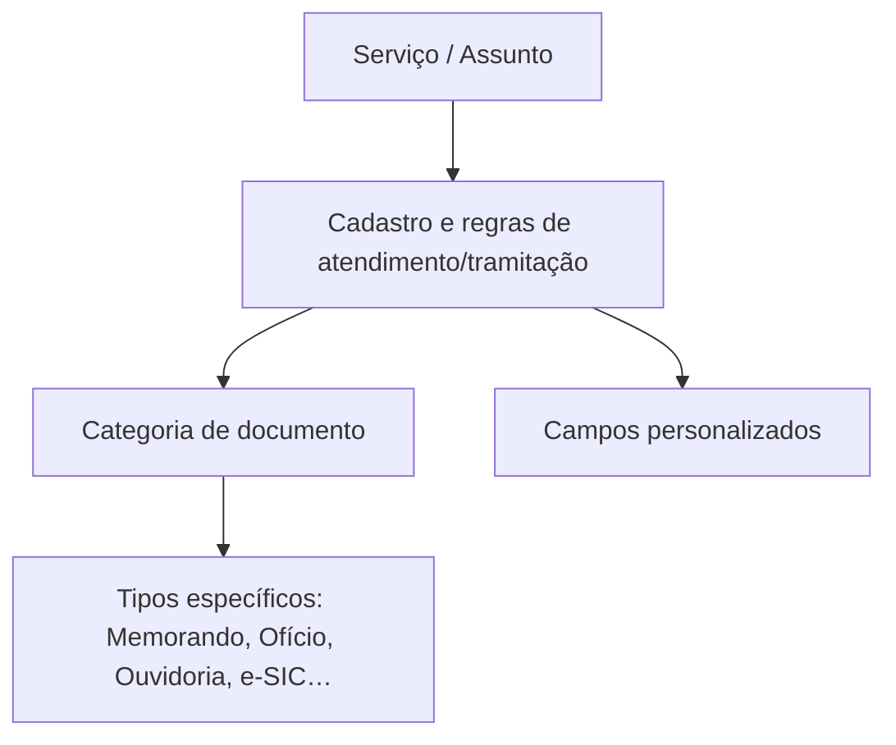
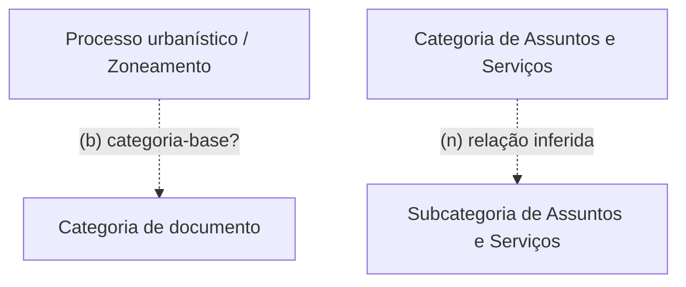

# 04 - Serviços, assuntos e categorias de documentos (itens 1.28–1.29)

> [!info]- Navegação
> **Matriz/índice:** [[../01 - Matriz de atores e relações|Matriz de atores e relações]] · **Demanda:** [[../../00 QA/01 - Demanda]] · **Plano de análise:** [[../../00 QA/02 - Plano de análise]] · **Mapa geral:** [[../00 - Mapa geral]]

> [!info] Escopo deste recorte — relido e aprovado pelo Codex em 09/10/2026
> Itens do TR: **1.28–1.29**, cobertos recursivamente em todos os subitens numerados que o PDF apresenta (29 linhas na Cobertura — 6 sob 1.28, 23 sob 1.29). Lido diretamente por render de página, não por extração textual. **Material arquivado não foi usado como evidência.** Mapa de páginas: 1.28–1.28.1 (p. 7–8); 1.28.1.2–1.29.1 (p. 8–9); 1.29.2–1.29.8 (p. 9–10); 1.29.9–1.29.10.4 (p. 10–11). Listas com letras dentro de um item numerado são conteúdo desse item, não subitens próprios do TR.

## Modelo visual

### Zoneamento e categorias de Assuntos e Serviços

## Cobertura dos itens

| Item do TR | Situação | Justificativa ou pendência |
|---|---|---|
| 1.28 | Mapeado | Gerenciamento de Serviços e Assuntos: CRUD de categorias/subcategorias, serviços e assuntos, com filtros e busca. |
| 1.28.1 | Mapeado | Campos mínimos do cadastro de serviço/assunto: nome, descrição, categoria de documento vinculada, abertura externa, setores de interação externa, sigilo (com/sem/anônimo), setores com acesso a dados sigilosos, setores que abrem/recebem processos, envio automático a setor, prazo oficial (dias úteis/corridos, prorrogação limitada e justificável), numeração oficial pré-existente (reinício anual ou sequência infinita). |
| 1.28.1.2 | Mapeado | Introduz a customização de campos personalizados do serviço/assunto, após os parâmetros base definidos. |
| 1.28.1.2.1 | Mapeado | Define o conjunto de tipos de campo personalizado; detalhado abaixo. |
| 1.28.1.3 | Mapeado | Configuração por campo: título, visibilidade (servidor/cidadão/ambos), obrigatoriedade, repetição, sensibilidade (LGPD), uso como título do documento/mesa de trabalho. |
| 1.28.1.4 | Não aplicável | Reordenação visual dos campos no formulário — requisito de interface. |
| 1.29 | Mapeado | Categorias de documentos para geração de processos/comunicação oficial, com regras de tramitação pré-estabelecidas por categoria e módulo, sem limite de quantidade. |
| 1.29.1 | Mapeado | 3 categorias-base: Documento oficial (atos oficiais), Comunicação oficial (memorando/ofício/circular), Processo administrativo (ouvidoria/protocolo/processo administrativo). |
| 1.29.2 | Mapeado | Categoria "Memorando" — comunicação oficial entre setores/subsetores (de uma secretaria ou mais amplo). |
| 1.29.2.1 | Mapeado | Campos do Memorando: numeração única/contínua, origem, setor(es) destinatário(s) em cópia, assunto, texto livre + anexos. |
| 1.29.3 | Mapeado | Categoria "Circular" — comunicado em massa, para todos os setores ou alguns. |
| 1.29.3.1 | Mapeado | Campos da Circular: numeração, assunto, texto+anexos, e se o documento é respondível ou só informativo (definido pelo setor criador). |
| 1.29.4 | Mapeado | Categoria "Ofício" — comunicação oficial para contatos externos (PF/PJ/outras organizações). |
| 1.29.4.1 | Mapeado | Campos do Ofício: numeração, origem, destinatário externo, assunto, texto+anexos; exige confirmação de recebimento; destinatário recebe alerta de envio. |
| 1.29.5 | Mapeado | Categoria "Processo administrativo" (genérico) — atividade administrativa robusta, múltiplos setores, assuntos pré-definidos. |
| 1.29.5.1 | Mapeado | Campos: numeração (única ou por assunto), seleção de assunto (herda campos personalizados do serviço/assunto vinculado), origem, setor destinatário em cópia. |
| 1.29.6 | Mapeado | Categoria "Processo administrativo — solicitação externa" — entrada de requerimento/solicitação por usuário externo (contribuinte/fornecedor/empresa/população). |
| 1.29.6.1 | Mapeado | Campos: numeração, demandante (ator externo), setor destinatário (1ª tratativa), seleção de assunto/serviço (campos herdados), notificação em tempo real ao demandante, despacho sigiloso opcional. |
| 1.29.7 | Mapeado | Categoria "Processo administrativo — Ouvidoria" (Lei 13.460/2017) — denúncias/reclamações/sugestões/elogios. |
| 1.29.7.1 | Mapeado | Campos: numeração, demandante, opção anônima/sigilosa/não sigilosa, setor destinatário, assunto, texto+anexos, notificação, despacho sigiloso, restrição de setor para dados sigilosos, controle de prazo por lei. |
| 1.29.8 | Mapeado | Categoria "Processo administrativo — e-SIC" (Lei 12.527/2011) — solicitação de informação/dados públicos. |
| 1.29.8.1 | Mapeado | Campos: numeração, demandante, setor destinatário, assunto, texto+anexos, notificação, despacho sigiloso. |
| 1.29.9 | Mapeado | Categoria "Documento oficial" (Ato oficial) — leis, portarias, decretos, resoluções, instruções normativas. |
| 1.29.9.1 | Mapeado | Campos: numeração, setor emissor, setor(es) destinatário(s) em cópia, assunto, texto livre. |
| 1.29.10 | Mapeado | Categoria de transparência/zoneamento urbano (consulta/licenciamento) — ver dúvida sobre encaixe nas 3 categorias-base. |
| 1.29.10.1 | Mapeado | Reafirma o objetivo da funcionalidade de zoneamento, sem elemento novo além do já coberto em 1.29.10.4. |
| 1.29.10.2 | Mapeado | Ferramenta acessível a servidores e também a cidadãos/empresas (ator externo com acesso de consulta). |
| 1.29.10.3 | Mapeado | Servidores (com permissão) gerenciam zoneamentos e categorias de uso. |
| 1.29.10.4 | Mapeado | Entidades Zona e Categoria de uso, criação manual ou por upload de arquivo (.kmz), com histórico completo e publicação no portal de transparência — detalhado abaixo. |

**Resultado do recorte:** 29/29 itens (incluindo subitens numerados) considerados; 28 Mapeados, 1 Não aplicável (1.28.1.4 — interface). Nenhum item pendente de leitura.

## Elementos identificados

| Referência do TR | Elemento | Tipo | Papel/descrição | Dados ou atributos relevantes | Certeza/evidência |
|---|---|---|---|---|---|
| 1.28 | Categoria (de assuntos e serviços) | Entidade | Nomeada no título de 1.28 e em 1.27.8.2.o ("cadastrar categorias e subcategorias de assuntos e serviços"); o TR não detalha atributos próprios além do nome do conceito e da ação de cadastro | — (sem atributos próprios confirmados neste recorte) | Confirmado que o conceito existe e é cadastrável; estrutura/atributos **não especificados** |
| 1.28 | Subcategoria (de assuntos e serviços) | Entidade | Mesma fonte que Categoria (1.28, 1.27.8.2.o); relação com Categoria sugerida pelo nome composto, mas não detalhada | — (sem atributos próprios confirmados neste recorte) | Confirmado que o conceito existe; relação com Categoria **Inferida** do nome, não descrita explicitamente |
| 1.28, 1.28.1 | Serviço | Entidade | Unidade configurável de tramitação, tratada lado a lado com Assunto | ver bloco de configuração compartilhada abaixo | Confirmado — o TR nomeia "serviços" separadamente de "assuntos" (título de 1.28), mas descreve os campos de cadastro em conjunto ("esse serviço ou assunto") |
| 1.28, 1.28.1 | Assunto | Entidade | Unidade configurável de tramitação, tratada lado a lado com Serviço | ver bloco de configuração compartilhada abaixo | Confirmado — mesma observação da linha Serviço |
| 1.28.1 | Configuração de cadastro (compartilhada por Serviço e Assunto) | Configuração | O TR não diferencia atributos entre Serviço e Assunto; descreve o mesmo bloco de campos para "esse serviço ou assunto" | nome, descrição, categoria de documento vinculada, abertura externa (sim/não), setores de interação externa, sigilo (com sigilo/sem sigilo/anônimo), setores com acesso a dados sigilosos, setores que abrem/recebem processos, envio automático a setor, prazo oficial (dias úteis/corridos + regras de prorrogação com limite e justificativa), numeração oficial pré-existente (reinício anual ou sequência infinita) | Confirmado |
| 1.28.1.2.1 | Campo personalizado (tipo) | Configuração (enum) | Tipo de campo do formulário de um serviço/assunto | Texto curto; Texto grande (com texto pré-definido); Número (subtipos: simples, porcentagem, moeda BR, telefone, celular, CPF, CNPJ, m², m³); E-mail; Mapa; Link; Arquivo; Data e hora; Escolha única/múltipla; Grupo de campos (aninhável); Texto informativo (não preenchível); Seleção de referência (Pessoas — cidadãos/empresas/servidores — ou Setores) | Confirmado |
| 1.28.1.3 | Configuração do campo | Configuração | Parâmetros aplicáveis a qualquer campo personalizado | título, visibilidade (servidor/cidadão/ambos), descrição, dica, obrigatório (sim/não), repetível (sim/não), sensível/LGPD (protegido e não exibido externamente), é título do documento/mesa de trabalho | Confirmado |
| 1.29.1 | Categoria de documento (base) | Entidade (enum, 3 valores-base) | Classificação macro de todo documento gerado | Documento oficial; Comunicação oficial; Processo administrativo | Confirmado |
| 1.29.2, 1.29.3, 1.29.4, 1.29.5, 1.29.6, 1.29.7, 1.29.8, 1.29.9 | Categoria de documento (específica) | Entidade (enum, 8 valores) | Subtipo de documento, cada um com campos próprios | Memorando; Circular; Ofício; Processo administrativo (genérico); Processo administrativo – solicitação externa; Ouvidoria; e-SIC; Ato oficial | Confirmado |
| 1.29.2.1, 1.29.3.1, 1.29.4.1, 1.29.5.1, 1.29.6.1, 1.29.7.1, 1.29.8.1, 1.29.9.1 | Campos por categoria específica | Dado/atributo | Cada categoria define seu próprio conjunto de campos obrigatórios (ver Cobertura acima, item a item) | numeração, setor de origem/destinatário, assunto, texto+anexos, e variações específicas (demandante externo, sigilo, notificação, prazo legal) conforme a categoria | Confirmado |
| 1.29.6, 1.29.7, 1.29.8 | Demandante (ator externo) | Ator | Quem solicita um processo administrativo externamente (contribuinte, fornecedor, cidadão, empresa) | identificação do solicitante; pode ser anônimo (só na Ouvidoria, 1.29.7.1) | Confirmado |
| 1.29.9 | Ato oficial (subtipo) | Dado/atributo (enum) | Tipos de ato dentro da categoria Documento oficial | Lei; Portaria; Decreto; Resolução; Instrução normativa | Confirmado |
| 1.29.10.4 | Zona | Entidade | Unidade de zoneamento urbano; ponto de partida para abertura de processo urbanístico | nome, descrição, bairros/localidades, categorias de uso associadas; arquivo georreferenciado associado (1.29.10.4.d); estado de publicação (publicado/não publicado — 1.29.10.4.e); histórico completo de criação/edição/associações/dissociações (1.29.10.4.f) | Confirmado |
| 1.29.10.4 | Categoria de uso | Entidade | Uso permitido associável a uma Zona | nome, descrição, parâmetros (unidade de medida + valor); histórico completo de criação/edição (1.29.10.4.f) | Confirmado |
| 1.29.10.4 | Processo urbanístico | Entidade/processo | Processo iniciado por ator externo a partir da consulta a uma Zona publicada | zona de origem (relação direta); anexos (ver linha abaixo) | Confirmado (1.29.10.4.g–h) |
| 1.29.10.4 | Anexo de processo urbanístico | Entidade/estado | Arquivo inserido no processo (upload ou despacho), sujeito a revisão | estado (revisado, aprovado, reprovado); comentários/anotações e destaque de áreas feitos por analista do órgão | Confirmado (1.29.10.4.i–j) |

## Relações/dependências identificadas

| Origem | Relação/dependência | Destino | Referência do TR | Certeza/evidência ou pendência |
|---|---|---|---|---|
| Categoria (de assuntos e serviços) | organiza | Subcategoria (de assuntos e serviços) | 1.27.8.2.o | Inferido do nome composto "categorias e subcategorias" — o texto não descreve a mecânica da relação |
| Serviço | tem (1:N) | Campo personalizado | 1.28.1.2.1 | Confirmado |
| Assunto | tem (1:N) | Campo personalizado | 1.28.1.2.1 | Confirmado |
| Serviço | vinculado a | Categoria de documento | 1.28.1.c | Confirmado |
| Assunto | vinculado a | Categoria de documento | 1.28.1.c | Confirmado |
| Processo administrativo (1.29.5) / Solicitação externa (1.29.6) | herda campos personalizados de | Serviço ou Assunto selecionado | 1.29.5.1, 1.29.6.1 | Confirmado |
| Memorando | é subtipo de | Comunicação oficial (base) | 1.29.1.b, 1.29.2 | Confirmado |
| Circular | é subtipo de | Comunicação oficial (base) | 1.29.1.b, 1.29.3 | Confirmado |
| Ofício | é subtipo de | Comunicação oficial (base) | 1.29.1.b, 1.29.4 | Confirmado |
| Processo administrativo (genérico) | é subtipo de | Processo administrativo (base) | 1.29.1.c, 1.29.5 | Confirmado |
| Processo administrativo — solicitação externa | é subtipo de | Processo administrativo (base) | 1.29.1.c, 1.29.6 | Confirmado |
| Ouvidoria | é subtipo de | Processo administrativo (base) | 1.29.1.c, 1.29.7 | Confirmado |
| e-SIC | é subtipo de | Processo administrativo (base) | 1.29.1.c, 1.29.8 | Confirmado |
| Ato oficial | é subtipo de | Documento oficial (base) | 1.29.1.a, 1.29.9 | Confirmado |
| Categoria "Zoneamento" (1.29.10) | categoria-base não determinada pelo TR | Categoria de documento (base, 1.29.1) | 1.29.1, 1.29.10 | **A confirmar — ver dúvida abaixo** |
| Zona | associada a | Categoria de uso | 1.29.10.4.a, c | Confirmado — o TR não explicita multiplicidade (ex.: N:N) nos dois sentidos |
| Upload de arquivo de zoneamento (.kmz) | sobrescreve | Zonas já existentes | 1.29.10.4.b | Confirmado |
| Cidadão/Empresa (ator externo) | consulta | Zona publicada e suas categorias de uso | 1.29.10.4.g | Confirmado |
| Cidadão/Empresa (ator externo) | inicia, a partir de uma Zona | Processo urbanístico | 1.29.10.4.h | Confirmado |
| Servidor (com permissão) | revisa/aprova/reprova | Anexo de processo urbanístico | 1.29.10.4.i–j | Confirmado |

## Dúvidas/ambiguidades

- **Zoneamento (1.29.10) não é explicitamente enquadrado numa das 3 categorias-base de 1.29.1** (Documento oficial, Comunicação oficial, Processo administrativo). **Categoria-base: A confirmar — mantida, não resolvida.** Pista terminológica encontrada (não evidência de categoria-base): 1.29.10 fala em abrir "uma solicitação junto ao órgão" e 1.29.10.4.h em iniciar um "processo urbanístico" — palavras também usadas nas subcategorias já confirmadas como Processo administrativo (1.29.6, 1.29.7, 1.29.8). Isso é só uma **pista de vocabulário**, não uma declaração de categoria — nossa regra é não deduzir categoria-base por semelhança/analogia de termos, então não concluo a partir disso. Em `Conhecimento/Módulos`, [[QA Workspace/04 Conhecimento/Módulos/Fluxo de trabalho (Workflow)|Fluxo de trabalho (Workflow)]] cita "processo urbanístico" como um tipo de documento/módulo real do produto, mas também **não declara** a categoria-base. **Pergunta objetiva para Rafael:** o "processo urbanístico" do zoneamento é tratado, no produto, como mais uma subcategoria de Processo administrativo (como Ouvidoria/e-SIC) ou como uma categoria à parte?

## Fontes/evidências

- PDF: `Fontes/Termo de Referência SOGOV.pdf`, p. 7–11 (ver mapa de páginas no Escopo acima). Lido por render de página, conferido diretamente nesta sessão em 08/10/2026. Material arquivado **não** foi consultado como evidência.
- Conhecimento de produto (verificado em 08/10/2026, reexame da dúvida de Zoneamento): [[QA Workspace/04 Conhecimento/Módulos/Fluxo de trabalho (Workflow)|Fluxo de trabalho (Workflow)]] — confirma "processo urbanístico" como tipo de documento/módulo real, sem declarar a categoria-base.
