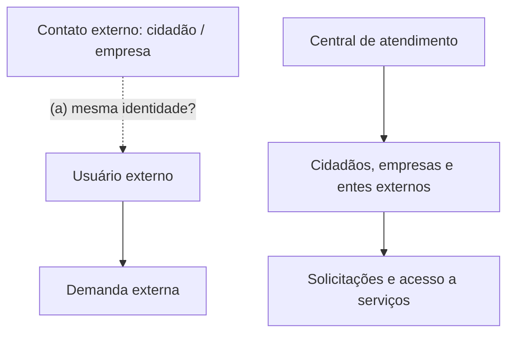

# 06 - Atores externos e atendimento ao cidadão (itens 1.32, 1.36–1.37)

> [!info]- Navegação
> **Matriz/índice:** [[../01 - Matriz de atores e relações|Matriz de atores e relações]] · **Demanda:** [[../../00 QA/01 - Demanda]] · **Plano de análise:** [[../../00 QA/02 - Plano de análise]] · **Mapa geral:** [[../00 - Mapa geral]]

> [!info] Escopo deste recorte — revisado e aprovado pelo Codex em 08/10/2026
> Itens do TR: **1.32, 1.32.1, 1.36–1.37** — **intervalo não contíguo no PDF**, agrupado por tema comum (atores externos — cidadãos, empresas e entes externos — e seu atendimento). Lido diretamente por render de página, não por extração textual. **Material arquivado não foi usado como evidência.** Mapa de páginas: 1.32–1.32.1 (p. 13); 1.36–1.37 (p. 16). Nesta rodada, a análise usou exclusivamente o texto do TR — Conhecimento > Módulos não foi consultado para este recorte.

## Modelo visual

## Cobertura dos itens

| Item do TR | Situação | Justificativa ou pendência |
|---|---|---|
| 1.32 | Mapeado | Área para cadastro/gerenciamento de contatos externos: cidadão (pessoa física) ou empresa (pessoa jurídica), identificados por CPF ou CNPJ conforme o caso; garante cadastro único na plataforma para esses tipos de usuário. |
| 1.32.1 | Mapeado | Ao serem cadastrados novos contatos externos, devem receber um e-mail de confirmação do cadastro. |
| 1.36 | Mapeado | Central de atendimento disponibilizada para que cidadãos, empresas e entes externos tenham acesso, via canais digitais do órgão, para realizar solicitações e acessar os serviços oferecidos pela entidade. |
| 1.37 | Mapeado | Cada usuário externo tem acesso a um ambiente virtual próprio para acompanhamento das demandas externas: recebe notificações, acompanha andamento das demandas que abriu/solicitou, realiza novas interações, realiza assinaturas, imprime documentos e abre novas demandas. |

**Resultado do recorte:** 4/4 itens (incluindo o subitem 1.32.1) considerados; 4 Mapeados, 0 Não aplicáveis. Pendências de detalhe registradas em Dúvidas/ambiguidades abaixo — não impedem a classificação "Mapeado" dos itens em si, pois os requisitos centrais estão expressos no TR.

## Elementos identificados

| Referência do TR | Elemento | Tipo | Papel/descrição | Dados ou atributos relevantes | Certeza/evidência |
|---|---|---|---|---|---|
| 1.32 | Contato externo | Entidade/Ator | Pessoa física (cidadão) ou pessoa jurídica (empresa) cadastrada na plataforma para interação com o órgão | tipo (pessoa física/jurídica); identificador (CPF ou CNPJ, conforme o tipo); cadastro único garantido na plataforma | Confirmado |
| 1.36 | Central de atendimento | Entidade/Canal | Canal disponibilizado para cidadãos, empresas e entes externos realizarem solicitações e acessarem os serviços oferecidos pela entidade | canais digitais do órgão (mecanismo não detalhado pelo TR); acesso a Serviço (entidade já mapeada no recorte 04, item 1.28) | Confirmado quanto à existência/propósito; mecanismo exato dos canais — A confirmar |
| 1.37 | Usuário externo | Ator | Cada usuário externo tem ambiente virtual próprio para acompanhar as demandas que abriu/solicitou | notificações recebidas; demandas abertas/solicitadas; ações disponíveis (interagir, assinar, imprimir documentos, abrir nova demanda) | Confirmado |
| 1.37 | Demanda (externa) | Entidade | Solicitação aberta/registrada por um usuário externo e acompanhada no ambiente virtual próprio | abertura por usuário externo; notificações associadas; assinaturas; documentos; estado de andamento (não nomeado pelo TR neste item) | Confirmado quanto à existência da entidade; estados nomeados — A confirmar |

## Relações/dependências identificadas

| Origem | Relação/dependência | Destino | Referência do TR | Certeza/evidência ou pendência |
|---|---|---|---|---|
| Contato externo | identificado por | CPF (pessoa física) ou CNPJ (pessoa jurídica) | 1.32 | Confirmado |
| Contato externo | tem garantido | cadastro único na plataforma | 1.32 | Confirmado |
| Contato externo | recebe (ao ser cadastrado) | E-mail de confirmação de cadastro | 1.32.1 | Confirmado |
| Central de atendimento | disponibiliza acesso a | Serviço (oferecido pela entidade — ver recorte 04, 1.28) | 1.36 | Confirmado quanto ao propósito; vínculo exato com a entidade Serviço do recorte 04 não detalhado neste item |
| Central de atendimento | disponibilizada para acesso de | Cidadãos, empresas e entes externos (via canais digitais do órgão) | 1.36 | Confirmado |
| Usuário externo (1.37) | corresponde à mesma população de — **não declarado pelo TR** | Cidadãos, empresas e entes externos que acessam a Central de atendimento (1.36) | 1.36, 1.37 | A confirmar — 1.37 só fala do ambiente virtual próprio; o TR não declara que "usuário externo" é a mesma população citada em 1.36 |
| Usuário externo | abre/solicita | Demanda (externa) | 1.37 | Confirmado |
| Usuário externo | recebe | Notificações sobre suas demandas | 1.37 | Confirmado |
| Usuário externo | pode realizar | Novas interações, assinaturas, impressão de documentos e abertura de novas demandas | 1.37 | Confirmado |
| Contato externo (1.32) | mesma identidade de — **não declarado pelo TR** | Usuário externo (1.37) | 1.32, 1.37 | A confirmar — ver dúvida abaixo |

## Dúvidas/ambiguidades

- **Contato externo (1.32) × Usuário externo (1.37):** o TR não declara explicitamente que o cadastro de contato externo (cidadão/empresa, identificado por CPF/CNPJ) é a mesma identidade/conta usada pelo usuário externo para acessar o ambiente virtual próprio. Os dois itens tratam de atores externos de forma consistente, mas essa consistência temática não é, por si, evidência de equivalência — não concluo a partir dela (mesma régua aplicada à dúvida de Zoneamento no recorte 04). **Pergunta objetiva para Rafael:** o cadastro de 1.32 é a mesma conta usada no acesso de 1.37, ou são dois conceitos distintos no produto?
- **"Entes externos" (1.36):** 1.36 cita um terceiro tipo de ator — "cidadãos, empresas **e entes externos**" — além dos dois tipos definidos em 1.32 (pessoa física/CPF, pessoa jurídica/CNPJ). O TR não define o que caracteriza um "ente externo" nem como ele é identificado/cadastrado. **Pergunta objetiva para Rafael:** o que é um "ente externo" neste contexto, e ele é cadastrado pelo mesmo mecanismo de 1.32 (CPF/CNPJ) ou por outro meio?
- **Mecanismo dos "canais digitais do órgão" (1.36):** o TR não detalha quais são esses canais nem como a Central de atendimento se conecta tecnicamente a eles — registrado como A confirmar, sem impacto na classificação do item.
- **Estado de andamento da Demanda (externa) (1.37):** o TR não nomeia estados explícitos (ex.: aberta/em andamento/concluída) para a demanda externa neste item. Pode haver relação com os estados de "mesa de trabalho" tratados em 1.33 (recorte 07, ainda não analisado) — não presumir equivalência sem análise desse recorte.

## Contexto de produto verificado em documentação (09/10/2026)

> Esta seção registra contexto de produto (Conhecimento > Módulos) — não é requisito literal do TR e não substitui nem resolve as dúvidas acima, que permanecem registradas tal como estão.

- **Contato externo (1.32) × Usuário externo (1.37):** [[QA Workspace/04 Conhecimento/Módulos/Usuário Cidadão|Usuário Cidadão]] documenta dois tipos de usuário (Pessoa Física/CPF, Pessoa Jurídica/CNPJ) que acessam "um ambiente próprio onde faz[em] solicitações e acompanha[m] o andamento delas" e podem "fazer solicitações na central de atendimento". Isso esclarece, **para o produto atual**, que 1.32 e 1.37 descrevem a mesma população/entidade ("Usuário Cidadão") — **confirmado no produto**. O TR, porém, não declara essa identidade explicitamente; a dúvida acima permanece registrada como tal.
- **Estado de andamento da Demanda externa (1.37):** [[QA Workspace/04 Conhecimento/Módulos/Mesa de trabalho|Mesa de trabalho]] documenta que uma solicitação externa pode ficar **Pausada** (o cidadão ainda interage) e, uma vez **Encerrada**, só volta a aceitar interação do cidadão depois que um servidor reabre a demanda. **Esclarecido no produto** — usa o mesmo modelo de status já mapeado no recorte 07.
- **"Entes externos" (1.36):** [[QA Workspace/04 Conhecimento/Módulos/Usuário Cidadão|Usuário Cidadão]] só documenta os dois tipos PF/PJ — **segue sem evidência** de um terceiro tipo "ente externo".
- **Mecanismo dos "canais digitais do órgão" (1.36):** a existência da Central de Atendimento está documentada ([[QA Workspace/04 Conhecimento/Módulos/Usuário Cidadão|Usuário Cidadão]]: "Fazer solicitações na central de atendimento"), mas o mecanismo técnico dos canais em si **segue sem evidência** específica.

## Fontes/evidências

- PDF: `Fontes/Termo de Referência SOGOV.pdf`, p. 13 (1.32, 1.32.1) e p. 16 (1.36–1.37). Lido por render de página, conferido diretamente nesta sessão em 08/10/2026. Material arquivado **não** foi usado como evidência.
- Conhecimento > Módulos: consultados em 09/10/2026 — [[QA Workspace/04 Conhecimento/Módulos/Usuário Cidadão|Usuário Cidadão]] e [[QA Workspace/04 Conhecimento/Módulos/Mesa de trabalho|Mesa de trabalho]] — só como evidência do produto atual (ver "Contexto de produto verificado em documentação" acima), não como requisito literal do TR.
