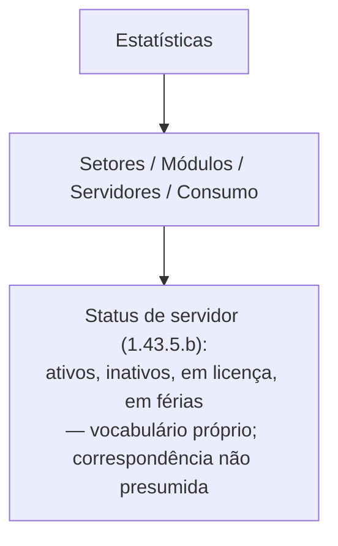

# 11 - Estatísticas e indicadores (item 1.43)

> [!info]- Navegação
> **Matriz/índice:** [[../01 - Matriz de atores e relações|Matriz de atores e relações]] · **Demanda:** [[../../00 QA/01 - Demanda]] · **Plano de análise:** [[../../00 QA/02 - Plano de análise]] · **Mapa geral:** [[../00 - Mapa geral]]

> [!info] Escopo deste recorte — revisado e aprovado pelo Codex em 08/10/2026
> Item do TR: **1.43**, coberto recursivamente em todos os subitens numerados que o PDF apresenta (8 linhas na Cobertura: 1.43, 1.43.1, 1.43.2, 1.43.3, 1.43.3.1, 1.43.4, 1.43.5, 1.43.6). Lido diretamente por render de página, não por extração textual. **Material arquivado não foi usado como evidência.** Mapa de páginas: 1.43–1.43.3.1.c (p. 19, após 1.42, que pertence ao recorte 10 e já foi analisado); 1.43.3.1.d–1.43.6.d (p. 20, última página do TR). Listas com letras dentro de um item numerado são conteúdo desse item, não subitens próprios do TR — exceto onde o próprio TR numera. No ponto em que o próprio item cita literalmente "nível de permissão" (1.43.5.c), o texto literal do TR é registrado normalmente na Cobertura/Elementos, e o **contexto de negócio já confirmado por Rafael** sobre os 5 níveis canônicos (recorte 03) é registrado ao lado, explicitamente rotulado como `Contexto confirmado por Rafael` — nunca reescrevendo ou substituindo o texto do TR. Para o status de servidor citado em 1.43.5.b ("ativos, inativos, em licença, em férias"), o mapeamento de status funcional/presença já confirmado por Rafael para outros itens (1.25.3, 1.27.10.1, 1.27.11.2 — ver recorte 03, revisado em 09/10/2026) **não é aplicado automaticamente aqui**: este item usa vocabulário próprio, em minúsculas e no plural, sem remissão cruzada no TR a esses outros itens — a exclusividade/sobreposição das categorias segue como dúvida (ver abaixo), sem presumir que "inativos" aqui signifique presença offline (sentido de 1.27.10.1) nem acesso suspenso (interpretação de trabalho confirmada por Rafael para outros itens). A pendência de "quem acessa a funcionalidade de estatísticas" (1.43, "administradores e usuários autorizados") permanece aberta, pois essa permissão específica ainda não foi confirmada por Rafael. Nesta rodada, a análise usou o texto do TR mais o contexto de negócio já confirmado apenas onde aplicável — Conhecimento > Módulos não foi consultado para este recorte.

## Modelo visual

## Cobertura dos itens

| Item do TR | Situação | Justificativa ou pendência |
|---|---|---|
| 1.43 | Mapeado | Funcionalidade de estatísticas da solução, para administradores e usuários autorizados visualizarem dados detalhados/organizados de setores, módulos, servidores e consumo de recursos, apoiando decisões baseadas em dados e conformidade legal. |
| 1.43.1 | Mapeado | Visualizadores: (a) gráficos — visão gerencial, dados agregados; (b) tabelas — visão operacional detalhada, complementar aos gráficos. |
| 1.43.2 | Mapeado | Categorias de relatórios de estatísticas: (a) Setores; (b) Módulos; (c) Servidores; (d) Consumo de recursos. |
| 1.43.3 | Mapeado | Dados de setores e subsetores cadastrados, permitindo comparações entre eles. |
| 1.43.3.1 | Mapeado | Dados gerais de setores (além de gráficos): (a) total de setores e quantidade de setores principais/subsetores/ativos/inativos; (b) demandas recebidas (internas/externas, com filtros por período e setor); (c) tempo médio de resolução de demandas (por setor); (d) documentos por situação, por setor — por status (em aberto, em elaboração, em tramitação, pausado, encerrado — **mesmo enum já citado no recorte 07**, 1.33.3.6/1.35.2.1); (e) engajamento de setores (média, baseada em ações realizadas nos documentos); (f) qualidade de atendimento externo (avaliações de satisfação de usuários externos nos documentos/processos, por setor). |
| 1.43.4 | Mapeado | Dados estatísticos de documentos criados nos módulos contratados: (a) total de documentos criados (internos/externos, com filtros por período, módulo e assunto ou serviço); (b) demandas por módulo (ranking de utilização); (c) demandas por serviço ou assunto (ranking de utilização); (d) documentos por situação, por módulo — mesmo enum de status; (e) qualidade de atendimento externo, por módulo. |
| 1.43.5 | Mapeado | Dados detalhados de servidores cadastrados: (a) total de servidores (ativos e inativos); (b) servidores por status — **TR: ativos, inativos, em licença, em férias** (vocabulário próprio deste item, sem remissão cruzada a 1.25.3/1.27.10.1/1.27.11.2 no texto — exclusividade/sobreposição das categorias não declarada; ver dúvida abaixo); (c) servidores por nível de permissão, exibição por níveis — **TR não nomeia os níveis neste item**. *Contexto confirmado por Rafael (recorte 03):* os 5 níveis canônicos — Administrador, Administrador Setorial, Especialista, Usuário básico, Somente leitura; (d) tempo médio de permanência na plataforma; (e) engajamento por usuário (mais/menos engajados, baseado em ações realizadas nos documentos). |
| 1.43.6 | Mapeado | Consumo de recursos e economia gerada pela digitalização: (a) armazenamento total (MB ou GB); (b) economia gerada — estimativa do valor economizado em papel e tinta, **com base na utilização do sistema**; (c) impressões e assinaturas realizadas; (d) usuários externos e atendimentos realizados. |

**Resultado do recorte:** 8/8 itens (incluindo subitens numerados) considerados; 8 Mapeados, 0 Não aplicáveis. Nenhum item pendente de leitura — pendências de conciliação com contexto já confirmado registradas em Dúvidas/ambiguidades abaixo. Este é o último recorte do TR (1.43 é o item final, p. 20).

## Elementos identificados

| Referência do TR | Elemento | Tipo | Papel/descrição | Dados ou atributos relevantes | Certeza/evidência |
|---|---|---|---|---|---|
| 1.43, 1.43.1, 1.43.2 | Estatística/Relatório | Entidade/Funcionalidade | Painel de estatísticas da solução, para administradores e usuários autorizados | visualizador (Gráfico ou Tabela); categoria (Setores, Módulos, Servidores, Consumo de recursos) | Confirmado |
| 1.43.3, 1.43.3.1 | Métrica de Setor | Entidade/Atributo | Conjunto de indicadores exibidos por setor/subsetor | total de setores/subsetores/ativos/inativos; demandas recebidas (internas/externas, filtro período/setor); tempo médio de resolução; documentos por situação (status); engajamento de setor; qualidade de atendimento externo (por setor) | Confirmado |
| 1.43.4 | Métrica de Módulo | Entidade/Atributo | Conjunto de indicadores exibidos por módulo contratado | total de documentos criados (filtros período/módulo/assunto-serviço); demandas por módulo (ranking); demandas por serviço/assunto (ranking); documentos por situação (status, por módulo); qualidade de atendimento externo (por módulo) | Confirmado |
| 1.43.5 | Métrica de Servidor | Entidade/Atributo | Conjunto de indicadores exibidos por servidor cadastrado | total ativos/inativos; status (ver linha "Status de servidor" abaixo); nível de permissão (ver linha "Nível de permissão" abaixo); tempo médio de permanência; engajamento por usuário | Confirmado (TR) quanto à existência das métricas; mapeamento de status/nível — ver linhas específicas abaixo (TR + Contexto confirmado por Rafael) |
| 1.43.6 | Métrica de Consumo de recursos | Entidade/Atributo | Conjunto de indicadores de uso de armazenamento e economia gerada pela digitalização | armazenamento total (MB/GB); economia gerada — estimativa de valor economizado em papel/tinta, **com base na utilização do sistema** (1.43.6.b); impressões/assinaturas realizadas; usuários externos e atendimentos realizados | Confirmado |
| 1.43.5.b | Status de servidor (estatística) | Estado/enum | Categorias usadas para classificar servidores nas estatísticas | **TR:** 4 categorias — ativos, inativos, em licença, em férias. Vocabulário próprio deste item, sem remissão cruzada a 1.25.3, 1.27.10.1 ou 1.27.11.2 — **não se presume** que corresponda ao mapeamento de status funcional/presença confirmado por Rafael para esses outros itens (ver recorte 03) | Confirmado (TR, enum citado neste item); exclusividade/sobreposição das categorias e eventual correspondência com os demais enums de status — **A confirmar** |
| 1.43.5.c | Nível de permissão (estatística) | Dimensão de agrupamento | Estatística de servidores agrupada por nível de permissão | **TR:** não nomeia os níveis neste item. **Contexto confirmado por Rafael (recorte 03):** os 5 níveis canônicos — Administrador, Administrador Setorial, Especialista, Usuário básico, Somente leitura (mapeados dos rótulos originais do TR) | Confirmado (TR, existência da estatística) + Contexto confirmado por Rafael (nomes dos níveis, recorte 03) — fontes mantidas separadas |
| 1.43 | "Administradores e usuários autorizados" | Ator (termo do TR) | Quem acessa a funcionalidade de estatísticas, segundo o texto introdutório do item | termo genérico do TR, não nomeia níveis específicos | Confirmado quanto à citação textual; correspondência com os níveis canônicos (Administrador, Administrador Setorial etc.) — **A confirmar**, ver dúvida abaixo |

## Relações/dependências identificadas

| Origem | Relação/dependência | Destino | Referência do TR | Certeza/evidência ou pendência |
|---|---|---|---|---|
| Estatística/Relatório | usa | Visualizador (Gráfico ou Tabela) | 1.43.1 | Confirmado |
| Estatística/Relatório | categorizada em | Setores, Módulos, Servidores ou Consumo de recursos | 1.43.2 | Confirmado |
| Relatório de Setores | tem | Métrica de Setor | 1.43.3, 1.43.3.1 | Confirmado |
| Relatório de Módulos | tem | Métrica de Módulo | 1.43.4 | Confirmado |
| Relatório de Servidores | tem | Métrica de Servidor | 1.43.5 | Confirmado |
| Relatório de Consumo de recursos | tem | Métrica de Consumo de recursos | 1.43.6 | Confirmado |
| Documento/Processo (recorte 07) | tem | Status (Em aberto \| Em elaboração \| Em tramitação \| Pausado \| Encerrado) usado nas estatísticas de Setor e de Módulo | 1.43.3.1.d, 1.43.4.d | Confirmado — mesmo enum já citado no recorte 07 (1.33.3.6, 1.35.2.1) |
| Usuário externo (recorte 06) | participa de (e fornece avaliação de satisfação em) | Documento/Processo | 1.43.3.1.f, 1.43.4.e | Confirmado que o TR cita avaliação de satisfação de "usuários externos" nestes itens, para compor o indicador de Qualidade de atendimento externo — registrado dentro da fronteira deste recorte, **sem resolver** a dúvida mais ampla do recorte 06 sobre identidade/população de atores externos |
| Servidor | tem | Status para fins estatísticos — TR: ativos, inativos, em licença, em férias (vocabulário próprio deste item, sem remissão cruzada no TR a 1.25.3/1.27.10.1/1.27.11.2) | 1.43.5.b | Confirmado (TR, enum citado); correspondência com os demais enums de status/presença — **não presumida**, A confirmar |
| Servidor | tem | Nível de permissão — TR não nomeia; Contexto confirmado por Rafael: Administrador, Administrador Setorial, Especialista, Usuário básico, Somente leitura | 1.43.5.c | Confirmado (TR, existência da estatística) + Contexto confirmado por Rafael (recorte 03) |
| Estatística/Relatório (1.43) | acessível a | "Administradores e usuários autorizados" (termo do TR) | 1.43 | Confirmado quanto à citação; correspondência com os níveis canônicos — **A confirmar**, ver dúvida abaixo |

## Dúvidas/ambiguidades

- **"Administradores e usuários autorizados" (1.43, texto introdutório):** termo genérico usado pelo TR para quem acessa a funcionalidade de estatísticas — não nomeia níveis específicos. Não presumo que "administradores" aqui corresponda exatamente ao nível canônico "Administrador" (e/ou "Administrador Setorial"); pode ser um termo informal mais amplo. **Pergunta objetiva para Rafael:** o acesso às estatísticas é restrito a Administrador/Administrador Setorial, ou abrange outros níveis também ("usuários autorizados")?
- **Categorias de status nas estatísticas de servidores (1.43.5.b):** o TR lista "ativos, inativos, em licença, em férias" como categorias desta estatística, sem declarar se são mutuamente exclusivas ou se "em licença"/"em férias" também contam dentro de "ativos". Este item usa vocabulário próprio (minúsculo, plural), sem remissão cruzada no texto a 1.25.3, 1.27.10.1 ou 1.27.11.2 — **não presumo** que "inativos" aqui signifique presença offline (sentido de 1.27.10.1, p. 6) nem acesso suspenso (interpretação de trabalho confirmada por Rafael para esses outros itens, ver recorte 03), por falta de evidência textual que ligue este item aos demais. **Pergunta objetiva para Rafael:** no relatório 1.43.5.b, as categorias "ativos", "inativos", "em licença" e "em férias" são mutuamente exclusivas (um servidor conta numa só), ou "em licença"/"em férias" também são contados dentro de "ativos"?

## Fontes/evidências

- PDF: `Fontes/Termo de Referência SOGOV.pdf`, p. 19–20 (ver mapa de páginas no Escopo acima). Lido por render de página, conferido diretamente nesta sessão em 08/10/2026. Material arquivado **não** foi consultado como evidência.
- Conhecimento > Módulos: não consultado nesta rodada (análise restrita ao texto do TR).
- Recorte 07 (`Seções do TR/07 - Mesa de trabalho, etiquetas e tramitação (1.33–1.35)`): cross-referência do enum de status de Documento/Processo, citado novamente de forma idêntica em 1.43.3.1.d e 1.43.4.d.
- Recorte 03 (`Seções do TR/03 - Estrutura organizacional e cadastro de servidores (1.26–1.27)`): contexto de negócio confirmado por Rafael sobre os 5 níveis canônicos — aplicado em 1.43.5.c, lado a lado com o texto literal do TR, mantendo a proveniência separada (`Contexto confirmado por Rafael` ≠ exigência literal do PDF). **Não aplicado** em 1.43.5.b (status): esse item usa vocabulário próprio, sem remissão cruzada no TR, e o mapeamento de status funcional/presença (revisado no recorte 03 em 09/10/2026) não é propagado automaticamente para ele — ver dúvida acima.
