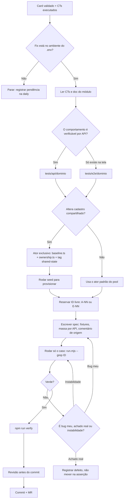
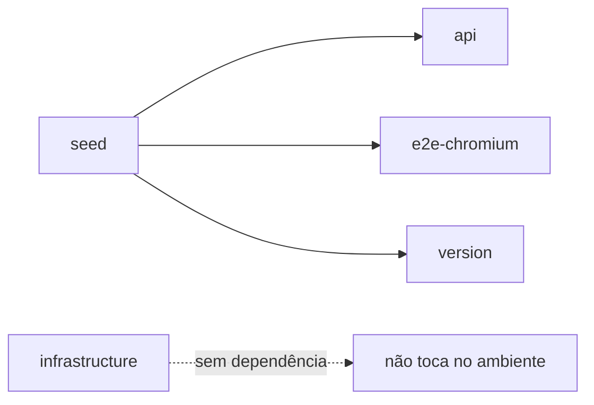

---
tags:
  - qa
  - conhecimento
  - automacao
tipo: referencia
revisado: 2026-10-01
---
# Automação Playwright

> [!info] Por que esta nota existe
> A suíte Playwright entrou na `main` do `sogov-automation-test` em setembro/2026, escrita por **Waldemar Coimbra**, sem passar por nenhum registro do vault. Até 01/10/2026 **todo** documento de automação daqui — [[1.24-1.25 - Plano de Automação|Plano de Automação]], as skills, o [[FLUXOS]] — dizia "Cypress". Esta nota fecha esse buraco: é o que você lê antes de voltar a escrever teste.

## O estado em uma frase

**Playwright é o padrão. Cypress é legado em fim de vida.**

> [!success] Decisão do Rafael, 01/10/2026
> A migração está sendo finalizada. O Cypress **vai ser descartado — mas não agora**. **Teste novo só se escreve em Playwright.**
>
> A suíte Cypress continua existindo e rodando até o descarte: serve para ler o que já existe e como referência de regra de negócio. Não é lugar de escrever caso novo.

| | Cypress (raiz) | Playwright (`playwright/`) |
|---|---|---|
| Specs | ~127 testes legados | **131 arquivos / 398 testes** |
| Entrada | `cypress.config.js` | `playwright/playwright.config.ts` |
| Roda no CI | ✅ sim (`.gitlab-ci.yml`) | ❌ **não** |
| Estado | **legado**, a descartar (sem data) | **padrão** — todo caso novo vem pra cá |

## Como a migração entrou

Três commits de migração, mergeados na `main` pela MR da branch `migracao-playwright` (commit de merge `1d78bf9`):

- `a8bc9c5` (20/09) — `feat: add Playwright migration suite`, o commit-raiz
- `87ceee1` (23/09) — merge da `main` e espelhamento dos casos novos
- `e7fd5f5` (24/09) — execução paralela com até 4 workers

A branch **não existe mais** no GitLab. Quem tiver clone antigo vê `origin/migracao-playwright` num ref congelado — é ilusão, resolve com `git fetch --prune`.

> [!tip] Feita com Claude Code
> Os commits trazem `Co-Authored-By: Claude`. O registro do processo está em `playwright/planning/` (15 documentos) — vale como leitura de contexto, não como regra viva.

## Arquitetura — o que muda em relação ao Cypress

### Fixtures no lugar de commands

Nenhum spec importa `test` do `@playwright/test`. **Todos** importam de `src/fixtures/index.ts`, que entrega quatro coisas no `async ({ ... })`:

| Fixture | Escopo | O que é |
|---|---|---|
| `env` | worker | config validada (URLs, timeouts, `runId`) |
| `seed` | worker | manifesto da massa, já amarrado ao worker |
| `actors` | teste | sessões autenticadas (ver abaixo) |
| `cleanup` | teste | `ScenarioScope` para restaurações LIFO |

Mais dois automáticos: `diagnostics` (anexa log GraphQL em falha) e `pace` (3 s entre testes, herdado do Cypress, porque o homolog é compartilhado).

### Autenticação por ator — não existe `cy.loginAgent`

Sem `storageState`, sem login global. Cada ator abre o próprio `BrowserContext`:

```ts
const agent   = await actors.agent();      // servidor, com page
const citizen = await actors.citizenApi(); // cidadão, só API, sem browser
const admin   = await actors.admin();      // admin SOGOV
```

A sessão traz `page`, `request`, `api` (cliente GraphQL), `token`, `instanceId`. Fecha sozinha no teardown.

> [!warning] Regra que substitui o `cy.goToFresh`
> Vários atores no mesmo teste = **vários contexts**. Nunca fazer logout/login na mesma página. Isso resolve de origem o problema de estado React/Apollo herdado que o `goToFresh` contornava no Cypress.

Teste de API usa `actors.agentApi()`; teste E2E usa `actors.agent()` e pega o `page` dali.

### Massa de dados: seed idempotente

`src/data/seed/` reconcilia tudo por API antes da suíte rodar. É o projeto `seed`, do qual `api`, `e2e-chromium` e `version` dependem — roda sozinho, não precisa ser chamado.

O preparo de massa dentro do teste é **sempre por API**; só a ação avaliada passa pela UI:

```ts
await generateDocument(agent.api, makeDocument(documentContext(seed)));
```

### Paralelismo com posse declarada

Até 4 workers. Cada worker recebe um servidor/cidadão próprio do pool.

> [!important] Antes de escrever teste que altera cadastro
> Teste que muda setor, e-mail, nome ou mesa de um servidor precisa de um **servidor exclusivo**: declarar em `src/data/seed/baseline.ts`, registrar o dono em `src/data/seed/ownership.ts`, marcar o arquivo com `@shared-state` e rodar o seed. Nunca alterar servidor que outro arquivo lê.
>
> Asserção sobre listagem compartilhada (mesa, mural, contadores) **filtra pelo protocolo do próprio caso**.
>
> Isso é verificado automaticamente por `tests/infrastructure/parallel-safety.spec.ts` — violação reprova sem nem rodar o teste.

### Camada de UI: funções, não Page Objects

`src/ui/<domínio>.ts` reexporta `src/ui/internal/<domínio>.ts` embrulhado em `test.step` automático. Por isso `test.step` explícito é raro nos specs — o passo aparece no relatório sozinho.

Domínios disponíveis: `access-keys`, `common`, `contact-groups`, `deadlines`, `dispatch`, `document`, `imported-documents`, `labels`, `matters-services`, `models`, `mural`, `organizational`, `profile`, `public-agents`, `signature`, `tracking`, `workboard`, `workflow`.

Helpers de sincronização que substituem os `cy.wait` do Cypress:

- `waitForGraphQL(page, operationName, opts)` — arma a espera **antes** da ação
- `clickWhenStable(locator)` — para modal/gaveta MUI que entra animando
- `clickUntilGraphQL(page, target, operationName)` — reclica só se nenhuma requisição saiu

## Convenção de escrita

```ts
import { test, expect } from '../../../src/fixtures/index.js';  // sempre .js

// E26 — origem: cypress/testes/e2e/.../arquivo.e2e.cy.js (SGV-8173)
// Por que diverge da origem, se divergir.

test.describe('Downloads - Versão compactada', { tag: ['@e2e', '@downloads'] }, () => {
  test('E26-C01 [REGRESSÃO] O download produz um ZIP íntegro', { tag: '@smoke' }, async ({ actors, seed }) => {
    expect(valor, 'mensagem descritiva obrigatória').toBeGreaterThan(0);
  });
});
```

Regras que o lint cobra:

1. **ID no título**: `A<NN>` (API) ou `E<NN>` (E2E) + `-C<NN>`. É o que o relatório usa para agrupar.
2. **Classificação**: `[SUCESSO]` · `[FALHA]` · `[REGRESSÃO]`.
3. **Comentário de origem obrigatório** logo após os imports.
4. **Toda `expect` leva mensagem** no segundo argumento.
5. **Tags**: `['@api'|'@e2e', '@<domínio>']` no describe; `@smoke` no `test`, não no describe.
6. `@shared-state` no describe quando o arquivo muta estado compartilhado.
7. **Bug de produto**: `test.fail()` imediatamente antes da asserção do bug, nunca no topo.
8. **Skip** sempre com `annotation` tipada explicando o motivo.

Proibido pelo ESLint: `waitForTimeout`, `elementHandle`, asserção que não seja web-first, `expect` sem `await`.

## Fluxo do QA com o repositório

Do card validado até o teste entregue. Os dois primeiros losangos são **gates**: não se passa deles sem resposta.



`Card validado → Gates → Camada → Ator → ID → Spec → Verde → Verify → Revisão`

A triagem de falha em três categorias (bug meu × achado real × instabilidade) vem da [[SKILL_AUTOMACAO_TERMO_REFERENCIA]] e continua valendo igual — é independente de framework.

### A ordem do que chamar

| # | Comando | Quando |
|---|---|---|
| 1 | `npm run test:infra` | Depois de mexer em config, seed ou ownership. Local, não toca no ambiente |
| 2 | `node scripts/run.mjs --project=api --grep "A55"` | Enquanto escreve — só o seu caso |
| 3 | `npm run test:api` / `test:e2e` | Domínio inteiro, antes de considerar pronto |
| 4 | `npm run verify` | Antes do commit: typecheck + lint + knip + independência + infra + audit |
| 5 | `npm run report` | Ver o que falhou, com trace |

> [!tip] O seed roda sozinho
> `api`, `e2e-chromium` e `version` declaram `dependencies: ['seed']` — o Playwright executa o seed **automaticamente** antes deles. `npm run test:seed` avulso só é necessário em dois casos: no **UI mode** (`test:ui` não executa dependências) e para provisionar um ator novo que você acabou de declarar no `baseline.ts`.
>
> `infrastructure` **não** depende do seed: roda isolado, sem tocar no ambiente.



## Como rodar

Sempre via `scripts/run.mjs` (gera o `PW_RUN_ID`), **nunca** `playwright test` direto. Os scripts `npm run test:*` já chamam o launcher.

### No dia a dia

```bash
cd ~/Documentos/Sogov/sogov-automation-playwright/playwright

npm run test:smoke    # 10 casos críticos — melhor primeiro comando, valida tudo em poucos minutos
npm run test:api      # 202 testes
npm run test:e2e      # 147 testes, bem mais lento
npm run report        # abre o relatório da última rodada, com trace das falhas
```

Um caso ou um domínio específico:

```bash
node scripts/run.mjs --project=api --grep "A55"
node scripts/run.mjs --project=e2e-chromium --grep @signatures
```

> [!danger] Não rode `npm run test`
> A suíte inteira de uma vez satura o gerador de PDF do backend e produz falhas que **não são bugs reais** (`system.messages.pdf-generator-attachment-error`). Vá por domínio, em lotes de 15–20 min. Os specs de `signatures` são anormalmente lentos — trate à parte, com tempo reservado.
>
> Duas execuções simultâneas no mesmo ambiente também não são suportadas.

### Setup da máquina (uma vez só)

```bash
cd ~/Documentos/Sogov/sogov-automation-playwright/playwright
npm install                        # install, NÃO ci — ver aviso abaixo
npx playwright install chromium
# montar o .env (tabela de variáveis logo abaixo)
npm run test:infra                 # confirma que a config está de pé, sem tocar no ambiente
```

> [!warning] `npm ci` não funciona — o pacote não tem lockfile versionado
> Não existe `package-lock.json` em `playwright/`, e o `.gitignore` **não** o exclui: simplesmente nunca foi commitado. `npm ci` falha de saída; use `npm install`.
>
> Consequência real: as dependências **diretas** estão pinadas (versões exatas, sem `^`), mas as **transitivas** não são reproduzíveis entre máquinas nem no CI. Vale propor ao time commitar o lockfile.

> [!tip] Node: `.nvmrc` pede 24, `engines` aceita 22
> O `package.json` declara `"node": ">=22.0.0"` e o `.nvmrc` diz `24`. Divergência interna do projeto. Rodou sem problema em **Node 22.22.1** (01/10/2026).

> [!success] Ambiente validado na máquina do Rafael em 01/10/2026
> `npm run test:infra` → **50/50**. `npm run test:seed` → **passou em 1.4 min**, instância `E2E Automatic Test` id **45 reutilizada** (prova de que a idempotência funciona — não recriou nada). Manifesto: 3 setores (GP, SCTA, DIR), 29 agentes, 5 cidadãos. `npm run test:list` → **398 testes em 131 arquivos**.
>
> O seed emite avisos de *"vínculos duplicados ignorados"* nos módulos PA e CO — resíduo de dados no homolog, não erro: ele escolhe o vínculo mais antigo e segue.

### Variáveis do `.env`

Derivam do `cypress.env.json` do lado Cypress. Todas obrigatórias para `seed`, `api` e `e2e` — o `config/env.ts` lança erro se faltar uma.

| Variável | Vem de |
|---|---|
| `PW_BASE_URL` | `GUI_BASE_URL` |
| `PW_GRAPHQL_URL` | `API_URL` |
| `PW_AUTH_URL` | `API_URL_AUTH` |
| `PW_ADMIN_USERNAME` / `PW_ADMIN_PASSWORD` | `ADMINISTRATOR_*` |
| `PW_AGENT_PASSWORD` / `PW_CITIZEN_PASSWORD` | fixas no produto: `Teste123!` |
| `PW_GMAIL_USER` / `PW_GMAIL_APP_PASSWORD` | `GMAIL_*` |
| `PW_SEED_NAMESPACE` | qualquer string — **é obrigatória mas não é usada em lugar nenhum do código** (vestígio de design) |

O `.env` está coberto por `.gitignore` (`.env*`), então não corre o risco dos `cypress.env.*` do lado Cypress.

## O que a migração NÃO cobriu

> [!warning] Três lacunas abertas em 01/10/2026
> 1. **O CI continua 100% Cypress** — `.gitlab-ci.yml` usa `image: cypress/included:16.0.0`. Nenhum pipeline roda Playwright. **Enquanto isso durar, a suíte Playwright não protege merge nenhum** — é a inconsistência mais séria, e não se resolve do lado do vault.
> 2. **As skills e agentes `.claude/` do repo ensinam Cypress** linha a linha (`cy.loginAgent`, `cy.apiRequest`, `cy.goToFresh`). Quem pedir "cria um teste" hoje é empurrado para o framework que está sendo descartado. Proposta de correção: [[2026-10-01-skills-automacao-playwright]].
> 3. ~~**O TR 1.24-1.25 não existe no lado Playwright** — zero ocorrências de `CT-0` em `playwright/`. Há `tests/api/auth/{login,credentials}.spec.ts`, mas sem relação com a numeração CT-001…CT-038.~~ **Corrigido em 02/10/2026** — essa conclusão estava errada: só buscou pelo rótulo literal `CT-0`, sem comparar o conteúdo. `tests/api/auth/login.spec.ts` e `credentials.spec.ts` **são** o porte de CT-001 a CT-012 (Suítes 1 e 2) — títulos idênticos aos do `03 - Casos de teste`, só com rótulo de teste diferente (`A02-C01`...`A02-C09`, `A01-C01`...`A01-C03`). Confirmado verde num run real de 01/10/2026 (`playwright/test-results/results.xml`, 398 testes). Restam as Suítes 3, 4 e 5 (26 CTs) a portar. Ver [[QA Workspace/02 Demandas/DEV/SGV-11262 - [QA-Automação] Termo de Referência SOGOV/SGV-11971 - TR 1.24-1.25 Autenticação e Ciclo de Vida/01 Automação/01 - Plano de automação|Plano de Automação]].

## Antes de escrever o primeiro spec

Ler, nesta ordem:

1. `playwright/README.md` — paralelismo e posse de atores
2. `playwright/src/fixtures/index.ts` — o que está disponível no teste
3. `playwright/src/ui/internal/common.ts` — `clientPath`, `citizenPath`, `byTestId`, `waitForGraphQL`
4. `playwright/src/data/factories/documents.ts` — como montar massa
5. Um spec do mesmo domínio, como molde
6. `playwright/eslint.config.mjs` — o que o lint recusa
7. `playwright/planning/10-PARIDADE-P90.md` — qual ID ainda está livre

## Referências

- Repo: `~/Documentos/Sogov/sogov-automation-test` (branch de trabalho) · worktree de leitura em `~/Documentos/Sogov/sogov-automation-playwright`
- `playwright/planning/01-ARQUITETURA.md` — decisões de arquitetura
- `playwright/planning/10-PARIDADE-P90.md` — rastreabilidade Cypress → Playwright
- `PLAYWRIGHT_LESSONS.md` (raiz) — lições do porte
- [[Ambientes e Links de Trabalho]] · [[Docs do repositório Sogov]]
