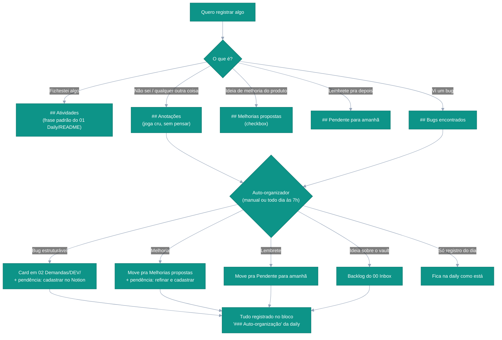

---
tags:
  - qa
  - dashboard
cssclasses:
  - qa-dashboard
---
# Central de Operações QA

> [!tip] Como usar
> Esta é a única página inicial do vault — as demais dashboards (Bugs, Demandas) ficam embutidas aqui embaixo como seções, não são pontos de entrada separados.

---

## Hoje

```dataviewjs
const hoje = dv.pages('"QA Workspace/01 Daily"')
  .where(p => p.date && p.date.toISODate() === dv.date("today").toISODate());
const wrap = dv.el("p", "", { cls: "qa-today" });
if (hoje.length > 0) {
  dv.el("span", `[[${hoje[0].file.path}|✏️ Escrever na daily de hoje — ${hoje[0].file.name}]]`, { container: wrap });
} else {
  dv.el("span", "A daily de hoje ainda não existe — o botão Atualizar cria na hora. ", { container: wrap, cls: "qa-today-missing" });
}
const btn = dv.el("button", "🔄 Atualizar", { container: wrap, cls: "qa-atualizar" });
btn.onclick = () => {
  const { exec } = require("child_process");
  const script = app.vault.adapter.basePath + "/.obsidian/scripts/qa-atualiza.py";
  new Notice("🔄 Atualizando o ciclo da daily…");
  exec(`python3 "${script}"`, { timeout: 30000 }, (err, stdout, stderr) => {
    if (err) new Notice("❌ Falhou: " + (stderr || err.message), 10000);
    else new Notice(stdout.trim() || "✅ Atualizado", 10000);
  });
};
```

---

## Resumo de Bugs

```dataviewjs
const bugs = dv.pages('#bug').where(p => p.file.ext === "md");
const kpis = [
  { label: "abertos",       n: bugs.where(p => p.status === "aberto").length,        cor: "#dc2626" },
  { label: "em validação",  n: bugs.where(p => p.status === "em_validacao").length,  cor: "#d97706" },
  { label: "resolvidos",    n: bugs.where(p => p.status === "resolvido").length,     cor: "#059669" },
  { label: "descartados",   n: bugs.where(p => p.status === "descartado").length,    cor: "#64748b" },
  { label: "total",         n: bugs.length,                                          cor: "#0d9488" },
];
const faixa = dv.el("div", "", { cls: "qa-kpis" });
for (const k of kpis) {
  const card = faixa.createDiv({ cls: "qa-kpi" + (k.n === 0 ? " is-zero" : "") });
  card.style.setProperty("--kpi", k.cor);
  card.createDiv({ cls: "qa-kpi-n", text: String(k.n) });
  card.createDiv({ cls: "qa-kpi-l", text: k.label });
}
```

## Bugs

![[Bugs.base]]

---

## Demandas (hub)

> [!info] O que aparece aqui
> Notas hub com a tag `demanda` (criadas a partir de [[Sistema/Templates/Demanda.md|Demanda.md]] para Melhorias/Funcionalidades/POCs). Bugs individuais usam só a tag `bug` e aparecem na seção "Bugs" acima, não aqui.

![[Demandas.base]]

---

## Pendências em aberto

### Diário mais recente

```dataviewjs
const dailies = dv.pages('"QA Workspace/01 Daily"').where(p => p.date && p.date <= dv.date("today"));
if (dailies.length === 0) {
  dv.el("p", "Nenhuma nota diária encontrada.");
} else {
  const latest = dailies.sort(p => p.date, 'desc')[0];
  dv.el("p", `Mostrando pendências de **${latest.file.link}** (${latest.date.toFormat("dd/MM/yyyy")}):`);
  const openTasks = latest.file.tasks.where(t => !t.completed && t.text.trim() !== "" && !/^(Sim|Não)$/i.test(t.text.trim()));
  if (openTasks.length === 0) {
    dv.el("p", "✅ Nenhuma pendência aberta no diário mais recente.");
  } else {
    dv.taskList(openTasks, false);
  }
}
```

### Inbox

```dataview
TASK
FROM "QA Workspace/00 Inbox"
WHERE !completed
```

---

## Melhorias propostas em aberto

```dataviewjs
const dailies = dv.pages('"QA Workspace/01 Daily"').where(p => p.date);
let items = [];
let maxMel = 0;
for (const p of dailies) {
  for (const t of p.file.tasks) {
    const m = t.text.match(/MEL-(\d{4})/);
    if (m) maxMel = Math.max(maxMel, parseInt(m[1], 10));
    if (!t.completed && t.text.trim() !== "" && t.section && t.section.subpath === "Melhorias propostas") items.push(t);
  }
}
// cards Demanda já cadastrados também seguram o número (frontmatter mel)
for (const p of dv.pages('#demanda')) {
  if (p.mel) maxMel = Math.max(maxMel, parseInt(String(p.mel), 10) || 0);
}
const prox = String(maxMel + 1).padStart(4, "0");
dv.el("p", `Próximo número livre: **MEL-${prox}**`);
if (items.length === 0) {
  dv.el("p", "✅ Nenhuma melhoria proposta em aberto.");
} else {
  dv.taskList(items, true);
}
```

---

## Navegação rápida

| Área | Link |
|---|---|
| Passo a passo dos fluxos | [[Sistema/Contexto/FLUXOS\|FLUXOS]] |
| Diário de hoje | [[QA Workspace/01 Daily/README\|01 Daily]] |
| Índice de diários | [[QA Workspace/01 Daily/Índice Diário.base\|Índice Diário]] |
| Backlog do vault | [[QA Workspace/00 Inbox/README\|00 Inbox]] |
| Demandas por ambiente | [[QA Workspace/02 Demandas/README\|02 Demandas]] |
| Evidências de validação | [📁 abrir pasta](file:///home/sogov-rafael-cartaxo/Documentos/Sogov/Obsidian/BrainWork/QA%20Workspace/Evid%C3%AAncias/) |
| Padrões e skills | [[Sistema/README\|Sistema]] |

---

## Fluxo de trabalho

> [!tip] Regra de bolso
> **Escreveu? Foi na daily. Quer ver? Foi aqui na Dashboard.** O Inbox não é lugar de anotar — é só o backlog do próprio vault. Passo a passo completo de cada fluxo (dia, bug, melhoria, evidência): [[Sistema/Contexto/FLUXOS|FLUXOS]]. Lógica do organizador: [[Sistema/Skills/SKILL_INBOX|SKILL_INBOX]].


