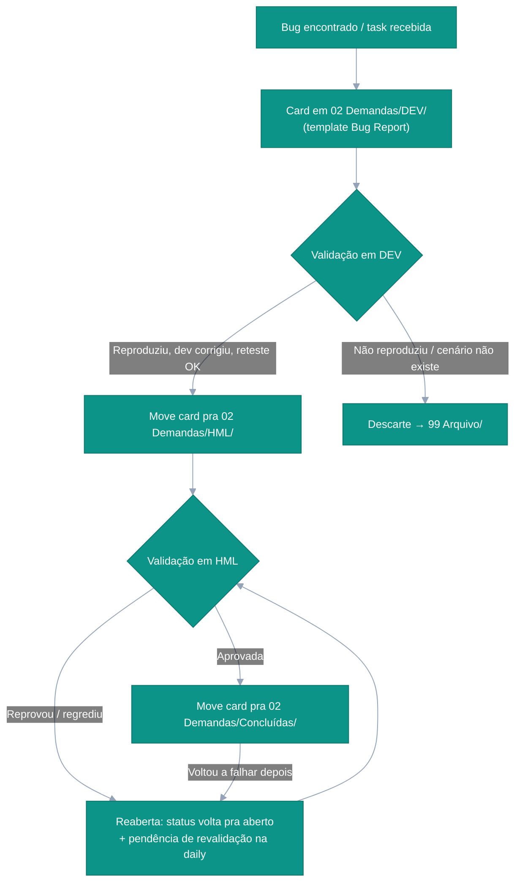

---
tags:
  - qa
  - contexto
---
# Fluxos — passo a passo

Guia prático de execução: a ordem certa de fazer cada coisa, do começo ao fim. As regras completas moram nos documentos linkados em cada passo — este arquivo não duplica regra, só encadeia. Validação destes fluxos: [[QA Workspace/Sistema/Specs/2026-07-14-cts-fluxos-vault|CTs dos fluxos do vault]].

## 0. Mapa de atuação — aconteceu X, uso qual fluxo?

Roteamento de um olhar: acha a situação na coluna da esquerda e segue. A **ação imediata** é o primeiro passo concreto — o resto está no fluxo linkado.

| Aconteceu isso | Fluxo | Ação imediata |
|---|---|---|
| Começando o dia | 1 | Abrir a Dashboard → **✏️ daily de hoje** (não existe? 🔄 Atualizar cria) → revisar Pendências de ontem |
| Fiz/testei/vi/pensei algo e quero registrar | 2 | Escrever na seção certa da daily (na dúvida: `## Anotações`, cru — o organizador roteia) |
| Suspeitei de bug (ainda não confirmei) | 3a·0 | `❓ Suspeita de bug registrada: <título>` em Atividades + "Investigar suspeita" em A fazer hoje |
| Confirmei bug novo (reproduzível) | 3a | Gravar evidência (fluxo 5) → card em `02 Demandas/<ambiente testado>/` via [[QA Workspace/Sistema/Skills/SKILL_BUGS\|SKILL_BUGS]] |
| Vou validar demanda em DEV / HML / hotfix | 3b / 3c / 3d | Executar os CTs do card, gravar evidência, frase padrão na daily |
| Bug investigado não reproduz / cenário não existe | 3e | Regra de descarte → card pro `99 Arquivo/` com `🗑️` na daily |
| Chegou task só de API | 3f | Definir critérios no card; validação pula DEV, direto em homologação |
| Validação reprovou **e** abriu bug novo (SGV próprio) | 3g | Marcar a pendência com `(reprovada em <ambiente>, bug SGV-YYYY aberto)` — o organizador completa o resto |
| Tive ideia de melhoria do produto | 4 | Checkbox `**MEL-NNNN · Título**` em Melhorias propostas (próximo número livre: Dashboard) |
| Gravei um vídeo de validação | 5 | Renomear (`<número> - <descrição e resultado>`) e mover pra subpasta do ambiente **no mesmo dia** ([[QA Workspace/Evidências/README\|convenção]]) |
| Chegou demanda já cadastrada pra refinar (com ou sem análise junto) | 6 | Material bruto → `05 Refinar/` + pendência na fila; análise na mesa ([[QA Workspace/Sistema/Templates/Refinamento.md\|Refinamento.md]]) → card destilado, só com o problema |
| Fechando o dia | 7 | Anotar resultado curto nos checkboxes feitos (com ambiente!) → Pendente para amanhã → 🔄 Atualizar |
| Quero que a IA organize tudo que ficou cru | — | Pedir "organiza a daily" numa sessão — cobre a parte mecânica + classificação ([[QA Workspace/Sistema/Skills/SKILL_INBOX\|SKILL_INBOX]]) |

---

## 1. Começar o dia

1. Abrir a [[QA Workspace/Dashboard/Dashboard|Dashboard]] — é a página de leitura: KPIs de bugs, pendências em aberto, melhorias propostas.
2. Conferir a seção **Pendências em aberto** (o que ficou de ontem) e **Melhorias propostas em aberto**.
3. Clicar no botão **✏️ Escrever na daily de hoje**. Se a daily ainda não existe: `Ctrl+P` → "Daily notes: Open today's daily note" (cria já com o template).
4. Na daily, revisar o callout **Pendências de ontem** e marcar em **A fazer hoje** o que continua valendo.

A partir daqui, o dia inteiro acontece dentro da daily.

## 2. Registrar algo durante o dia

Regra de bolso: **escreveu? foi na daily. quer ver? foi na Dashboard.**

| O que aconteceu | Onde registrar na daily |
|---|---|
| Fiz/testei algo | `## Atividades` (DEV/HML/POCs), com a [[QA Workspace/01 Daily/README|frase padrão]] |
| Vi um bug | `## Bugs encontrados` |
| Tive ideia de melhoria do produto | `## Melhorias propostas` (checkbox) |
| Lembrete pra depois | `## Pendente para amanhã` |
| Não sei classificar / qualquer outra coisa | `## Anotações`, cru, sem pensar |

Não precisa decidir na hora: o que cair em **Anotações** ou **Bugs encontrados** sem estrutura, o auto-organizador ([[QA Workspace/Sistema/Skills/SKILL_INBOX|SKILL_INBOX]]) roteia. Três gatilhos: o botão **🔄 Atualizar** da Dashboard (parte mecânica — carry-over e continuações anotadas — instantâneo, sem IA), a sessão interativa ("organiza a daily", cobre tudo e pergunta nas dúvidas) e a rodada automática das 7h. Fluxograma de decisão: na própria [[QA Workspace/Dashboard/Dashboard|Dashboard]], seção "Fluxo de trabalho".

## 3. Esteira do bug (DEV → HML → Concluída)

### 3a. Da suspeita ao card (nasce em DEV)

0. **Identificou um possível bug?** Registrar na hora: `❓ Suspeita de bug registrada: <título>` em Atividades, item em Bugs encontrados como suspeita, e "Investigar suspeita: <título>" em **A fazer hoje**. Investigou → confirmou (segue os passos abaixo) ou descartou (`🗑️ Suspeita descartada: <título> (não é bug: <motivo>)`; se já tinha card, [[QA Workspace/Sistema/Contexto/PADROES_QA#Descarte de bug/suspeita (99 Arquivo)|regra de descarte]]). Mesmo ciclo por estágios da melhoria: cada etapa vivida é uma linha na daily.
1. Reproduzir o problema e **gravar evidência** (ver fluxo 5).
2. Criar o card em `02 Demandas/DEV/` com o template [[QA Workspace/Sistema/Templates/Bug Report.md|Bug Report]], seguindo [[QA Workspace/Sistema/Skills/SKILL_BUGS|SKILL_BUGS]] (título claro, Dado/Quando/Então, critérios de aceite, CTs básicos). Nome do arquivo: `<SGV> - <título curto>.md`.
3. Registrar na daily: linha em `## Bugs encontrados` com wikilink pro card, e `SGV-XXXX - Bug cadastrado` em `## Atividades`.
4. Se ainda falta cadastrar na ferramenta externa (Notion ou equivalente): item em **A fazer hoje** ("SGV-XXXX - Cadastrar no Notion") — não finalizou no dia, o carry-over leva.

### 3b. Validar em DEV

1. Executar os CTs do card; marcar **Execução Passou?** (Sim/Não) em cada um.
2. Gravar evidência do reteste (fluxo 5) e embedar no card.
3. Registrar na daily (`## Atividades` → `### DEV`) com a frase padrão: `Aprovada em DEV`, `Reaberta em DEV`, etc.
4. Aprovou? Mover o card fisicamente pra `HML/`, atualizar `ambiente: HML` no frontmatter e adicionar item no **Histórico** do card (regra em [[QA Workspace/Sistema/Contexto/PADROES_QA|PADROES_QA]]).

### 3c. Validar em HML

1. Mesmo ciclo do 3b, agora em homologação (regressão do entorno inclusa — HML deve espelhar produção).
2. Aprovou? `status: resolvido`, preencher `data_fim`, mover pra `Concluídas/`, item no Histórico, e `SGV-XXXX - Aprovada em homologação` (ou `Retestada e aprovada...` se já teve reabertura) na daily.
3. Reprovou? `status: aberto`, registrar `SGV-XXXX - Reaberta em homologação` na daily **e** item em `## Pendente para amanhã` pra lembrar de revalidar ([[QA Workspace/01 Daily/README|regra de reabertura]]).

### 3d. Hotfix (correção urgente)

Mesma esteira, encurtada: o card vive em `02 Demandas/Hotfix/` (`ambiente: HOTFIX`) e a validação acontece num **ambiente de homologação que carrega a versão de produção + a hotfix**. Evidências vão pra `Evidências/Hotfix/`. Copy: as frases normais com `hotfix` como ambiente (`✅ SGV-XXXX - Aprovada em hotfix`). Aprovada → `status: resolvido`, move pra `Concluídas/`, Histórico, daily.

### 3e. Descartar (quando o bug não existe)

Investigou e confirmou que o cenário não ocorre? Seguir a [[QA Workspace/Sistema/Contexto/PADROES_QA#Descarte de bug/suspeita (99 Arquivo)|regra de descarte]]: `status: descartado` → CTs marcados como Sim → Observações com o motivo → mover pra `99 Arquivo/` → `Bug/SGV XXXX - Descartado (não reproduz: <motivo>)` na daily.

### 3f. Variação: tasks só de API (sem validação em DEV)

Tasks que envolvem apenas API não passam pela validação de QA em DEV. O ciclo é: **(1)** QA define os critérios de aceite no card (Bug Report pra bug, Demanda pra melhoria/funcionalidade — a definição é a mesma dos fluxos normais); **(2)** dev implementa os cenários de teste; **(3)** QA revisa os cenários implementados contra os critérios — confere se cobrem tudo, se falta cenário (um "code review" de QA); **(4)** teste real direto em **homologação**, pelo QA que definiu ou outro. Sem esteira própria por enquanto — o card segue as pastas normais, só pulando a etapa DEV.

### 3g. Validação que reprova e abre bug novo (com SGV próprio)

Qualquer validação — de bug, melhoria ou funcionalidade, em qualquer ambiente — pode reprovar **abrindo um bug novo**, cadastrado com número próprio. A partir daí são **duas demandas**:

1. A demanda validada é **reaberta**: `🔴 SGV-XXXX - <Tipo> reaberta em <ambiente>` em Atividades + pendência de revalidação na fila ([[QA Workspace/01 Daily/README|regra de reabertura]]), anotando que aguarda a correção do bug novo.
2. O bug novo ganha **card próprio** em `02 Demandas/<ambiente testado>/` (passos 2–4 do fluxo 3a): `🐛 SGV-YYYY - Bug cadastrado` em Atividades, entrada em Bugs encontrados e pendência `SGV-YYYY - Acompanhar (<título>)` na fila.
3. A **mesma gravação** pode evidenciar os dois casos: cópia renomeada com o número de cada card, compartilhamento anotado em Observações ([[QA Workspace/Sistema/Skills/SKILL_BUGS#Evidências|SKILL_BUGS]]).
4. Atalho de automação: marcar a pendência da validação com o resultado anotado — `(reprovada em <ambiente>, bug SGV-YYYY aberto)` — e o auto-organizador completa tudo acima sozinho ([[QA Workspace/Sistema/Skills/SKILL_INBOX|SKILL_INBOX]], tabela de continuação de pendências).

## 4. Melhoria: da ideia ao cadastro

1. A ideia nasce como **checkbox** em `## Melhorias propostas` da daily, já numerada: `**MEL-NNNN · Título** — contexto. (origem: ...)`. O próximo número livre aparece na Dashboard, na seção de melhorias ([[QA Workspace/01 Daily/README|formato e ciclo completos]]). A Dashboard agrega todas as não marcadas — não recopiar entre dias; enquanto não cadastrada, o `MEL-NNNN` é a referência dela em qualquer lugar. A proposta também é atividade do dia: `💭 MEL-NNNN - Melhoria proposta` em Atividades.
2. Quando decidir tocar ela pra frente: **refinar** — escrever bem regras de negócio, escopo e justificativa (é o que diferencia melhoria de bug; o destino final é o mesmo, card numerado). O refinamento já materializa o card: template [[QA Workspace/Sistema/Templates/Demanda.md|Demanda]] (tipo Melhoria) em `02 Demandas/DEV/`, arquivo `MEL-NNNN - <título>`, `task` vazio e `mel: "NNNN"` preenchido. No checkbox da daily original, transformar o `MEL-NNNN` em wikilink pro card recém-criado; se o escopo mudou, atualizar o texto também (a Dashboard exibe essa linha).
3. Cadastrar na ferramenta externa (ganha SGV): preencher `task` e o Link no card e renomear o arquivo pra `<SGV> - <título>` — o MEL "se transforma" no SGV sem perder o rastro.
4. Marcar o checkbox original como feito (`- [x]`) **na daily em que nasceu** — ela some da Dashboard sozinha — e registrar na daily: `💡 SGV-XXXX - Melhoria cadastrada (MEL-NNNN)`. (Descartou no refinamento? `🗑️ MEL-NNNN - Melhoria descartada (<motivo>)`, marcar o checkbox e mover o card pra `99 Arquivo/`.)
5. Daí em diante segue a mesma esteira do bug (fluxo 3: DEV → HML → Concluída), com as frases de melhoria.

## 5. Evidência (qualquer validação)

1. Gravar com o OBS — já salva direto na raiz de `Evidências/`.
2. Renomear pro padrão `<SGV> - <breve descrição>.mp4`.
3. Mover pra subpasta do ambiente (`Desenvolvimento/`, `Homologação/`, `Produção/`, `Hotfix/`, `Arquitetura/`).
4. Embedar na nota (card de bug ou CT): `![[arquivo.mp4]]` — toca direto na nota.

Detalhes e links de atalho (📁/🔍) no título de Evidências do card: [[QA Workspace/Sistema/Contexto/COMO_EU_TRABALHO#Evidências|COMO_EU_TRABALHO]] e [[QA Workspace/Sistema/Skills/SKILL_BUGS#Evidências|SKILL_BUGS]]. Convenção de nomes completa, subpastas e os casos sem SGV (`Cadastrar/`, `MEL-NNNN`, gravação compartilhada): [[QA Workspace/Evidências/README|Evidências/README]].

> [!warning] Não deixar vídeo cru pra trás
> Gravação sem renomear/mover na raiz de `Evidências/` é o primeiro sinal de fluxo quebrado — resolver no mesmo dia, antes de fechar a daily.

## 6. Refinar demanda já cadastrada (Notion → vault)

Espelho do fluxo 4: lá a ideia nasce interna e vai pro Notion; aqui a task **já existe no Notion** (cadastrada por qualquer pessoa do time) e o refinamento acontece no vault. Vale pra bug, melhoria, funcionalidade — qualquer demanda.

O princípio da esteira: **a análise tem casa própria** (a mesa de trabalho no `05 Refinar/`) e **o card nasce limpo** — só o problema, sem análise nem suposição. Trilha na daily: `🔎 (rodadas de análise) → 📝 (card destilado) → 📤 (Notion)`.

0. **Material bruto entra em `05 Refinar/`**: export `.md` do Notion, texto colado — do jeito que veio, com pendência `SGV-XXXX - Refinar (material em 05 Refinar/)` na fila.
1. **Refinar o .md na mesa** (sessão com IA): o material é envelopado no template [[QA Workspace/Sistema/Templates/Refinamento.md|Refinamento.md]] (original intocado + seções Análise / Pontos a definir / Destilado) e a análise acontece **nele**, em quantas rodadas precisar — causa raiz, evidências, hipóteses descartadas, dúvidas pra dev/produto. Cada rodada rende `🔎 SGV-XXXX - Análise (<resultado curto>)` na daily. O card ainda não existe ([[QA Workspace/05 Refinar/README|regras da mesa]]).
2. **Destilar = criar o card interno** a partir da seção **Destilado** da mesa: template certo ([[QA Workspace/Sistema/Templates/Bug Report.md|Bug Report]] pra bug, [[QA Workspace/Sistema/Templates/Demanda.md|Demanda]] pro resto), arquivo já nomeado `<SGV> - <título>`, `task` preenchida, `cadastrado_por` se souber quem cadastrou. O coração do card são os **critérios de aceite** — escritos pra guiar o dev e a revisão de QA depois. **Análise e suposição não entram no card** — ficam na mesa; em Observações, só o wikilink pro arquivo de refinamento ([[QA Workspace/Sistema/Skills/SKILL_BUGS#Bug com análise (causa raiz)|regra no SKILL_BUGS]]). **Conferir também o Status/sprint da task na plataforma** — ele diz em que ponto da esteira a demanda já está e calibra a pendência do passo 5 (ex.: "aguardando dev" vs "MR em revisão" mudam completamente o próximo passo; anotar o status visto em Observações do card).
3. **Registrar na daily**: `📝 SGV-XXXX - <Tipo> refinado(a) (critérios de aceite prontos)` em Atividades — ex.: `Bug refinado`, `Melhoria refinada`.
4. **Levar pro Notion e arquivar a mesa**: registrar a análise/critérios na task da plataforma e marcar na daily: `📤 SGV-XXXX - <Tipo> atualizado(a) no Notion (análise/critérios registrados na task)`. O arquivo de refinamento vai pra `04 Conhecimento/` (`status: refinado`, renomeado `<SGV> - Refinamento <título curto>.md`, link cruzado com o card). O ciclo de definição fecha aqui: material → análise na mesa → card destilado → plataforma atualizada.
5. **Pendências automáticas — todo refinamento gera DUAS**, na hora, em **A fazer hoje**:
   - `SGV-XXXX - Atualizar no Notion (levar análise/critérios pra task)` — a materialização do passo 4; ao concluir, vira o `📤` (inclui os pontos "definir com dev/produto" que os critérios levantarem);
   - o **próximo passo da esteira**, calibrado pelo Status visto no passo 2 — ex.: `SGV-XXXX - Revisar cenários de teste quando o dev entregar` (aguardando dev) ou `SGV-XXXX - Revisar cenários de teste (MR em revisão)` (dev já entregou).
   Isso é um caso do **invariante da fila viva** ([[QA Workspace/Sistema/Skills/SKILL_INBOX|SKILL_INBOX]]): *todo card em aberto tem item ativo em A fazer hoje, em qualquer estágio* — e o botão **🔄 Atualizar** garante sozinho, varrendo os cards abertos e movendo/criando as pendências que faltam.
6. **Concluir com anotação**: quando o próximo passo acontecer, marcar a pendência com o resultado entre parênteses — `(cenários ok)`, `(aprovada)`, `(reprovada)` — e o auto-organizador preenche tudo no lugar certo (linha em Atividades com a frase padrão, card atualizado/movido, Histórico), conforme a "Continuação de pendências concluídas" do [[QA Workspace/Sistema/Skills/SKILL_INBOX|SKILL_INBOX]].

## 7. Fechar o dia

1. Ao marcar itens de **A fazer hoje** como feitos, anotar o resultado curto entre parênteses — ex.: `(aprovada)`, `(reprovada)`, `(SGV-XXXX)` pra cadastros — e o auto-organizador completa o resto (linha em Atividades, card atualizado/movido, Histórico), conforme [[QA Workspace/01 Daily/README|regra de conclusão de pendência]] e [[QA Workspace/Sistema/Skills/SKILL_INBOX|SKILL_INBOX]]. Sem anotação, ele não inventa: pergunta (manual) ou sinaliza aguardando resultado (agendado).
2. Preencher `## Pendente para amanhã` com o que ficou.
3. Conferir se não sobrou vídeo cru na raiz de `Evidências/` (fluxo 5).
4. Clicar em **🔄 Atualizar** na Dashboard: as conclusões anotadas viram atividades/movimentações na hora e o que sobrar de cru fica pro organizador com IA (7h ou sessão). O bloco `### Auto-organização` na daily registra o que cada rodada fez.
