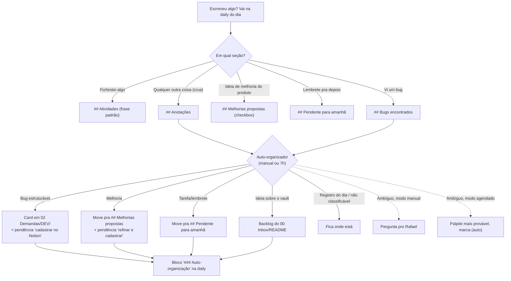

---
tags:
  - qa
  - spec
---
# Design — Auto-organização (daily como lugar único de escrita)

> [!note] Revisão no mesmo dia (14/07)
> A primeira versão deste design usava arquivos de captura soltos em `00 Inbox/` como fonte. Na prática, isso criava **dois lugares de escrita** (Inbox e daily) e Rafael relatou a fricção de decidir onde anotar cada coisa. O design foi revisado no mesmo dia: **a daily é o único lugar de escrita; a Dashboard é o único lugar de leitura; o Inbox vira só backlog do vault/ferramenta**. As capturas soltas viraram mecanismo legado (processadas até zerar).

## Contexto

Pendência listada em [[QA Workspace/00 Inbox/README|00 Inbox/README]] ("Próximos passos — Central de Operações"): auto-organizar as anotações soltas nas referências corretas do vault. O problema real por trás: descentralização — Dashboard, Inbox e daily competindo como lugar de trabalho, sem regra clara.

## Princípio

- **Escrever**: sempre na daily do dia. Anotação crua em `## Anotações`, bug em `## Bugs encontrados`, melhoria em `## Melhorias propostas`, lembrete em `## Pendente para amanhã`. Não é preciso decidir destino na hora — o organizador faz isso depois.
- **Ler**: sempre na Dashboard (KPIs, pendências em aberto, melhorias agregadas, link da daily de hoje).
- **Inbox**: só backlog de melhorias do próprio vault/ferramenta. Nunca mais lugar de captura.

## Fluxo (visão geral)

## 1. Fonte

O organizador processa a daily mais recente até hoje (na execução agendada das 7h, normalmente a de ontem; no modo manual, a de hoje):

- `## Anotações`: linhas cruas sem a marca de processado
- `## Bugs encontrados`: itens em texto puro ainda sem card

Itens **não marcados** de `## Melhorias propostas` e `## Pendente para amanhã` não são processados — já são o destino certo; a Dashboard agrega de lá (por isso melhoria não "repete" em outro lugar: ela mora na daily e a Dashboard só exibe).

**Extensão (15/07) — checkbox concluído como gatilho de continuação**: pendências marcadas `[x]` cujo desfecho ainda não foi aplicado no vault também são fonte. Rafael anota o resultado curto entre parênteses ao marcar (`(aprovada)`, `(reprovada)`, `(SGV-XXXX)` pra cadastros) e o organizador completa o processo definido: linha em Atividades com a frase padrão, card atualizado/movido/renomeado, Histórico. Sem anotação, não inventa — pergunta (manual) ou sinaliza `⏳ aguardando resultado` (agendado). Tabela completa em [[QA Workspace/Sistema/Skills/SKILL_INBOX.md|SKILL_INBOX.md]].

**Marca de processado**: linha já roteada ganha sufixo ` → <resultado>` (ex.: ` → card criado: [[...]]`). O organizador nunca reprocessa linha com essa marca. A daily continua legível como diário: registro original + desfecho na mesma linha.

**Legado**: arquivos `00 Inbox/*.md` com `status: pendente` (formato da v1) continuam sendo processados até zerar. Não se cria mais captura solta; o template `Captura Inbox.md` foi removido.

## 2. Roteamento

| Tipo detectado | Destino | Marca no registro original |
|---|---|---|
| Bug (comportamento errado observado) | Card em `02 Demandas/DEV/` ([[QA Workspace/Sistema/Templates/Bug Report.md\|Bug Report.md]]) | ` → card criado: [[card]]` |
| Melhoria de produto | Checkbox em `## Melhorias propostas` da mesma daily | ` → movido pra Melhorias propostas` |
| Tarefa/lembrete pontual | Item em `## Pendente para amanhã` da mesma daily | ` → movido pra Pendente para amanhã` |
| Ideia sobre o próprio vault/ferramenta | Item no checklist "Próximos passos" de `00 Inbox/README.md` | ` → backlog do vault` |
| Anotação de contexto/registro do dia | Fica onde está | nenhuma |
| Sanidade / Conhecimento / não classificável | Fica onde está | ` → aguardando estrutura` |

`03 Sanidades/` e `04 Conhecimento/` estão vazias, sem template — rotear com confiança pra lá seria inventar destino que ainda não existe.

**Nota — Bug e Melhoria são a mesma coisa por baixo.** Os dois são "tasks": um card numerado em `02 Demandas/`, só muda o `tipo`. A diferença de tratamento é de **momento**, não de destino final: bug já nasce card porque a estrutura de reprodução (passos, evidência, critério de aceite) já é objetiva o suficiente. Melhoria fica no checkbox porque precisa ser bem escrita — regras de negócio, escopo, justificativa — antes de virar card; esse refinamento é manual, do Rafael. Quando concluída (formalizada com `Demanda.md`), segue o mesmo caminho do bug: cadastrada, segue pra desenvolvimento.

## 3. Gatilho e tratamento de ambiguidade

- **Manual**: Rafael pede numa sessão ("organiza a daily"). Interativo — item ambíguo gera pergunta antes de decidir.
- **Agendado**: tarefa cron às 7h. Aplica o palpite mais provável e segue; na dúvida entre "registro do dia" e algo processável, deixa como está (conservador).

**Registro**: todo processamento grava um bloco `### Auto-organização` na daily processada, listando item → destino. Palpites do modo agendado levam `(auto)`.

**Pendência até o cadastro externo.** Todo item roteado como Bug ou Melhoria também gera linha em `## Pendente para amanhã` (ex.: `Cadastrar bug "X" no Notion`), reaproveitando a "Regra de conclusão de pendência" de [[QA Workspace/01 Daily/README|01 Daily/README]]: carrega de um dia pro outro até ser marcada como feita, quando vira linha em Atividades com a frase padrão (`SGV-XXXX - Bug cadastrado`).

## 4. Onde a lógica fica documentada

- [[QA Workspace/Sistema/Skills/SKILL_INBOX.md|SKILL_INBOX.md]] — lógica completa (fonte, roteamento, marcas, modos). Comando manual e tarefa agendada seguem esse mesmo documento.
- Fluxograma didático na [[QA Workspace/Dashboard/Dashboard|Dashboard]] — o guia visual mora onde Rafael trabalha.

## Fora de escopo (não incluído neste design)

- Estrutura/template de `03 Sanidades/` e `04 Conhecimento/` — pendência separada, mencionada em [[QA Workspace/00 Inbox/README|00 Inbox/README]].
- Esteira prática por etapa da demanda — outra pendência separada.
- Melhorar a precisão da busca `evidencia://` — outra pendência separada.
