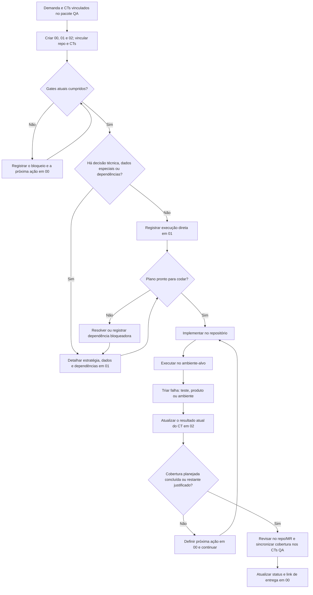

---
tags:
  - qa
  - automacao
  - spec
data: 2026-10-07
---
# Briefing — Automação SOGOV: estado atual, convenções e ponto de dor

> Documento gerado pra servir de contexto numa sessão de desenho de processo (Codex). Cobre: como a task de automação chega hoje, como os arquivos estão organizados (vault + repo), convenções de código, e o caso concreto que motivou a pergunta — aplicar um conceito de "Preset" na TR 1.24-1.25.

## Objetivo de quem está lendo isto

Rafael é responsável por evoluir a automação do Termo de Referência (TR) do SOGOV. Quer adotar um padrão pra que a automação "nasça junto" com a demanda, do mesmo jeito que o pacote de QA manual já nasce hoje (template fixo, preenchível). O padrão atual de automação existe mas ficou com texto demais, longe do estilo enxuto do resto do vault — é isso que precisa ser redesenhado.

## 1. Dois mundos — vault e repo

- **Vault Obsidian** (`/home/sogov-rafael-cartaxo/Documentos/Sogov/Obsidian/BrainWork`) — documentação viva do trabalho de QA: demandas, casos de teste, validação, automação. Cada demanda vira um "pacote" de arquivos.
- **Repo de automação** (`sogov-automation-test`, worktree de leitura em `sogov-automation-playwright`) — o código de automação de verdade. Playwright é o padrão atual (`playwright/`); Cypress é legado em fim de vida (segue rodando, não recebe teste novo).

## 2. Como a task de automação chega hoje (intake)

No vault, cada demanda vira:
```
02 Demandas/<ambiente>/<SGV> - <título>/
├── 00 QA/         manual: 01-Demanda → 02-Plano de teste → 03-Casos de teste → 04-Validação dev → 05-Preparação Qase
└── 01 Automação/  opcional — nasce quando a automação é escolhida, antes da implementação; sem gatilho automático
```

No repo, intake de automação hoje é 100% manual: ler os CTs do vault → escrever um briefing → disparar um subagente (`.claude/agents/criar-teste-{e2e,api}.md`, no repo) → o spec sai em `tests/{api,e2e}/<domínio>/*.spec.ts`. **Esses subagentes são do Cypress legado — não existe equivalente ensinando Playwright ainda.**

## 3. Organização de arquivos

| Onde | O quê |
|---|---|
| `Sistema/Templates/Pacote/00 QA/*` (vault) | templates manuais — curtos, tabela + checklist |
| `Sistema/Templates/Pacote/01 Automação/*` (vault) | templates de automação (ver seção 6) |
| `playwright/tests/{api,e2e}/<domínio>/*.spec.ts` (repo) | specs — 1 arquivo por suíte, 1 `describe`, 1 `test` por CT |
| `playwright/src/api/services/*.ts` (repo) | operação de API por entidade, padrão `getXOrCreate` |
| `playwright/src/data/factories/*.ts` (repo) | monta payload de mutation |
| `playwright/src/data/seed/*.ts` (repo) | baseline fixo + `provisionBaseline` (idempotente) |
| `playwright/src/ui/<domínio>.ts` + `internal/` (repo) | ações de tela, com `test.step` automático |
| `playwright/src/fixtures/index.ts` (repo) | `actors`, `seed`, `env`, `cleanup` |
| `playwright/planning/*.md` (repo) | 15 docs de arquitetura/decisão (regra D4, inventários de ID, paridade Cypress→Playwright) |

## 4. Convenções de escrita de teste (repo)

- **ID no título**: `A<NN>` (API) ou `E<NN>` (E2E) + `-C<NN>`/`-S<NN>`. Numeração **sequencial por arquivo de origem do Cypress legado** — não tem relação com o `CT-NNN` do vault. Esse descasamento de numeração é um gap real de rastreabilidade entre vault e repo.
- Próximo ID livre é consultado em `playwright/planning/11-INVENTARIO-API.md` (registro central — nunca "chutar" um número).
- Classificação obrigatória no título: `[SUCESSO]` · `[FALHA]` · `[REGRESSÃO]`.
- Comentário de origem logo após os imports (de onde veio o caso, por que diverge se divergir).
- Toda `expect` leva mensagem descritiva no segundo argumento.
- Tags: `['@api'|'@e2e', '@<domínio>']` no describe; `@smoke` no test, nunca no describe; `@shared-state` quando o arquivo muta estado compartilhado.
- Bug de produto conhecido: `test.fail()` imediatamente antes da asserção, nunca no topo do teste.
- Skip sempre com `annotation` tipada explicando o motivo (ex.: `d4`, `pendencia-de-produto`).

## 5. Pontos principais de arquitetura/código

- Toda função de API recebe `instanceId` explícito (`GraphQLClient.withTenant(instanceId)`, em `src/api/graphql-client.ts`) — a arquitetura já é pronta pra multi-cliente, mas hoje só uma instância fixa roda de verdade (`BASELINE.instance` em `src/data/seed/baseline.ts`).
- O padrão `getXOrCreate` idempotente (`getInstanceOrCreate`, `getSectorOrCreate`, `getModuleOrCreate`, `getMatterServiceOrCreate`, `getPublicAgentOrCreate`, `getCitizenOrCreate` — todos em `src/api/services/*.ts`) **é**, na prática, o conceito de "Preset" que já existe no repo — só que hoje aplicado só ao baseline fixo do seed, nunca a um cliente variável.
- **Regra D4** (documentada em `planning/13-REVISAO-E-ONDAS-DREAM.md:242`): nunca criar instância/usuário novo em execução normal de teste — não existe API de exclusão de instância no backend, então criar à vontade vira lixo permanente no ambiente compartilhado. `tests/api/instance/in-deployment.spec.ts` já tem o código pra criar instância, mas está `test.skip` por essa razão.
- Sharding/paralelismo multi-ambiente é bloqueado explicitamente em `scripts/run.mjs` ("concorrência no tenant único") — a arquitetura assume **um backend, uma instância, uma execução por vez**.
- `changePublicAgentWorkStatus(publicAgentId, input: Status)` — muda o status do servidor (Ativo/Licença/Férias/Inativo-Suspenso). **Mutation e enum já confirmados via captura real de API** (`WORK_STATUS = IN_ACTIVITY | LICENSE | VACATION | SUSPEND`), implementados como command Cypress, **nunca portados pro Playwright** (`src/api/services/users.ts` hoje só tem `getPublicAgentOrCreate`/`editPublicAgent`).

## 6. Estrutura anterior do template (antes da revisão)

`Sistema/Templates/Pacote/01 Automação/`:

1. `00 - Automação.md` — hub, status geral, link pros outros 4
2. `01 - Plano de automação.md` — arquitetura/estratégia de porte **← este é o que virou texto demais, log de investigação acumulado**
3. `02 - Validação automação.md` — placar por CT (frontmatter `ct_resultados` + tabela + widget Meta Bind) **← este já é enxuto, bom modelo pro resto**
4. `03 - Handoff de execução.md` — log cronológico do processo
5. `04 - Documentação de entrega.md` — detalhe de code review

O ponto de dor: `01 - Plano de automação.md` cresceu como narrativa de investigação (decisões, achados, histórico), bem mais denso que o padrão tabela+checkbox do `00 QA/`. O `02 - Validação automação.md` é o contra-exemplo bom — nasceu justamente pra resolver esse mesmo problema de densidade, só que pro placar de resultado, não pro plano.

## 7. Processo/tooling com lacuna

- Não existe subagente Claude Code pra criar teste Playwright — só os antigos `.claude/agents/criar-teste-{e2e,api}.md`, que ensinam Cypress.
- CI roda só Cypress (`.gitlab-ci.yml`) — a suíte Playwright não protege merge nenhum ainda.
- O worktree `sogov-automation-playwright` está em HEAD destacado (sem branch) — decisão de branch pendente antes de qualquer commit novo nele.

## 8. Caso concreto que motivou a investigação — TR 1.24-1.25 (SGV-11971, vault)

38 CTs de autenticação/ciclo de vida, 5 suítes. Hoje portadas pra Playwright: Suítes 1, 2 e CT-038 (Suíte 5) — nenhuma delas precisa de "Preset" (usam só o servidor/cidadão padrão do baseline, sem estado especial).

**Quem precisa de Preset**: Suíte 3 (bloqueio/desbloqueio, CT-013 a CT-019) e Suíte 4 (ciclo de vida, CT-020 a CT-036) — ambas exigem um servidor **num estado específico** (bloqueado por tentativas, ou `workStatus` em Licença/Férias/Suspenso) antes do teste rodar, isolado do agente global do baseline (que não pode ser mexido sem quebrar os outros 127+ testes que dependem dele). Isso já tinha sido identificado pelo próprio Rafael em 31/08/2026 (`01 - Plano de automação.md`, vault): *"Usuários de teste isolados por cenário (bloqueio, Licença, Férias, Inativo, Suspenso) via `getPublicAgentOrCreate` com nome fixo por cenário — nunca reusar o agente global do setup."*

O que falta tecnicamente: portar `changePublicAgentWorkStatus` pro Playwright (seção 5). O que **não** é resolvido por um Preset (são gaps de investigação de produto, não de infraestrutura de teste): a mutation de desbloqueio manual (CT-017) nunca foi capturada; o mecanismo de aplicação em tempo real do status (CT-025/CT-033 — revogação de token? polling?) segue sem confirmação.

## 9. Decisões e pendências de desenho

- **Template do vault — definido nesta revisão:** quando a pasta de automação for criada, usar sempre `00` (hub), `01` (plano, mesmo que direto) e `02` (placar por CT), com navegação, controles, tabelas e checklist no padrão dos templates QA. Não incluir handoff ou documentação de entrega no pacote padrão.
- Decidir se o escopo do "Preset" agora é estreito (preparar servidor/cidadão num estado específico, pra destravar Suítes 3/4 da TR 1.24-1.25) ou genérico (módulos/assuntos/serviços/documentos, qualquer cliente novo por `clienteId` — que hoje não existe como conceito no repo, nem variável de ambiente nem parametrização).
- Se for o escopo genérico, ficam em aberto: como o `clienteId` seria passado numa execução, e se o Preset precisa criar instância nova (esbarra na regra D4) ou só operar sobre instância já existente.

## 10. Revisão da estrutura atual e proposta

### Diagnóstico

A pasta atual tem informação suficiente para uma automação grande como a SGV-11971, mas os cinco arquivos não formam uma sequência simples de trabalho. Eles foram numerados como se fossem etapas, embora três sejam registros opcionais e de naturezas diferentes.

| Arquivo atual | Problema observado |
|---|---|
| `00 - Automação.md` | Mistura configuração, resumo, pendências gerais e checklist de saída. É um bom hub, mas o texto explica demais o que cada outro arquivo não deve conter. |
| `01 - Plano de automação.md` | Tem os campos certos para arquitetura, mas não define limite de tamanho nem destino para achados. Vira caderno de investigação e histórico. |
| `02 - Validação automação.md` | É o melhor modelo: estado atual por CT numa tabela, sem histórico. Deve continuar sendo a fonte única do resultado por CT. |
| `03 - Handoff de execução.md` | Junta estado de continuidade, decisões pendentes, regras e log cronológico. Handoff é uma necessidade eventual, não uma etapa obrigatória. |
| `04 - Documentação de entrega.md` | A revisão por cenário pode ajudar num porte grande, mas repete contexto e status e não é necessária em toda entrega. |

Há duplicação concreta na SGV-11971: resumo e pendências aparecem no hub, o plano contém histórico de investigação, o handoff repete decisões e progresso, e a documentação de entrega volta a descrever cobertura e situação. A navegação repetida em cada nota também ocupa espaço sem ajudar a decidir onde registrar uma informação.

### Estrutura recomendada

Manter somente `00` a `02`. A numeração é ordem de leitura. Os três arquivos são sempre criados quando a pasta `01 Automação/` nasce; o plano fica curto na automação direta e ganha detalhe quando houver decisões técnicas.

```text
01 Automação/
├── 00 - Automação.md          entrada e visão geral do trabalho
├── 01 - Plano de automação.md escopo e estratégia antes de codar
└── 02 - Validação automação.md resultado atual por CT
```

`03 - Handoff de execução.md` e `04 - Documentação de entrega.md` saem do pacote padrão. Não criar um histórico substituto. Se houver uma decisão duradoura de arquitetura/regra de negócio, documentá-la na fonte técnica do repo; o andamento do dia fica no registro de trabalho já usado. A revisão de código ocorre no repo/MR, e o hub aponta para esse endereço.

### Divisão dos três templates

| Nota | Responde a | Deve conter | Não deve conter |
|---|---|---|---|
| `00 - Automação` | O que é esta automação e qual é o próximo passo? | Link da demanda e dos CTs; repo; framework; ambiente-alvo; status geral; próxima ação; link de MR quando existir; links para `01` e `02`. Pendências gerais só quando bloquearem várias suítes ou o trabalho todo. | Contagem manual de CTs, investigação detalhada, lista de asserts ou histórico de rodadas. |
| `01 - Plano de automação` | O que precisa ser construído e quais decisões/gates vêm antes do código? | CTs no escopo; suíte/camada; estratégia de reuso; preparação e isolamento/limpeza de dados; gaps técnicos; fases curtas e critério de pronto. Usar linhas de tabela e checkboxes. Sempre criar; em automação direta, registrar uma única linha de estratégia simples. | Resultado de execução, cronologia, detalhes de cada assert ou explicação da arquitetura inteira do repo. |
| `02 - Validação automação` | O que está passando no teste automatizado agora? | Uma linha por CT candidato, link ao CT fonte, identificador/caminho do teste, resultado atual, data/build da última execução e observação curta. Framework e ambiente ficam no frontmatter. | Histórico; decisão de arquitetura; resumo escrito à mão que possa divergir da tabela. |

O fluxo documental é sempre `00 → 01 → 02`. `00` abre o pacote; `01` registra o plano, mesmo que seja uma linha de execução direta; `02` registra os resultados. Não há arquivos opcionais dentro da pasta padrão.

### Esqueleto de leitura de cada nota

**`00 - Automação`** deve caber numa tela e responder estado/próximo passo:

```text
Automação — <ID>
Demanda: <link> · Casos de origem: <link>
Repo: <link/nome> · Framework: <Playwright> · Ambiente-alvo: <HML>
Como executar: <link para README/instruções do repo>
Status geral: <planejado | em execução | bloqueado | concluído>
Próxima ação: <verbo + entrega concreta + responsável, se houver>
Plano: <link para 01>
Validação: <link para 02>
Branch/MR: <link quando existir>
Pendência geral: <somente se bloquear mais de um CT ou a automação toda>
```

Status geral descreve a etapa do trabalho; `02` descreve o resultado dos testes. Assim os dois campos não competem. Não exibir contagem digitada manualmente no hub.

**`01 - Plano de automação`** é uma matriz curta de decisão, não um relatório:

| Suíte / CTs | Camada | Dados e estado inicial | Reuso / mudança necessária | Dependência ou gate |
|---|---|---|---|---|
| <suíte e links aos CTs> | API / E2E | <ator, preset, cleanup> | <helper existente ou item a criar> | <captura, acesso, fix no ambiente> |

Acima ou abaixo da matriz, manter somente **objetivo/fora de escopo** e **critério de pronto**. O plano termina antes da implementação: depois disso, código e progresso vivem no repo e o resultado executado vive em `02`.

**`02 - Validação automação`** separa existência de código do último resultado:

| CT | Teste no repo | Resultado atual | Última execução | Observação |
|---|---|---|---|---|
| link ao CT de origem | caminho e ID do teste, ou `sem teste` | sem teste / aguardando / em andamento / aprovado / falhou / bloqueado | data + build/commit | causa curta ou link ao bug/pendência |

O campo **Teste no repo** deixa claro quando ainda não existe cobertura. `Resultado atual` trata somente a última execução conhecida; falha sem causa confirmada continua falha e não vira defeito de produto por inferência. Ambiente fica no topo; a data/versão da execução é por CT quando os CTs foram rodados em momentos/builds diferentes. Se toda a tabela veio de uma única rodada, pode-se informar a rodada uma vez no topo.

### Exemplo completo de como os templates ficariam

Os exemplos abaixo são o formato proposto dos arquivos, não conteúdo novo da SGV-11971. Mantêm a estrutura dos templates QA atuais: frontmatter, navegação, controles, tabelas e checklist. Os campos entre `< >` são preenchidos ao copiar o template; os defaults de repo/framework/ambiente refletem a configuração atual da automação SOGOV e devem ser revistos se essa configuração mudar.

#### `00 - Automação.md` — entrada e estado geral

```markdown
---
demanda: "[[../00 QA/01 - Demanda]]"
casos_origem: "[[../00 QA/03 - Casos de teste]]"
repo: "sogov-automation-test"
framework: playwright
ambiente: hml
status: planejado
---

# Automação — <ID>

> [!info]- Navegação QA
> **Demanda:** [[../00 QA/01 - Demanda]] · **Casos:** [[../00 QA/03 - Casos de teste]]
> **Plano:** [[01 - Plano de automação]] · **Validação:** [[02 - Validação automação]]

> [!settings]- Controle da automação
> **Status:** `INPUT[inlineSelect(option(planejado),option(execucao),option(bloqueado),option(concluido)):status]`
> **Framework:** `INPUT[inlineSelect(option(playwright),option(cypress_legado),option(outro)):framework]`
> **Ambiente-alvo:** `INPUT[inlineSelect(option(dev),option(hml),option(prod)):ambiente]`

**Instruções de execução:** <link para o README do repo>
**Próxima ação:** <verbo + entrega concreta + responsável, se houver>
**Plano:** [[01 - Plano de automação]]
**Branch/MR:** <link quando existir>

## Pendência geral

- <somente bloqueio que afeta várias suítes ou a automação toda; apagar a seção se não houver>
```

As propriedades de repo/framework/ambiente ficam no frontmatter; não repeti-las na tabela do corpo. `status` descreve a etapa geral do trabalho, enquanto os resultados por CT ficam em `02`. Não escrever no hub “12/20 CTs passaram”.

#### `01 - Plano de automação.md` — decisões antes da implementação

```markdown
---
demanda: "[[../00 QA/01 - Demanda]]"
casos_origem: "[[../00 QA/03 - Casos de teste]]"
repo: "sogov-automation-test"
status: planejado
---

# Plano de automação — <ID>

> [!info]- Navegação QA
> **Automação:** [[00 - Automação]] · **Casos:** [[../00 QA/03 - Casos de teste]]
> **Validação:** [[02 - Validação automação]]

## Objetivo e escopo

- **Objetivo:** <comportamento que a automação vai cobrir>
- **CTs incluídos:** <suítes/CTs vinculados à origem>
- **Fora do escopo:** <somente exclusões importantes>

## Decisões de implementação

| Suíte / CTs | Camada | Dados e estado inicial | Reuso / mudança necessária | Dependência ou gate |
|---|---|---|---|---|
| <suíte e CTs> | <API / E2E> | <ator, preset, limpeza> | <helper existente ou item a criar> | <captura, acesso, fix no ambiente> |

## Pronto para codar quando

- [ ] <comportamento e dados necessários estão confirmados>
- [ ] <dependências resolvidas; CT bloqueado foi retirado do escopo desta rodada e registrado como próxima ação em 00>

## Pronto para validar quando

- [ ] <implementação concluída e CTs mapeados aos testes no repo>
- [ ] <ambiente e instruções de execução confirmados>
```

Manter só o que muda a decisão de como construir. Em execução direta, registrar uma linha com os CTs, a camada escolhida, o dado/reuso padrão e “nenhuma” dependência. O plano existe para deixar explícita a estratégia, não para produzir texto por obrigação.

#### `02 - Validação automação.md` — estado atual por CT

```markdown
---
demanda: "[[../00 QA/01 - Demanda]]"
casos_origem: "[[../00 QA/03 - Casos de teste]]"
framework: playwright
ambiente: hml
status: planejado
ct_resultados:
  ct_001: "🧩 Sem teste"
---

# Validação automação — <ID>

> [!info]- Navegação QA
> **Automação:** [[00 - Automação]] · **Casos:** [[../00 QA/03 - Casos de teste]]

> [!settings]- Controle da validação
> **Status:** `INPUT[inlineSelect(option(planejado),option(execucao),option(concluido)):status]`
> **Framework:** `INPUT[inlineSelect(option(playwright),option(cypress_legado),option(outro)):framework]`
> **Ambiente:** `INPUT[inlineSelect(option(dev),option(hml),option(prod)):ambiente]`

| CT | Teste no repo | Resultado atual | Última execução | Observação |
|---|---|---|---|---|
| [[../00 QA/03 - Casos de teste#^ct-001\|CT-001]] | <caminho + ID do teste; ou `sem teste`> | `INPUT[inlineSelect(option(🧩 Sem teste),option(⏳ Aguardando),option(🔵 Em andamento),option(✅ Aprovado),option(❌ Falhou),option(🚫 Bloqueado)):ct_resultados.ct_001]` | <data + build/commit> | <curta; link ao bug se aplicável> |
```

Valores de `Resultado atual`: **Sem teste**, **Aguardando**, **Em andamento**, **Aprovado**, **Falhou**, **Bloqueado**. `Sem teste` significa que o código ainda não existe; `Aguardando` significa que há teste mapeado, mas ainda não executado. Para cada CT, substituir o valor anterior pelo resultado mais recente. Não acrescentar rodadas antigas embaixo.

Registrar data e build/commit por CT para que um resultado antigo não pareça corresponder a uma rodada mais recente. A coluna pode usar `—` enquanto o CT estiver sem teste ou aguardando execução.

Manter o resumo Dataview atual para contar aprovados e executados. Não preencher um segundo “resultado geral” à mão: ele repetiria o placar da tabela e poderia divergir dele.

### Fluxograma do fluxo



O ramo `Não` em “Gates atuais cumpridos?” é uma espera com motivo e próxima ação clara; não é autorização para codar parcialmente. Para TRs, card e CTs são criados cedo para rastreabilidade, mas a implementação continua aguardando o gate manual indicado pela skill.

### Conteúdo mínimo que o template precisa pedir

O conjunto deve permitir que uma pessoa entenda **o que será automatizado, onde está o código, como preparar/rodar com segurança e o que está passando agora**, sem ler um relato longo.

- **Hub (`00`)**: ID/link da demanda e dos CTs de origem; repo; framework; ambiente; status geral; próxima ação; branch/MR quando houver. A contagem atual vem de `02`, não é digitada de novo.
- **Plano (`01`)**: CTs incluídos; estratégia por suíte/camada; o que reutilizar; dados/estado especial e forma segura de preparar/limpar; risco de estado compartilhado; lacunas que bloqueiam; gates e critério de pronto. Cada item é uma decisão ou ação verificável.
- **Validação (`02`)**: uma linha por CT no escopo; link ao CT original; caminho e ID do teste; resultado atual; observação curta; ambiente/build/data da execução. Sem histórico ou segunda contagem manual.

O modelo atualizado mantém repo, framework, ambiente e placar; explicita também a **origem e o escopo dos CTs**, o **preparo e a limpeza de dados**, os **riscos de estado compartilhado**, o **link para as instruções de execução no repo** e a **próxima ação**. O vault aponta para o comando canônico em vez de duplicá-lo; os demais campos cabem em tabelas e checklists curtas.

### Aplicação ao preset

Para este pacote, “preset” deve ser tratado inicialmente como **preparo repetível de dados/estado para testes** (por exemplo, servidor de teste isolado bloqueado ou com `workStatus` específico), e não como um mecanismo genérico de provisionamento de qualquer cliente/instância. Isso corresponde à necessidade comprovada das Suítes 3 e 4 e evita sugerir que a regra D4 de criação de instâncias foi resolvida.

No plano, o preset entra como uma linha de preparação: estado desejado → mecanismo confirmado → identidade isolada → limpeza/limites → CTs consumidores. Até `changePublicAgentWorkStatus` e as regras de bloqueio estarem implementadas e validadas no Playwright, registrá-lo como dependência/pendência, sem prometer que os CTs já podem rodar.

### Fluxo de trabalho e encaixe no pacote QA

O pacote QA continua sendo a fonte dos critérios e cenários. A pasta `01 Automação/` registra a cobertura automatizada desses mesmos CTs; não abre um fluxo de teste paralelo.

1. **Decidir/iniciar**: após o gatilho de automação, criar os três arquivos em `01 Automação/` e vincular demanda e CTs. Na automação de card comum, cumprir primeiro os gates atuais: validação manual concluída e correção disponível no ambiente-alvo. No fluxo de TR, criar/linkar o card e CTs cedo, depois cumprir o gate manual antes de codar.
2. **Planejar**: preencher `01` sempre. Em caso direto, uma linha registra CTs, camada, dado/reuso e ausência de dependências especiais. Em caso complexo, detalhar decisões por suíte, preset, gaps e dependências. Registrar decisões e condições de pronto; não registrar diário de investigação.
3. **Construir no repo**: escrever/reusar código conforme guia do repo. O vault não replica arquitetura detalhada nem código; `00` pode apontar para repo/branch/MR.
4. **Executar e triar**: rodar no ambiente-alvo. Para cada CT, separar defeito do teste, achado real de produto e instabilidade. Atualizar a linha daquele CT em `02` para o estado atual. Observação deve ser curta; bug/pedido de produto ganha seu próprio registro, e instabilidade bloqueadora aparece em `00` como próxima ação/pendência geral.
5. **Revisar e fechar**: aplicar a revisão de código existente antes do commit/MR; registrar link de revisão/entrega em `00`; sincronizar o campo de automação dos CTs na nota QA. Fechar `00` quando a cobertura planejada estiver concluída ou quando o restante tiver justificativa e próximo passo claros.

Assim, a leitura é simples: abrir `00` para saber o estado e o próximo passo; abrir `01` para saber o que e como será construído; abrir `02` para saber o resultado atual de cada CT.

### Migração e alcance

Esta estrutura foi aplicada aos templates, ao mapa do pacote e às orientações de automação para trabalhos novos. A SGV-11971 contém registros técnicos úteis no seu `03` e `04`; esses arquivos existentes ficam preservados como documentação daquele caso, sem fazer parte do pacote-base daqui em diante. Pacotes anteriores não foram retrofitados.
